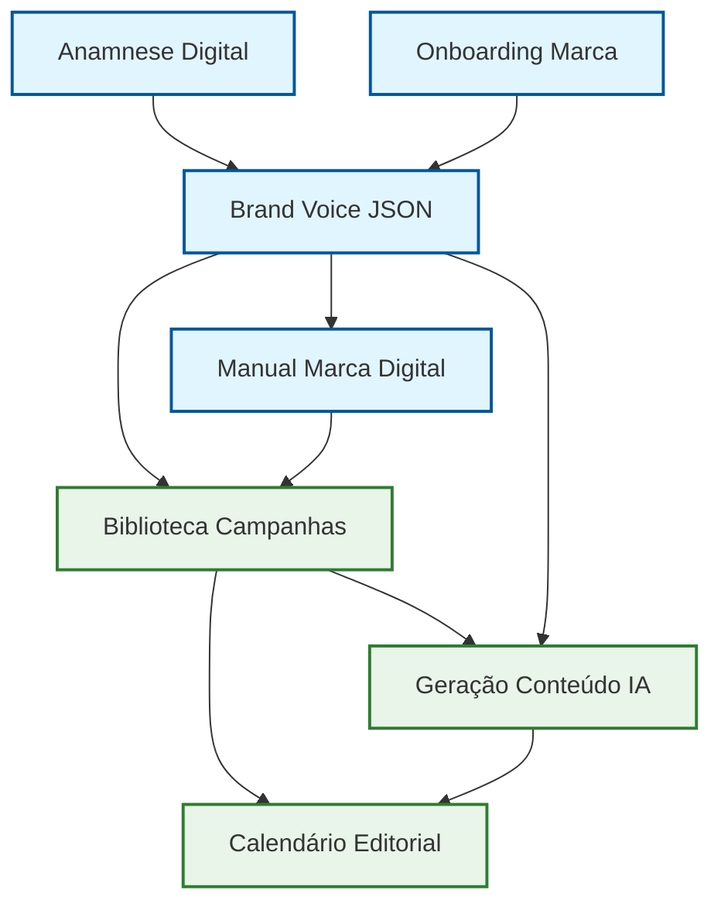

# 🚀 Execução de Planos - Digital Woof Platform

Este diretório contém arquivos de execução individuais para cada plano de desenvolvimento do projeto Digital Woof Platform.

## 📁 Arquivos de Execução

### Fase 1: Cérebro da Marca

1. **[exec_anamnese_digital.md](./exec_anamnese_digital.md)**
   - **Agente:** Backend_Developer
   - **Dependências:** Nenhuma
   - **Status:** ✅ Pronto para execução
   - **Duração Estimada:** 2-3 dias

2. **[exec_onboarding_marca.md](./exec_onboarding_marca.md)**
   - **Agente:** Frontend_Developer
   - **Dependências:** Opcional - Anamnese Digital
   - **Status:** ✅ Pronto para execução
   - **Duração Estimada:** 2-3 dias

3. **[exec_brand_voice_json.md](./exec_brand_voice_json.md)**
   - **Agente:** Backend_Developer
   - **Dependências:** Anamnese + Onboarding
   - **Status:** ✅ Pronto para execução
   - **Duração Estimada:** 3-4 dias

4. **[exec_manual_marca_digital.md](./exec_manual_marca_digital.md)**
   - **Agente:** Frontend_Developer
   - **Dependências:** Brand Voice JSON
   - **Status:** ✅ Pronto para execução
   - **Duração Estimada:** 2-3 dias

### Fase 2: Fábrica de Conteúdo

5. **[exec_biblioteca_campanhas.md](./exec_biblioteca_campanhas.md)**
   - **Agente:** Backend_Developer
   - **Dependências:** Brand Voice + Manual de Marca
   - **Status:** ✅ Pronto para execução
   - **Duração Estimada:** 4-5 dias

6. **[exec_geracao_conteudo_ia.md](./exec_geracao_conteudo_ia.md)**
   - **Agente:** Backend_Developer
   - **Dependências:** Brand Voice + Biblioteca de Campanhas
   - **Status:** ✅ Pronto para execução
   - **Duração Estimada:** 5-6 dias

7. **[exec_calendario_editorial.md](./exec_calendario_editorial.md)**
   - **Agente:** Frontend_Developer
   - **Dependências:** Geração de Conteúdo + Biblioteca
   - **Status:** ✅ Pronto para execução
   - **Duração Estimada:** 4-5 dias

## 🎯 Como Executar

### Opção 1: Execução Individual (Recomendada)

Para executar um plano específico:

```bash
# 1. Execute primeiro em modo dry-run para análise
npx ai-agent execute --config .github/executions/exec_anamnese_digital.md

# 2. Se satisfeito, execute em modo completo
npx ai-agent execute --config .github/executions/exec_anamnese_digital.md --mode execute
```

### Opção 2: Execução via VS Code + Copilot

1. Abra o arquivo de execução desejado (ex: `exec_anamnese_digital.md`)
2. No Copilot Chat, digite:
   ```
   Execute #file:executar_plan.prompt.md usando a configuração em #file:exec_anamnese_digital.md
   ```

### Opção 3: Batch Execution (Fase Completa)

```bash
# Executar toda a Fase 1
./scripts/execute-phase-1.sh

# Executar toda a Fase 2
./scripts/execute-phase-2.sh
```

## 📊 Dependency Graph



## 🔧 Configuração do Ambiente

Antes de executar qualquer plano, certifique-se de que o ambiente está configurado:

```bash
# 1. Instalar dependências
npm install

# 2. Configurar variáveis de ambiente
cp .env.example .env
# Edite .env com suas configurações

# 3. Setup do banco de dados
npx drizzle-kit migrate

# 4. Verificar configuração
npm run health-check
```

## 📝 Outputs Esperados

Cada execução gerará artefatos em `./_agent_outputs/{plan_name}/`:

```
_agent_outputs/
├── anamnese_digital/
│   ├── PRE_EXEC_SUMMARY.md
│   ├── TODOS.md
│   ├── progress.json
│   ├── REPORT.md
│   └── artifacts/
├── onboarding_marca/
│   └── ...
└── ...
```

## 🚨 Troubleshooting

### Problemas Comuns

1. **Dependências não satisfeitas**
   - Verifique se os planos dependentes foram executados com sucesso
   - Confirme que os artefatos necessários estão disponíveis

2. **Ambiente não configurado**
   - Execute `npm run health-check`
   - Verifique variáveis de ambiente

3. **Rate limits de API**
   - Configure limits apropriados no `.env`
   - Use modo dry-run para testing

### Logs e Debugging

```bash
# Ver logs detalhados
tail -f _agent_outputs/*/logs/run.log

# Status de todos os planos
npm run plans:status

# Cleanup de outputs anteriores
npm run plans:clean
```

## 📈 Monitoramento

- **Progress Tracking:** Cada plano mantém `progress.json` atualizado
- **Success Metrics:** Verifique `REPORT.md` de cada execução
- **Quality Gates:** Critérios de aceite devem estar 100% satisfeitos

---

**Próximos Passos:**
1. Execute Fase 1 em sequência (respeitando dependências)
2. Valide outputs de cada plano antes de avançar
3. Execute Fase 2 após Fase 1 completar com sucesso

Para suporte, consulte a documentação em `docs/` ou abra uma issue.