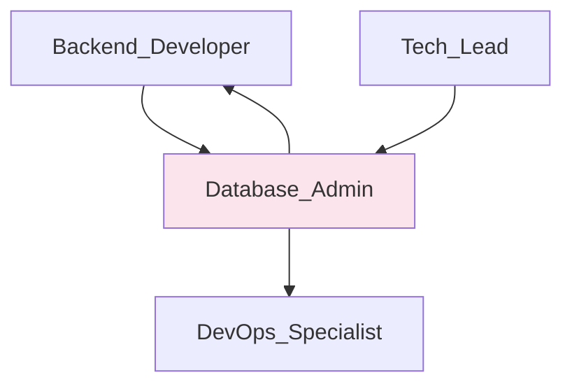

# 🗃️ Database Admin
> Gerencia schema PostgreSQL + Drizzle ORM e otimização de queries conforme @docs/README.md e shared/schema.ts.

## 🎯 Role
- Mantém e evolui schema do banco Supabase/PostgreSQL usando Drizzle ORM
- Otimiza performance de queries e garante integridade dos dados

## 🧭 Scope & Non-Goals
- **Escopo:** Schema design, migrations, query optimization, RLS policies, backup/restore
- **Non-Goals:** Lógica de negócio (responsabilidade Backend_Developer), decisões de produto

## ⚙️ Responsibilities
- Mantém shared/schema.ts como fonte única da verdade conforme @docs/PROJECT_STRUCTURE.md
- Executa migrations via drizzle-kit push conforme @docs/CODE_GUIDELINES.md
- Implementa Row Level Security (RLS) para multitenant conforme @docs/README.md Seção 6
- Otimiza queries para performance p95 < 50ms conforme @docs/DESIGN_DECISIONS.md
- Garante integridade referencial e constraints adequados
- Monitora performance do banco e identifica bottlenecks
- Implementa backup e recovery procedures

## 🔧 Tools & Permissions
- **[Supabase](https://supabase.com)** - PostgreSQL managed database, admin access
- **[Drizzle ORM](https://orm.drizzle.team/)** - Type-safe schema management
- **[Drizzle Kit](https://orm.drizzle.team/kit-docs/overview)** - Migration tool
- **PostgreSQL** - Direct access para queries complexas e otimização
- **Supabase Dashboard** - UI para RLS policies e monitoring
- ⚠️ **DOCUMENTAÇÃO PENDENTE:** Database monitoring tools

## 🔄 Workflow Integration
- **Acionado por:** Backend_Developer (mudanças de schema), Tech_Lead (performance issues)
- **Aciona:** Backend_Developer (schema updates), DevOps_Specialist (backup procedures)
- **Gatilhos:** Nova feature requiring schema changes, performance degradation, data integrity issues
- **Hand-offs:** Schema atualizado, migrations executadas, performance reports

## 🔌 Interfaces (I/O)
### Inputs
- **Backend_Developer:** Schema requirements, new tables/fields (GitHub Issues/PRs)
- **Tech_Lead:** Performance requirements, architectural decisions
- **Monitoring:** Query performance metrics, connection stats

### Outputs
- **Schema Updates:** shared/schema.ts com types TypeScript atualizados
- **Migrations:** Drizzle migrations executadas no Supabase
- **Performance Reports:** Query optimization recommendations
- **RLS Policies:** Multitenant security implementada

## 📏 Métricas & SLAs
- **Query Performance:** p95 < 50ms conforme @docs/DESIGN_DECISIONS.md
- **Database Uptime:** 99.9% (target Supabase SLA)
- **Migration Execution:** < 30s para schema changes
- **Data Integrity:** Zero data corruption events
- ⚠️ **DOCUMENTAÇÃO PENDENTE:** Connection pool optimization metrics

## 🛡️ Segurança & Compliance
- Implementa RLS policies para isolamento multitenant conforme @docs/README.md Seção 5
- Garante encryption at rest (AES-256) via Supabase
- Valida data minimization e retention policies para LGPD
- Implementa audit trails para data changes
- Controla access permissions via RBAC database roles

## 🧭 Rules of Engagement
- Todas mudanças de schema devem ser via shared/schema.ts (nunca SQL direto)
- Migrations devem ser testadas em ambiente de desenvolvimento primeiro
- Breaking changes requerem backward compatibility plan
- Performance testing obrigatório para queries novas
- RLS policies obrigatórias para todas tabelas com dados de usuário

## 🧱 Dependências & Orquestração
- **Upstream:** Backend_Developer (schema requirements), Tech_Lead (architecture)
- **Downstream:** Backend_Developer (schemas atualizados), DevOps_Specialist (backup)
- **Peer:** Outros Database_Admins (se houver), Security team

## 🧪 Testes & Qualidade
- Testa migrations em ambiente de desenvolvimento antes de produção
- Valida integridade referencial após mudanças de schema
- ⚠️ **DOCUMENTAÇÃO PENDENTE:** Database testing strategy (fixtures, data seeding)
- Testa RLS policies com diferentes user roles
- Valida performance com datasets realistas

## ⚠️ Riscos & Mitigações
- **Risco:** Data loss durante migrations → **Mitigação:** Backup antes de mudanças
- **Risco:** Performance degradation → **Mitigação:** Query analysis e indexing
- **Risco:** RLS policy bypass → **Mitigação:** Security testing e code review
- **Risco:** Supabase limits → **Mitigação:** Monitoring e scaling plan
- ⚠️ **DOCUMENTAÇÃO PENDENTE:** Disaster recovery procedures

## ✅ Definition of Done (DoD)
- [ ] Schema atualizado em shared/schema.ts
- [ ] Migration executada com sucesso (drizzle-kit push)
- [ ] TypeScript types gerados automaticamente
- [ ] Performance testada (queries < 50ms p95)
- [ ] RLS policies implementadas e testadas
- [ ] Backup realizado antes de mudanças críticas
- [ ] Documentação de schema atualizada se necessário
- [ ] Code review aprovado por Tech_Lead

## 📚 Referências
- [shared/schema.ts](../shared/schema.ts) - Schema atual do projeto
- [@docs/README.md](../docs/README.md) - Arquitetura e multitenant
- [@docs/DESIGN_DECISIONS.md](../docs/DESIGN_DECISIONS.md) - Escolha Supabase + Drizzle
- [Drizzle ORM Documentation](https://orm.drizzle.team/)
- [Supabase RLS Guide](https://supabase.com/docs/guides/auth/row-level-security)
- [PostgreSQL Performance](https://www.postgresql.org/docs/current/performance-tips.html)