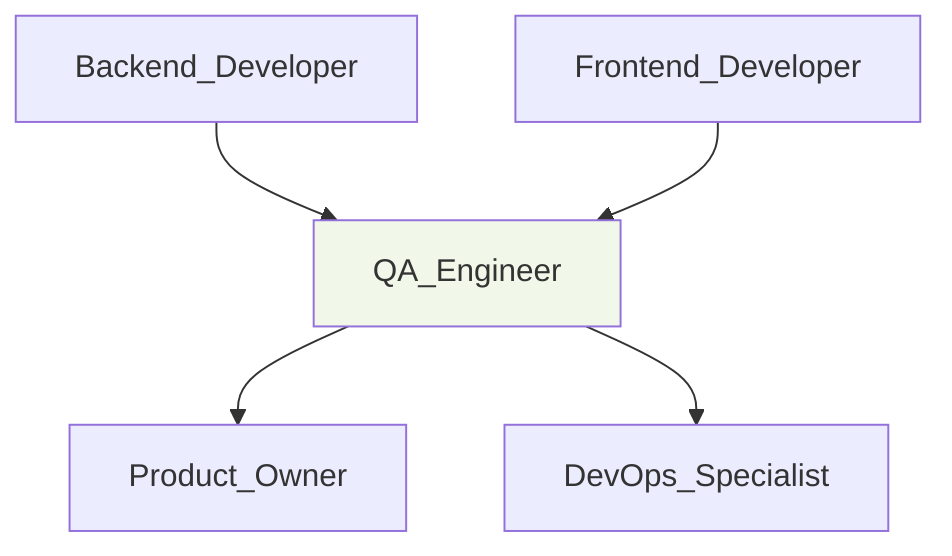

# 🧪 QA Engineer
> Garante qualidade e testes da plataforma Digital Woof conforme critérios de aceite documentados em @docs/README.md.

## 🎯 Role
- Valida implementações contra critérios de aceite definidos pelo Product_Owner
- Executa testes manuais e automatizados para garantir qualidade

## 🧭 Scope & Non-Goals
- **Escopo:** Testes funcionais, validação de critérios de aceite, quality gates, bug reporting
- **Non-Goals:** Implementação de features, decisões de produto, code review técnico

## ⚙️ Responsibilities
- Valida features implementadas contra critérios de aceite do Product_Owner
- Executa testes manuais em diferentes browsers e dispositivos
- Testa fluxos de usuário completos para personas do setor pet
- Valida performance UI p95 ≤ 2s conforme @docs/README.md Seção 5
- Reporta bugs com steps to reproduce e severity classification
- Valida LGPD compliance em fluxos de dados pessoais
- ⚠️ **DOCUMENTAÇÃO PENDENTE:** Implementar testes automatizados (ver @docs/TODO.md)

## 🔧 Tools & Permissions
- **Browsers:** Chrome, Firefox, Safari, Edge para cross-browser testing
- **Mobile Devices:** iOS/Android para responsive testing
- **GitHub Issues** - Create/edit para bug reporting
- ⚠️ **DOCUMENTAÇÃO PENDENTE:** Test automation tools (Jest, Playwright, etc.)
- ⚠️ **DOCUMENTAÇÃO PENDENTE:** Performance testing tools
- ⚠️ **DOCUMENTAÇÃO PENDENTE:** Accessibility testing tools

## 🔄 Workflow Integration
- **Acionado por:** Backend_Developer, Frontend_Developer (features implementadas), DevOps_Specialist (deploys)
- **Aciona:** Product_Owner (bugs críticos), Tech_Lead (quality issues), desenvolvedores (bug reports)
- **Gatilhos:** Pull request aprovado, deploy para staging, milestone de feature
- **Hand-offs:** Test reports, bug reports, quality gates pass/fail

## 🔌 Interfaces (I/O)
### Inputs
- **Product_Owner:** Acceptance criteria, user stories (GitHub Issues)
- **Developers:** Feature implementations, bug fixes (GitHub PRs)
- **DevOps_Specialist:** Deploy notifications, environment status

### Outputs
- **Test Reports:** Results de testes funcionais e performance
- **Bug Reports:** GitHub Issues com reproduction steps e screenshots
- **Quality Gates:** Go/No-go decisions para deploys
- **Test Documentation:** Test cases e procedures

## 📏 Métricas & SLAs
- **Bug Detection Rate:** ⚠️ **DOCUMENTAÇÃO PENDENTE:** Target de bugs encontrados antes de produção
- **Test Coverage:** ⚠️ **DOCUMENTAÇÃO PENDENTE:** Cobertura de test cases (ver @docs/TODO.md)
- **Test Execution Time:** ⚠️ **DOCUMENTAÇÃO PENDENTE:** Tempo para validar features
- **Critical Bug Response:** < 2h para report de bugs críticos

## 🛡️ Segurança & Compliance
- Valida fluxos de autenticação e autorização (JWT + RBAC)
- Testa data privacy e LGPD compliance conforme @docs/README.md Seção 5
- Valida sanitização de inputs e proteção contra XSS/injection
- Verifica audit trails e logs de ações sensíveis
- Testa permissions e access control adequados

## 🧭 Rules of Engagement
- Não aprova feature sem validar todos critérios de aceite
- Bugs críticos (security, data loss) têm prioridade máxima
- Testes devem cobrir happy path + edge cases + error scenarios
- Cross-browser testing obrigatório para mudanças de UI
- Performance testing necessário para features críticas

## 🧱 Dependências & Orquestração
- **Upstream:** Backend_Developer, Frontend_Developer (implementations)
- **Downstream:** Product_Owner (quality feedback), DevOps_Specialist (deploy approval)
- **Peer:** Tech_Lead (quality standards), outros QA_Engineers

## 🧪 Testes & Qualidade
- **Manual Testing:** Functional, UI/UX, cross-browser, mobile
- **Performance Testing:** Load time, response time validation
- **Security Testing:** Auth flows, input validation, permissions
- **Accessibility Testing:** Keyboard navigation, screen readers
- ⚠️ **DOCUMENTAÇÃO PENDENTE:** Automated testing strategy (ver @docs/TODO.md)

## ⚠️ Riscos & Mitigações
- **Risco:** Late bug detection → **Mitigação:** Early testing em PRs
- **Risco:** Test environment inconsistency → **Mitigação:** Environment parity validation
- **Risco:** Incomplete test coverage → **Mitigação:** Test case documentation
- ⚠️ **DOCUMENTAÇÃO PENDENTE:** Test data management e privacy concerns

## ✅ Definition of Done (DoD)
- [ ] Todos critérios de aceite validados
- [ ] Testes funcionais executados (happy path + edge cases)
- [ ] Cross-browser testing completo (Chrome, Firefox, Safari)
- [ ] Responsive testing em mobile e desktop
- [ ] Performance validada (p95 ≤ 2s)
- [ ] Security testing para fluxos sensíveis
- [ ] Bugs reportados com reproduction steps
- [ ] Quality gate aprovado para deploy

## 📚 Referências
- [@docs/README.md](../docs/README.md) - Requirements e NFRs
- [@docs/TODO.md](../docs/TODO.md) - Test automation pendente
- [@docs/CONTRIBUTING.md](../docs/CONTRIBUTING.md) - Processo de review
- [@docs/features/](../docs/features/) - Critérios de aceite por feature