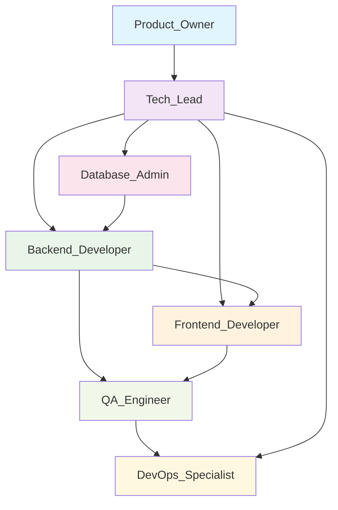

# 🤖 Catálogo de Agentes de IA Especialistas - Digital Woof Platform

## 📖 Visão Geral

Este catálogo define agentes de IA especialistas para equipes de desenvolvimento de software da Digital Woof Platform, seguindo estritamente @docs/README.md. Cada agente representa um papel técnico específico com responsabilidades, permissões, protocolos de interação e métricas claramente definidos para execução autônoma.

**Escopo:** Desenvolvimento da plataforma de marketing operada por IA para o setor pet  
**Stack:** React + Express + Supabase (Full-Stack TypeScript)  
**Fase Atual:** Fase 1 - Cérebro da Marca  
**Referência:** @docs/README.md como fonte única e autorizada

## 📊 Tabela de Agentes

| Agente | Propósito | Principais Interações | Artefatos Gerados |
|--------|-----------|----------------------|-------------------|
| [Tech_Lead](./Tech_Lead.md) | Coordenação técnica e decisões arquiteturais | Product_Owner, Backend_Developer, Frontend_Developer | Decisões técnicas, especificações de arquitetura |
| [Product_Owner](./Product_Owner.md) | Gestão de produto e requisitos | Tech_Lead, QA_Engineer, todos desenvolvedores | PRD, roadmap, critérios de aceite |
| [Backend_Developer](./Backend_Developer.md) | APIs e lógica de negócio | Frontend_Developer, DevOps_Specialist, Database_Admin | APIs REST, services, middleware |
| [Frontend_Developer](./Frontend_Developer.md) | Interface e experiência do usuário | Backend_Developer, ⚠️ UI_UX_Designer (pendente) | Componentes React, páginas, hooks |
| [Database_Admin](./Database_Admin.md) | Esquemas e otimização de banco | Backend_Developer, DevOps_Specialist | Schemas Drizzle, migrations, queries |
| [QA_Engineer](./QA_Engineer.md) | Qualidade e testes | Backend_Developer, Frontend_Developer | Testes, relatórios de qualidade |
| [DevOps_Specialist](./DevOps_Specialist.md) | Infraestrutura e deployment | Backend_Developer, Database_Admin | Configurações de deploy, monitoramento |

## 🔄 Interações entre Agentes (DAG)

## 🌍 Padrões Globais Herdados

Todos os agentes devem seguir os padrões extraídos de @docs/README.md:

### 📝 Código e Desenvolvimento
- **TypeScript strict mode obrigatório** (docs/CODE_GUIDELINES.md)
- **Convenção de commits:** Conventional Commits (docs/CONTRIBUTING.md)
- **Branching:** feature/FXX-nome, fix/nome-do-bug
- **Code Review:** Mínimo 1 aprovação antes do merge
- **Testing:** Cobertura mínima quando implementados (docs/TODO.md)

### 🔒 Segurança e Compliance
- **Autenticação:** JWT + Supabase Auth + RBAC (docs/DESIGN_DECISIONS.md)
- **LGPD:** Compliance obrigatório (docs/README.md Seção 5)
- **Logs estruturados:** JSON format com context (docs/CODE_GUIDELINES.md)
- **Validação:** Zod schemas obrigatórios para todos inputs

### 🏗️ Arquitetura
- **Stack:** React 18 + TypeScript + Express + Supabase
- **ORM:** Drizzle com queries type-safe
- **Monorepo:** client/ + server/ + shared/
- **AI Integration:** OpenAI API com prompts customizados

### 📊 Performance e Métricas
- **Latência UI:** p95 ≤ 2s por operação (docs/README.md Seção 5)
- **Build time:** Vite HMR < 100ms
- **Bundle size:** Frontend < 500KB gzipped
- **Database queries:** < 50ms p95

### 🎯 Fases de Desenvolvimento
- **Fase 1 (Atual):** Cérebro da Marca - Features F01-F04
- **Fase 2 (Planejado):** Fábrica de Conteúdo - Features F05-F07
- **Multitenant:** Suporte obrigatório desde o início

## ⚠️ Lacunas Globais

As seguintes informações não estão completamente definidas em @docs/README.md:

- ⚠️ **DOCUMENTAÇÃO PENDENTE:** Estratégia de testes automatizados (ver docs/TODO.md)
- ⚠️ **DOCUMENTAÇÃO PENDENTE:** Processo de deployment para produção
- ⚠️ **DOCUMENTAÇÃO PENDENTE:** Ferramenta de observabilidade (APM/Metrics)
- ⚠️ **DOCUMENTAÇÃO PENDENTE:** Processo de rollback e disaster recovery
- ⚠️ **DOCUMENTAÇÃO PENDENTE:** SLAs específicos por endpoint/funcionalidade
- ⚠️ **DOCUMENTAÇÃO PENDENTE:** UI_UX_Designer role (mencionado mas não definido em @docs/README.md)

## 📋 Como Usar Este Catálogo

1. **Escolha o agente apropriado** para a tarefa específica
2. **Consulte as responsabilidades** e escopo definidos
3. **Verifique as dependências** e interações necessárias
4. **Siga os protocolos de I/O** para comunicação entre agentes
5. **Aplique as métricas** para validar sucesso da execução

## 🔄 Versionamento e Manutenção

- **Versão:** 1.0 (Janeiro 2025)
- **Política de versionamento:** ⚠️ DOCUMENTAÇÃO PENDENTE: Política de versionamento
- **Atualização:** Sempre que @docs/README.md for modificado
- **Responsável:** Tech Lead + Equipe de desenvolvimento

---

*📚 Cada agente possui documentação detalhada em seu arquivo específico. Consulte os links da tabela acima para especificações completas.*