# 📚 Documentação Técnica - Digital Woof Platform

**Versão:** 1.0  
**Última atualização:** Janeiro 2025  
**Status do Projeto:** Desenvolvimento MVP (Fase 1 - Cérebro da Marca)

---

## 🎯 Por que esta documentação existe?

Esta documentação foi criada para permitir que **qualquer pessoa** (desde iniciantes até especialistas) comece a contribuir com o projeto Digital Woof Platform em **até 1 hora**. 

Ela reflete fielmente o **PRD (Product Requirements Document)** e **Roadmap** aprovados, garantindo que todos os padrões técnicos, decisões arquiteturais e diretrizes de desenvolvimento estejam centralizados e atualizados.

---

Bem-vindo à documentação oficial da **Plataforma Digital Woof** - a **primeira plataforma de marketing operada por IA** especializada no setor pet, combinando **80% de automação inteligente** com **20% de supervisão humana** para entregar diagnóstico estratégico, criação de conteúdo e gestão de marca consistente para clínicas veterinárias, pet shops e serviços especializados.

## 🗂️ Estrutura da Documentação

```
📁 docs/
├── 📖 README.md                    ← Você está aqui
├── 🔧 SETUP_GUIDE.md              ← Configuração inicial (5 min)
├── 📝 CODE_GUIDELINES.md          ← Padrões de código obrigatórios
├── 🏗️ PROJECT_STRUCTURE.md        ← Organização de arquivos e módulos
├── 🤝 CONTRIBUTING.md             ← Fluxo de contribuição passo-a-passo
├── 🧠 DESIGN_DECISIONS.md         ← Decisões técnicas justificadas
├── 🚨 TROUBLESHOOTING.md          ← Soluções para problemas comuns
├── 📚 GLOSSARY.md                 ← Definições de termos técnicos
├── ✅ TODO.md                     ← Lacunas pendentes de definição
└── features/                      ← Especificações por funcionalidade
    ├── README.md                  ← Índice das features
    ├── F01_ANAMNESE_DIGITAL.md
    ├── F02_ONBOARDING_MARCA.md
    ├── F03_BRAND_VOICE_JSON.md
    ├── F04_MANUAL_MARCA_DIGITAL.md
    ├── F05_BIBLIOTECA_CAMPANHAS.md
    └── [demais features...]
```

---

## 🚀 Links Essenciais

### Documentação Central
- **[Guia de Configuração](setup/SETUP_GUIDE.md)** - Configure o ambiente em 5 minutos
- **[Diretrizes de Código](CODE_GUIDELINES.md)** - Padrões obrigatórios
- **[Estrutura do Projeto](PROJECT_STRUCTURE.md)** - Onde encontrar e adicionar arquivos
- **[Como Contribuir](CONTRIBUTING.md)** - Fluxo completo de desenvolvimento

### Especificações Técnicas
- **[Decisões de Design](DESIGN_DECISIONS.md)** - Por que escolhemos cada tecnologia
- **[Arquitetura do Sistema](architecture/SYSTEM_ARCHITECTURE.md)** - Visão geral da infraestrutura
- **[Esquema do Banco](architecture/DATABASE_SCHEMA.md)** - Modelo de dados completo
- **[Contratos da API](architecture/API_CONTRACTS.md)** - Endpoints e payloads

### Features e Funcionalidades
- **[Índice de Features](features/README.md)** - Todas as funcionalidades documentadas
- **[F-1: Anamnese Digital](features/F01_ANAMNESE_DIGITAL.md)** - Análise IA de presença digital
- **[F-2: Onboarding de Marca](features/F02_ONBOARDING_MARCA.md)** - Configuração de identidade
- **[F-3: Brand Voice JSON](features/F03_BRAND_VOICE_JSON.md)** - Artefato central da marca
- **[F-4: Manual de Marca](features/F04_MANUAL_MARCA_DIGITAL.md)** - Interface visual da identidade
- **[F-5: Biblioteca de Campanhas](features/F05_BIBLIOTECA_CAMPANHAS.md)** - Templates do setor pet

### Solução de Problemas
- **[Troubleshooting](TROUBLESHOOTING.md)** - Erros comuns e soluções
- **[Glossário](GLOSSARY.md)** - Definições de termos técnicos
- **[TODO](TODO.md)** - Pendências e lacunas

## � Mapa Mental do Projeto

```mermaid
graph TD
    A[Digital Woof Platform] --> B[Frontend - React/TypeScript]
    A --> C[Backend - Express/Node.js]
    A --> D[Database - Supabase/PostgreSQL]
    A --> E[IA - OpenAI Integration]
    
    B --> B1[Components - shadcn/ui]
    B --> B2[Pages - Wouter Router]
    B --> B3[Hooks - React Query]
    B --> B4[Services - API Layer]
    
    C --> C1[Routes - Express]
    C --> C2[Middleware - Auth/CORS]
    C --> C3[Services - Business Logic]
    C --> C4[Storage - File Upload]
    
    D --> D1[Schema - Drizzle ORM]
    D --> D2[Migrations - Drizzle Kit]
    D --> D3[Types - TypeScript]
    
    E --> E1[Brand Voice Analysis]
    E --> E2[Content Generation]
    E --> E3[Compliance Checks]
    
    style A fill:#e1f5fe
    style B fill:#f3e5f5
    style C fill:#e8f5e8
    style D fill:#fff3e0
    style E fill:#fce4ec
```



---

## 📋 Checklist Rápido

### Para Novos Desenvolvedores
- [ ] Leia este README completo (5 min)
- [ ] Configure ambiente local: [SETUP_GUIDE.md](setup/SETUP_GUIDE.md) (30 min)
- [ ] Execute aplicação de exemplo: `npm run dev` (5 min)
- [ ] Leia coding standards: [CODE_GUIDELINES.md](CODE_GUIDELINES.md) (15 min)
- [ ] Revise features atuais: [features/README.md](features/README.md) (10 min)
- [ ] Faça primeira contribuição: [CONTRIBUTING.md](CONTRIBUTING.md) (5 min)

### Para Product Managers
- [ ] Entenda a arquitetura: [SYSTEM_ARCHITECTURE.md](architecture/SYSTEM_ARCHITECTURE.md) (15 min)
- [ ] Revise roadmap atual: [roadmap.md](roadmap/roadmap.md) (10 min)
- [ ] Analise features planejadas: [features/README.md](features/README.md) (15 min)
- [ ] Consulte métricas produto: [PRODUCT_METRICS.md](metrics/PRODUCT_METRICS.md) (10 min)

---

## 🎪 Contexto do Produto (Resumo Executivo)

**O que construímos:** Uma plataforma de marketing operada por IA para o setor pet, que automatiza diagnóstico de marca, criação de conteúdo, publicação e métricas.

**Tecnologias principais:**
- **Frontend:** React 18 + TypeScript + Tailwind CSS + shadcn/ui
- **Backend:** Node.js + Express + TypeScript
- **Banco:** Supabase (PostgreSQL) + Drizzle ORM
- **IA:** OpenAI API + Custom Prompts
- **Deploy:** Replit (desenvolvimento) + Production TBD

**Fases de desenvolvimento:**
1. **✅ Fase 0 (Concluída):** Fundações e infraestrutura
2. **🚧 Fase 1 (Atual):** Cérebro da Marca - Anamnese Digital + Brand Voice
3. **📅 Fase 2 (Planejado):** Fábrica de Conteúdo - Calendário + Geração
4. **📅 Fase 3 (Planejado):** Piloto Automático - Publicação + Jornadas
5. **📅 Fase 4 (Planejado):** Copiloto - Dashboard + Alertas

---

## 🚀 Como Contribuir com a Documentação

1. **Identifique gaps** - Encontrou algo mal documentado?
2. **Crie um branch** - `docs/nome-da-melhoria`
3. **Siga os padrões** - Use a estrutura e formatação existente
4. **Teste exemplos** - Certifique-se que os códigos funcionam
5. **Solicite review** - PR com descrição clara das mudanças

---

## 🚨 Importante - Antes de Começar

### ⚠️ Esta documentação reflete o estado atual do projeto em **Janeiro 2025**

**Sempre confira os arquivos-fonte para detalhes atualizados:**
- Schema do banco: [`shared/schema.ts`](../shared/schema.ts)
- Configuração do projeto: [`package.json`](../package.json)
- TypeScript config: [`tsconfig.json`](../tsconfig.json)

### 🔄 Como manter a documentação atualizada

Se você alterar algo no código que impacte esta documentação:

1. **Atualize primeiro a documentação relevante**
2. **Mencione no PR quais documentos foram alterados**
3. **Adicione a tag `docs-update` no PR**

---

## 🤝 Precisa de Ajuda?

### 🐛 Encontrou um erro na documentação?
Abra uma issue com a tag `documentation` descrevendo:
- Qual documento está incorreto
- O que deveria estar escrito
- Link para o arquivo-fonte correto

### ❓ Algo não está claro?
1. Verifique o [Glossário](GLOSSARY.md) primeiro
2. Consulte o [Troubleshooting](TROUBLESHOOTING.md)
3. Se não resolver, abra uma issue com a tag `question`

### 💡 Sugestão de melhoria?
Pull requests para melhorar a documentação são sempre bem-vindos! Siga o processo em [CONTRIBUTING.md](CONTRIBUTING.md).

---

## 📞 Suporte

- **Dúvidas técnicas**: Tech Lead responsável
- **Dúvidas de produto**: Product Owner
- **Documentação**: Time de desenvolvimento

---

## 📊 Status da Documentação

| Documento | Status | Última Revisão | Responsável |
|-----------|--------|---------------|-------------|
| README.md | ✅ Completo | Jan/2025 | Equipe |
| CODE_GUIDELINES.md | ✅ Completo | Jan/2025 | Tech Lead |
| PROJECT_STRUCTURE.md | ✅ Completo | Jan/2025 | Arquiteto |
| CONTRIBUTING.md | ✅ Completo | Jan/2025 | Tech Lead |
| DESIGN_DECISIONS.md | ✅ Completo | Jan/2025 | Arquiteto |
| TROUBLESHOOTING.md | ✅ Completo | Jan/2025 | DevOps |
| GLOSSARY.md | ✅ Completo | Jan/2025 | Equipe |
| TODO.md | ✅ Completo | Jan/2025 | Equipe |
| Features F01-F05 | ✅ Completo | Jan/2025 | Product |
| Features F06-F10 | 📝 Em progresso | - | Product |

---

## 📄 Licença e Propriedade

Esta documentação é propriedade da **Digital Woof** e destina-se exclusivamente ao uso interno da equipe de desenvolvimento.

---

*💡 **Dica:** Marque esta página nos favoritos - ela é seu ponto de partida para qualquer dúvida sobre o projeto!*