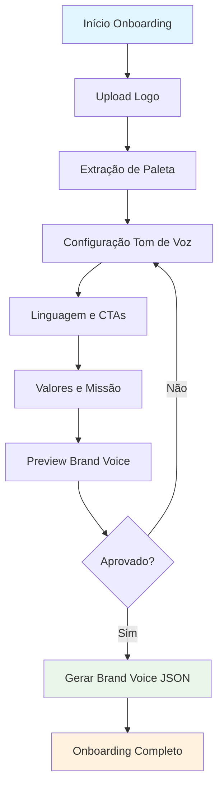

# F-2: Onboarding de Marca

**Status:** 📅 Planejado  
**Fase:** 1 - Cérebro da Marca  
**Prioridade:** P0 (Crítico)  
**Responsáveis:** Frontend, Backend, UX  
**Depende de:** F-1 (Anamnese Digital)

---

## Visão Geral
Wizard guiado para coleta e configuração da identidade visual e tom de voz da marca. Complementa os insights da Anamnese Digital com inputs diretos do usuário, resultando na geração do **Brand Voice JSON v1**.

## Objetivo
Capturar elementos visuais (logo, cores) e define personalidade de marca (tom, valores, restrições) de forma intuitiva e rápida, permitindo que qualquer usuário configure sua marca em < 15 minutos.

---

## Funcionalidades

### 🎨 Upload e Processamento de Logo

**Entrada:**
- Upload de arquivo de logo (SVG, PNG, JPG)
- Validação de formato e tamanho (máx 5MB)
- Preview instantâneo com crop/resize se necessário

**Processamento:**
- Extração automática de paleta de cores dominantes
- Detecção de background transparente vs sólido
- Geração de variações (light/dark mode se aplicável)
- Armazenamento seguro em Supabase Storage

**Saída:**
- URL pública do logo otimizado
- Array de cores extraídas: `["#1B365D", "#F9C000", "#EAEAEA"]`
- Metadados: dimensões, tipo de arquivo, transparência

```typescript
interface LogoProcessingResult {
  logoUrl: string;
  palette: string[]; // Array de cores hex
  metadata: {
    width: number;
    height: number;
    format: 'svg' | 'png' | 'jpg';
    hasTransparency: boolean;
  };
}
```

---

### 🎯 Configuração de Tom de Voz

**Interface:**
- Sliders para dimensões de personalidade:
  - **Confiança:** 0.0 (Humilde) ↔ 1.0 (Autoritário)
  - **Acolhimento:** 0.0 (Formal) ↔ 1.0 (Caloroso)
  - **Humor:** 0.0 (Sério) ↔ 1.0 (Divertido)
  - **Especialização:** 0.0 (Acessível) ↔ 1.0 (Técnico)

**Exemplos dinâmicos:**
- Conforme usuário ajusta sliders, interface mostra exemplos de copy:
  - "Agende sua consulta" vs "Marque uma conversa sobre seu pet"
  - "Tratamento veterinário" vs "Cuidado carinhoso para seu amigo"

**Validação:**
- Combinações extremas geram warnings:
  - Humor alto + Especialização alta = "Pode confundir credibilidade"
  - Confiança baixa + Acolhimento baixo = "Pode parecer pouco confiável"

```typescript
interface ToneConfiguration {
  confiança: number; // 0.0 - 1.0
  acolhimento: number; // 0.0 - 1.0
  humor: number; // 0.0 - 1.0
  especialização: number; // 0.0 - 1.0
}
```

---

### 📝 Configuração de Linguagem

**Termos Preferidos:**
- Input para palavras que a marca prefere usar
- Exemplos pré-populados para setor pet: "tutor", "amigo de quatro patas", "bem-estar"
- Autocomplete baseado em anamnese digital (se disponível)

**Termos a Evitar:**
- Input para palavras que a marca não usa
- Exemplos pré-populados: "dono", "bicho", "barato"
- Validação: não pode haver overlap entre preferidos e evitados

**Termos Proibidos:**
- Lista de termos que nunca devem aparecer
- Pré-populado com termos que violam compliance: "cura", "garante resultado", "milagroso"
- Não editável pelo usuário (definido por compliance)

**CTAs Padrão:**
- Input para calls-to-action preferidos da marca
- Exemplos: "Agende agora", "Fale no WhatsApp", "Saiba mais"
- Máximo 5 CTAs, validação de comprimento

```typescript
interface LanguageConfiguration {
  preferredTerms: string[]; // max 20
  avoidTerms: string[]; // max 15
  bannedTerms: string[]; // readonly, compliance-defined
  defaultCTAs: string[]; // max 5
}
```

---

### ⚙️ Valores e Missão (Opcional)

**Missão da Marca:**
- Campo de texto longo (máx 200 caracteres)
- Placeholder inteligente baseado na anamnese digital
- Validação: deve ter entre 20-200 caracteres

**Valores Centrais:**
- Lista de até 5 valores selecionáveis + input customizado
- Opções pré-definidas para pet: "Bem-estar animal", "Família", "Ciência", "Acolhimento", "Transparência"
- Cada valor pode ter descrição opcional (máx 50 chars)

**Disclaimers e Compliance:**
- Campo para disclaimer padrão que aparece em conteúdos
- Pré-populado: "Conteúdo educativo. Consulte sempre um veterinário."
- Editável mas deve passar por validação de compliance

```typescript
interface BrandValues {
  mission?: string; // 20-200 chars
  values: Array<{
    name: string;
    description?: string;
  }>; // max 5
  disclaimer: string; // compliance-validated
}
```

---

## Fluxo do Usuário

### Jornada Completa (15 minutos)



### Telas e Interações

**Tela 1: Upload de Logo**
- Drag & drop area ou seletor de arquivo
- Preview instantâneo
- Progress bar durante upload e processamento
- Feedback de erro claro (formato inválido, muito grande, etc.)

**Tela 2: Paleta de Cores**
- Exibição da paleta extraída automaticamente
- Opção de ajustar/remover cores
- Preview de como as cores funcionam juntas
- Botão "Detectar novamente" se resultado não satisfatório

**Tela 3: Tom de Voz**
- 4 sliders com labels descritivos
- Exemplos de copy atualizando em tempo real
- Comparação lado-a-lado: "Antes vs Depois"
- Warning para combinações problemáticas

**Tela 4: Linguagem**
- 4 seções: Preferidos, Evitar, Proibidos, CTAs
- Tags input com autocomplete
- Validação em tempo real
- Sugestões baseadas no setor

**Tela 5: Preview Final**
- Card com resumo visual da marca criada
- Exemplos de 3 tipos de content: educativo, promocional, humanizado
- Botão "Regenerar exemplos" para ver variações
- Opção de voltar e ajustar qualquer seção

---

## Modelo de Dados

### Tabela: brand_onboarding
```sql
CREATE TABLE brand_onboarding (
  id UUID PRIMARY KEY DEFAULT gen_random_uuid(),
  user_id UUID NOT NULL REFERENCES users(id),
  
  -- Logo e Visual
  logo_url TEXT,
  palette JSONB, -- array de cores hex
  logo_metadata JSONB,
  
  -- Tom de Voz
  tone_config JSONB NOT NULL, -- ToneConfiguration
  
  -- Linguagem
  language_config JSONB NOT NULL, -- LanguageConfiguration
  
  -- Valores e Missão
  brand_values JSONB, -- BrandValues
  
  -- Metadata
  step_completed TEXT CHECK (step_completed IN ('logo', 'palette', 'tone', 'language', 'values', 'completed')),
  
  created_at TIMESTAMP WITH TIME ZONE DEFAULT NOW(),
  updated_at TIMESTAMP WITH TIME ZONE DEFAULT NOW(),
  completed_at TIMESTAMP WITH TIME ZONE
);
```

### Artefato Gerado: Brand Voice JSON
```json
{
  "brand": {
    "name": "Clínica Amigo Pet",
    "segment": "pet",
    "mission": "Cuidar com amor e ciência do bem-estar de cada pet e sua família",
    "values": [
      {"name": "Bem-estar animal", "description": "Prioridade absoluta"},
      {"name": "Acolhimento", "description": "Cada tutor é único"}
    ]
  },
  "visual": {
    "logoUrl": "https://storage.supabase.co/v1/object/public/logos/user123/logo.png",
    "palette": ["#1B365D", "#F9C000", "#EAEAEA"],
    "fontHints": ["Sans-serif amigável", "Evitar serifs formais"]
  },
  "voice": {
    "tone": {
      "confiança": 0.8,
      "acolhimento": 0.9,
      "humor": 0.2,
      "especialização": 0.7
    },
    "persona": "Veterinária experiente, didática e acolhedora",
    "lexicon": {
      "prefer": ["tutor", "bem-estar", "amigo", "família"],
      "avoid": ["dono", "barato", "bicho"],
      "banned": ["cura", "milagroso", "garante resultado"]
    },
    "style": {
      "length": "frases curtas, listas quando possível",
      "cta": ["Agende agora", "Fale no WhatsApp", "Saiba mais"],
      "formatting": ["lista", "negrito moderado", "emoji ocasional"]
    }
  },
  "compliance": {
    "claimsPolicy": "Evitar promessas clínicas; usar linguagem de prevenção",
    "disclaimer": "Conteúdo educativo. Consulte sempre o veterinário."
  },
  "metadata": {
    "version": "1.0",
    "createdAt": "2025-09-05T14:30:00Z",
    "source": "onboarding-wizard"
  }
}
```

---

## Critérios de Aceite

### Funcional
- [ ] Upload de logo (SVG/PNG/JPG, máx 5MB) com validação
- [ ] Extração automática de 3-6 cores dominantes
- [ ] 4 sliders de tom de voz com exemplos dinâmicos
- [ ] Configuração de linguagem (preferidos, evitar, CTAs)
- [ ] Geração de Brand Voice JSON válido
- [ ] Persistência e recuperação de progresso
- [ ] Preview final com exemplos de conteúdo

### Técnico
- [ ] Interface responsiva (desktop + mobile)
- [ ] Validação em tempo real com feedback claro
- [ ] Upload seguro com antivírus scan
- [ ] Compressão de imagem automática
- [ ] Error handling robusto (falha de upload, processamento)
- [ ] Loading states informativos
- [ ] Accessibility (WCAG 2.1 AA)

### Performance
- [ ] Upload + processamento < 30s para arquivo 5MB
- [ ] Extração de paleta < 5s
- [ ] Interface responsiva (< 200ms para slider changes)
- [ ] Brand Voice JSON gerado < 2s

### UX
- [ ] Onboarding completado em < 15 min por usuário médio
- [ ] Progress indicator claro (5 steps)
- [ ] Opção de voltar e ajustar qualquer etapa
- [ ] Help text e tooltips para conceitos complexos
- [ ] Exemplos claros que ajudam o usuário a entender o impacto

---

## Integrações

### Dependências
- **F-1 Anamnese Digital:** Se disponível, pre-popula campos com insights
- **Supabase Storage:** Upload e armazenamento seguro de logos
- **Image Processing Library:** Sharp.js para compressão e paleta
- **Color Extraction:** Colorthief ou Vibrant.js

### Consome
- API de upload: `POST /api/brand/upload-logo`
- API de processamento: `POST /api/brand/process-palette`
- API de salvar: `PUT /api/brand/onboarding`

### Produz
- **Brand Voice JSON:** Usado por F-3, F-6, e todos os módulos de IA
- **Visual Assets:** Logo otimizado para uso em F-4 Manual de Marca
- **Completion Event:** Trigger para próximo passo do onboarding

---

## Testes

### Unitários
- [ ] Validação de upload (formato, tamanho)
- [ ] Extração de paleta com diferentes tipos de imagem
- [ ] Geração de Brand Voice JSON schema-compliant
- [ ] Validação de linguagem (overlap entre prefer/avoid)

### Integração
- [ ] Fluxo completo: upload → processamento → configuração → JSON
- [ ] Persistência de progresso (refresh da página)
- [ ] Error recovery (falha de upload, processamento)

### E2E
- [ ] Jornada completa de onboarding
- [ ] Mobile responsiveness
- [ ] Performance com arquivos grandes
- [ ] Accessibility com screen readers

---

## Métricas de Sucesso

### Produto
- **Completion Rate:** > 80% dos usuários que iniciam completam
- **Time to Complete:** < 15 min média
- **Satisfaction:** NPS > 70 para processo de onboarding
- **Re-visit Rate:** < 20% dos usuários voltam para ajustar configurações

### Técnico
- **Upload Success Rate:** > 99%
- **Processing Time:** < 30s para 95% dos uploads
- **Error Rate:** < 1% de falhas irrecuperáveis
- **Brand Voice Quality:** JSON schema compliance 100%

---

## Riscos e Mitigações

### Risco: Paleta de cores inadequada
**Mitigação:** 
- Múltiplos algoritmos de extração (fallback)
- Opção manual de ajuste
- Paleta padrão do setor como backup

### Risco: UX complexa demais
**Mitigação:**
- Testes de usabilidade durante desenvolvimento
- Wizard com progress clear
- Help text e tooltips
- Opção de "modo simples" vs "avançado"

### Risco: Upload de arquivos maliciosos
**Mitigação:**
- Validação rigorosa de MIME types
- Antivírus scan
- Sandbox de processamento
- Rate limiting por usuário

---

## Próximos Passos

1. **Design UX/UI:** Wireframes e prototypes das 5 telas
2. **API Design:** Endpoints detalhados e payloads
3. **Image Processing:** POC de extração de paleta
4. **Frontend Implementation:** Componentes do wizard
5. **Backend Integration:** Upload, storage, processamento
6. **Testing:** Unit, integration, E2E
7. **Integration:** Conectar com F-1 e F-3

---

## Documentação Técnica
- [API Endpoints](../architecture/API_CONTRACTS.md#brand-onboarding)
- [Database Schema](../architecture/DATABASE_SCHEMA.md#brand-onboarding)
- [System Architecture](../architecture/SYSTEM_ARCHITECTURE.md#brand-service)
- [Brand Voice JSON Schema](F03_BRAND_VOICE_JSON.md)