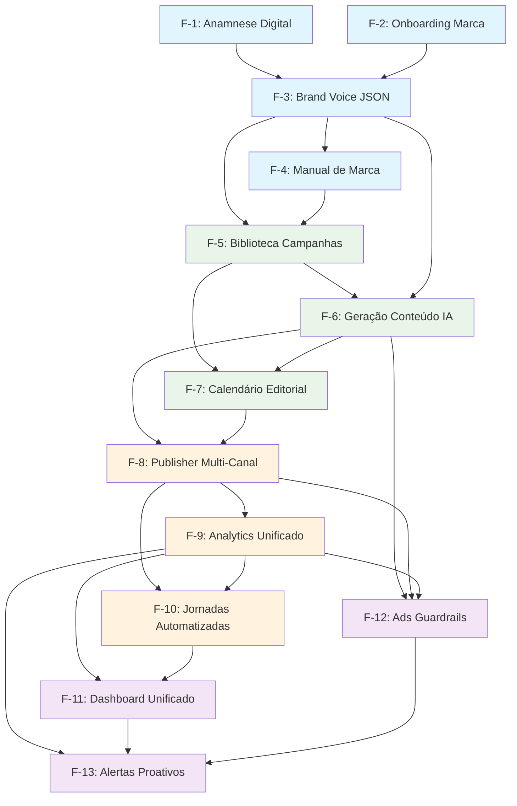

# Features Index - Digital Woof Platform

## 📋 Visão Geral

Este diretório contém a documentação detalhada de todas as features da Digital Woof Platform, organizadas por fase de desenvolvimento e prioridade.

---

## 🏗️ Fase 1: Cérebro da Marca

### Features Fundamentais (P0 - Crítico)

#### [F-1: Anamnese Digital](F01_ANAMNESE_DIGITAL.md)
- **Status:** 📅 Planejado
- **Objetivo:** Análise automatizada da presença digital existente
- **Entrega:** Insights detalhados sobre personalidade e performance atual da marca
- **Dependências:** Nenhuma (feature inicial)

#### [F-2: Onboarding de Marca](F02_ONBOARDING_MARCA.md)
- **Status:** 📅 Planejado  
- **Objetivo:** Wizard para configuração de identidade visual e tom de voz
- **Entrega:** Brand Voice JSON v1 configurado pelo usuário
- **Dependências:** F-1 (opcional para pre-populate)

#### [F-3: Brand Voice JSON](F03_BRAND_VOICE_JSON.md)
- **Status:** 📅 Planejado
- **Objetivo:** Artefato central com personalidade digital completa da marca
- **Entrega:** Schema estruturado consumido por toda IA da plataforma
- **Dependências:** F-1 (anamnese), F-2 (onboarding)

### Features de Suporte (P1 - Alta)

#### [F-4: Manual de Marca Digital](F04_MANUAL_MARCA_DIGITAL.md)
- **Status:** 📅 Planejado
- **Objetivo:** Interface visual navegável da identidade de marca
- **Entrega:** Dashboard interativo para consulta e compartilhamento
- **Dependências:** F-3 (Brand Voice JSON)

---

## 🎨 Fase 2: Criação de Conteúdo

### Features de Produção (P0 - Crítico)

#### [F-5: Biblioteca de Campanhas Pet](F05_BIBLIOTECA_CAMPANHAS.md)
- **Status:** 📅 Planejado
- **Objetivo:** Catálogo inteligente de templates específicos do setor pet
- **Entrega:** Templates personalizados automaticamente com Brand Voice
- **Dependências:** F-3 (Brand Voice), F-4 (Manual de Marca)

#### [F-6: Geração de Conteúdo IA](F06_GERACAO_CONTEUDO_IA.md)
- **Status:** � Planejado
- **Objetivo:** Engine de IA para criação automática de conteúdo
- **Entrega:** Posts, stories, emails gerados com consistência de marca
- **Dependências:** F-3 (Brand Voice), F-5 (Templates)

#### [F-7: Calendário Editorial Inteligente](F07_CALENDARIO_EDITORIAL.md)
- **Status:** � Planejado
- **Objetivo:** Planejamento automático baseado em sazonalidade e performance
- **Entrega:** Cronograma otimizado de publicações
- **Dependências:** F-5 (Campanhas), F-6 (Geração)

---

## 📈 Fase 3: Publicação e Análise

### Features de Distribuição (P1 - Alta)

#### [F-8: Publisher Multi-Canal](F08_PUBLISHER_MULTICANAL.md)
- **Status:** � Planejado
- **Objetivo:** Publicação automática em múltiplas plataformas
- **Entrega:** Integração nativa com Instagram, Facebook, WhatsApp, Email
- **Dependências:** F-6 (Conteúdo), F-7 (Calendário)

#### [F-9: Analytics Unificado](F09_ANALYTICS_UNIFICADO.md)
- **Status:** � Planejado
- **Objetivo:** Métricas consolidadas de performance cross-channel
- **Entrega:** Dashboard de ROI e otimização automática
- **Dependências:** F-8 (Publisher)

### Features Avançadas (P1 - Alta)

#### [F-10: Jornadas Automatizadas](F10_JORNADAS_AUTOMATIZADAS.md)
- **Status:** � Planejado
- **Objetivo:** Sequências de comunicação baseadas em comportamento
- **Entrega:** Nurturing automático com personalização dinâmica
- **Dependências:** F-8 (Publisher), F-9 (Analytics)

---

## 🤖 Fase 4: Inteligência e Escala

### Features de Business Intelligence (P2 - Média)

#### [F-11: Dashboard Unificado](F11_DASHBOARD_UNIFICADO.md)
- **Status:** 📅 Planejado
- **Objetivo:** Dashboard executivo com KPIs consolidados de negócio
- **Entrega:** Visão 360° da saúde do negócio com insights acionáveis
- **Dependências:** F-9 (Analytics), F-10 (Jornadas)

#### [F-12: Ads Guardrails](F12_ADS_GUARDRAILS.md)
- **Status:** 📅 Planejado
- **Objetivo:** Controles automáticos para campanhas de ads
- **Entrega:** Proteção contra desperdício e compliance automático
- **Dependências:** F-6 (Conteúdo), F-8 (Publisher), F-9 (Analytics)

### Features de Automação Avançada (P3 - Baixa)

#### [F-13: Alertas Proativos](F13_ALERTAS_PROATIVOS.md)
- **Status:** 📅 Planejado
- **Objetivo:** Sistema inteligente de notificações preventivas
- **Entrega:** Antecipação de problemas e oportunidades
- **Dependências:** F-9 (Analytics), F-11 (Dashboard), F-12 (Guardrails)

---

## 🔄 Status Legend

- 🟢 **Implementado:** Feature completa e em produção
- 🟡 **Em desenvolvimento:** Ativamente sendo desenvolvida
- 🔄 **Em documentação:** Especificação sendo criada
- 📅 **Planejado:** Documentado, aguardando desenvolvimento
- 📝 **Próximo:** Na fila para documentação
- 📋 **Backlog:** Identificado, aguardando priorização

---

## 🎯 Critérios de Priorização

### P0 - Crítico (Must Have)
Features essenciais para MVP funcional. Sem elas, a plataforma não entrega valor mínimo viável.

### P1 - Alta (Should Have)  
Features importantes que aumentam significativamente o valor, mas não bloqueiam o lançamento.

### P2 - Média (Could Have)
Features que melhoram a experiência mas podem ser implementadas em versões posteriores.

### P3 - Baixa (Won't Have)
Features interessantes mas não prioritárias para as primeiras versões.

---

## 🏗️ Arquitetura de Dependências

---

## 📊 Métricas de Progresso

### Fase 1 - Cérebro da Marca
- **Features Totais:** 4
- **Documentadas:** 4 (100%)
- **Em Desenvolvimento:** 0 (0%)
- **Completas:** 0 (0%)

### Fase 2 - Criação de Conteúdo  
- **Features Totais:** 3
- **Documentadas:** 3 (100%)
- **Em Desenvolvimento:** 0 (0%)
- **Completas:** 0 (0%)

### Fase 3 - Publicação e Análise
- **Features Totais:** 3  
- **Documentadas:** 3 (100%)
- **Em Desenvolvimento:** 0 (0%)
- **Completas:** 0 (0%)

### Fase 4 - Inteligência e Escala
- **Features Totais:** 3
- **Documentadas:** 3 (100%)
- **Em Desenvolvimento:** 0 (0%)
- **Completas:** 0 (0%)

**Total Geral:** 13 features | 13 documentadas (100%) | 0 em desenvolvimento | 0 completas

---

## 🎪 Como Contribuir

### Para Desenvolvedores
1. Leia a documentação da feature
2. Consulte [CODE_GUIDELINES.md](../CODE_GUIDELINES.md)
3. Siga o workflow em [CONTRIBUTING.md](../CONTRIBUTING.md)
4. Verifique dependências no diagrama acima

### Para Product Managers
1. Use este índice para planejar sprints
2. Respeite a ordem de dependências
3. Consulte [DESIGN_DECISIONS.md](../DESIGN_DECISIONS.md) para contexto
4. Atualize status conforme progresso

### Para Designers
1. Consulte [DESIGN_SYSTEM.md](../design/DESIGN_SYSTEM.md)
2. Cada feature tem seção "Interface e UX"
3. Siga padrões visuais estabelecidos
4. Valide accessibility nos critérios de aceite

---

## 📚 Links Relacionados

- [Product Requirements Document](../prd/prd.md)
- [System Architecture](../architecture/SYSTEM_ARCHITECTURE.md)
- [API Contracts](../architecture/API_CONTRACTS.md)
- [Database Schema](../architecture/DATABASE_SCHEMA.md)
- [Development Guide](../development/DEVELOPMENT_GUIDE.md)
- [Test Strategy](../testing/TEST_STRATEGY.md)

---

## 🔄 Última Atualização

**Data:** Setembro 2025  
**Versão:** 2.0  
**Responsável:** Equipe Digital Woof  
**Status:** 📋 Documentação completa de todas as features do PRD (F01-F13)  
**Próxima Revisão:** Outubro 2025