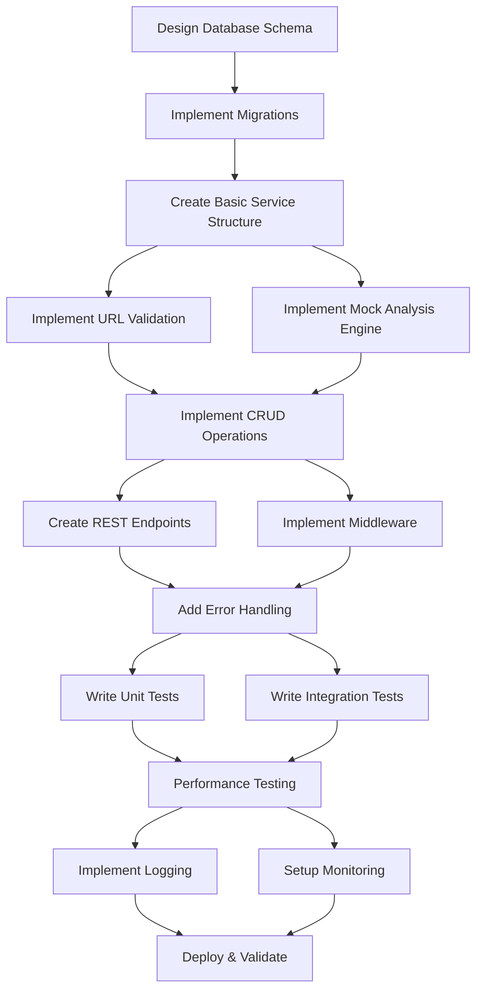

# Anamnese Digital - Execution Plan

**Versão:** 1.0  
**Data:** Setembro 2025  
**Status:** 📅 Pronto para execução por agente  
**Agent Responsável:** Backend_Developer

---

## 🎯 Feature Scope

### Fonte
Baseado em @docs/README.md (Fase 1 - Cérebro da Marca) e @docs/features/F01_ANAMNESE_DIGITAL.md

### Critérios de Aceitação
1. **RF-1.1:** Usuário pode inserir 1 site obrigatório + até 10 URLs de redes sociais com validação automática
2. **RF-1.2:** Pipeline de análise processa URLs e retorna diagnóstico estruturado em ≤ 2 min (mock atual)
3. **RF-1.3:** Dados persistidos no Supabase com deduplicação por URL normalizada
4. **RF-1.4:** Interface de resultados exibe 8 seções principais (Identidade, Personas, UX, etc.)
5. **RF-1.5:** CRUD completo - histórico, reprocessamento, exclusão de análises

### Contexto de Negócio & Valor
- **Time-to-Value:** Novo cliente gera diagnóstico completo em < 60 min
- **Proposta:** Análise automatizada que alimenta Brand Voice JSON
- **Job-to-be-Done:** "Como proprietário de negócio pet, preciso entender minha atual presença digital para identificar oportunidades de melhoria"

### [⚠️ DOCUMENTAÇÃO PENDENTE]
- Estratégia de testes automatizados específica (referenciado em docs/TODO.md)
- Ferramenta de observabilidade/APM definida
- Processo de rollback para falhas no pipeline de análise

---

## 📎 Premissas, Restrições & Políticas

### Tecnologias Obrigatórias
- **Backend:** Node.js + Express + TypeScript (strict mode)
- **Database:** Supabase PostgreSQL + Drizzle ORM
- **IA:** OpenAI API (integração futura, mock atual obrigatório)
- **Validação:** Zod schemas para todos inputs/outputs
- **Autenticação:** JWT + Supabase Auth + RBAC

### Padrões de Arquitetura
- **Monorepo:** server/ directory seguindo @docs/PROJECT_STRUCTURE.md
- **Error Handling:** Structured errors com error codes
- **Logs:** JSON format com contextId, userId, timestamp
- **API Design:** RESTful com response format consistente

### Limites de Performance
- **Processamento:** ≤ 2 min para análise mock completa
- **Latência API:** p95 < 300ms para endpoints de CRUD
- **Taxa de Sucesso:** > 95% para URLs válidas
- **Deduplicação:** 100% efetiva para URLs normalizadas

### Compliance & Políticas
- **LGPD:** Apenas dados públicos coletados, remoção automática de PII
- **Rate Limiting:** Configurável para evitar sobrecarga de sites
- **Robots.txt:** Respeito obrigatório durante coleta
- **User-agent:** Identificável nas requisições

---

## 🔌 Contratos & Interfaces (Data & API)

### APIs REST

#### POST /api/anamnesis
**Payload de Entrada:**
```json
{
  "primaryUrl": "string", // obrigatório, formato URL válido
  "socialUrls": ["string"], // opcional, máx 10 URLs
  "metadata": {
    "userAgent": "string",
    "requestId": "string"
  }
}
```

**Validação Zod:**
```typescript
const CreateAnamnesisSchema = z.object({
  primaryUrl: z.string().url().min(1),
  socialUrls: z.array(z.string().url()).max(10).optional(),
  metadata: z.object({
    userAgent: z.string().optional(),
    requestId: z.string().uuid()
  })
});
```

**Response (201):**
```json
{
  "success": true,
  "data": {
    "id": "uuid",
    "status": "queued",
    "estimatedCompletion": "ISO8601",
    "sources": [
      {
        "id": "uuid",
        "type": "site",
        "url": "string",
        "normalizedUrl": "string",
        "provider": null
      }
    ]
  }
}
```

#### GET /api/anamnesis/:id
**Response (200):**
```json
{
  "success": true,
  "data": {
    "id": "uuid",
    "status": "done|running|queued|error",
    "scoreCompleteness": "number",
    "findings": {
      "identity": { /* DiagnosisSection */ },
      "personas": { /* PersonasSection */ },
      "ux": { /* UXAuditSection */ },
      "ecosystem": { /* EcosystemSection */ },
      "actionPlan": { /* ActionPlanSection */ },
      "roadmap": { /* RoadmapSection */ },
      "homeAnatomy": { /* HomeAnatomySection */ },
      "questions": { /* QuestionsSection */ }
    },
    "sources": [/* AnamnesisSource[] */],
    "createdAt": "ISO8601",
    "updatedAt": "ISO8601"
  }
}
```

#### GET /api/anamnesis?userId={id}
**Response (200):**
```json
{
  "success": true,
  "data": [
    {
      "id": "uuid",
      "primaryUrl": "string",
      "status": "string",
      "scoreCompleteness": "number",
      "createdAt": "ISO8601"
    }
  ],
  "pagination": {
    "total": "number",
    "page": "number",
    "limit": "number"
  }
}
```

### Esquemas de Banco (Drizzle)

```typescript
// shared/schema.ts - Anamnesis tables
export const anamnesisAnalysis = pgTable('anamnesis_analysis', {
  id: uuid('id').primaryKey().defaultRandom(),
  accountId: uuid('account_id').references(() => accounts.id).notNull(),
  userId: uuid('user_id').references(() => users.id).notNull(),
  primaryUrl: text('primary_url').notNull(),
  status: text('status').notNull().$type<'queued' | 'running' | 'done' | 'error'>(),
  scoreCompleteness: real('score_completeness'),
  errorMessage: text('error_message'),
  createdAt: timestamp('created_at').defaultNow().notNull(),
  updatedAt: timestamp('updated_at').defaultNow().notNull()
});

export const anamnesisSource = pgTable('anamnesis_source', {
  id: uuid('id').primaryKey().defaultRandom(),
  analysisId: uuid('analysis_id').references(() => anamnesisAnalysis.id).notNull(),
  type: text('type').notNull().$type<'site' | 'social'>(),
  url: text('url').notNull(),
  normalizedUrl: text('normalized_url').notNull(),
  provider: text('provider'), // instagram, facebook, etc.
  lastFetchedAt: timestamp('last_fetched_at'),
  hash: text('hash').unique().notNull()
});

export const anamnesisFinding = pgTable('anamnesis_finding', {
  id: uuid('id').primaryKey().defaultRandom(),
  analysisId: uuid('analysis_id').references(() => anamnesisAnalysis.id).notNull(),
  key: text('key').notNull(),
  section: text('section').notNull().$type<'identity' | 'personas' | 'ux' | 'ecosystem' | 'actionPlan' | 'roadmap' | 'homeAnatomy' | 'questions'>(),
  payload: jsonb('payload').notNull()
});
```

### Config & Environment Variables

```bash
# .env obrigatórias
SUPABASE_URL=https://xxx.supabase.co
SUPABASE_ANON_KEY=eyJ...
SUPABASE_SERVICE_KEY=eyJ...
OPENAI_API_KEY=sk-... # futura integração
DATABASE_URL=postgresql://...

# Opcionais com defaults
ANAMNESIS_TIMEOUT_MS=120000 # 2 minutos
RATE_LIMIT_RPM=100
MAX_SOCIAL_URLS=10
```

---

## 📦 Artefatos a Entregar

### Código (Localização: server/)
- `server/services/anamnesis.service.ts` - Service principal com CRUD
- `server/services/anamnesis-agent.service.ts` - Mock engine de processamento  
- `server/routes/anamnesis.ts` - Endpoints REST
- `server/middleware/anamnesis.middleware.ts` - Validação e sanitização
- `shared/types/anamnesis.ts` - TypeScript types compartilhados

### Migrations & Schema
- `server/migrations/001_anamnesis_tables.sql` - Tabelas iniciais
- `shared/schema.ts` - Atualização com tabelas anamnesis_*

### Testes
- `server/tests/unit/anamnesis.service.test.ts` - Testes unitários
- `server/tests/integration/anamnesis.api.test.ts` - Testes de API
- `server/tests/fixtures/anamnesis-mock-data.json` - Dados de teste

### Documentação
- `docs/api/anamnesis-endpoints.md` - Documentação de API
- `server/services/README.md` - Atualizar com Anamnesis Service

---

## 🤖 Orquestração de Agentes

### Responsible Agent
**Backend_Developer** - Conforme @agents/Backend_Developer.md

### Collaborator Agents
- **Database_Admin:** Design de schema, otimização de queries, migrations
- **QA_Engineer:** Strategy de testes, validação de qualidade
- **DevOps_Specialist:** Configuração de rate limiting, monitoramento

### Permissões de Ferramentas
- **Backend_Developer:** Full access a server/, shared/schema.ts, migrations
- **Database_Admin:** Schema design approval, query optimization
- **QA_Engineer:** Test implementation, validation criteria
- **DevOps_Specialist:** Environment variables, monitoring setup

### Handoffs & Protocolos

#### Backend_Developer → Database_Admin
```json
{
  "trigger": "schema_design_complete",
  "payload": {
    "schemas": ["anamnesis_analysis", "anamnesis_source", "anamnesis_finding"],
    "queries": ["listByUser", "findByUrl", "createWithSources"],
    "indexes": ["normalized_url", "user_id", "status"]
  },
  "required_approval": true
}
```

#### Database_Admin → Backend_Developer  
```json
{
  "trigger": "schema_approved",
  "payload": {
    "migration_file": "001_anamnesis_tables.sql",
    "optimizations": ["composite_index_on_user_status", "partial_index_active_analysis"],
    "constraints": ["unique_normalized_url_per_user"]
  }
}
```

#### Backend_Developer → QA_Engineer
```json
{
  "trigger": "api_implementation_complete", 
  "payload": {
    "endpoints": ["/api/anamnesis", "/api/anamnesis/:id"],
    "test_scenarios": ["happy_path", "invalid_urls", "deduplication", "error_handling"],
    "performance_targets": {"p95_latency": "300ms", "processing_time": "120s"}
  }
}
```

#### Rollback Criteria
- Schema migration failure → rollback to previous version
- API tests failing > 80% → revert implementation
- Performance targets not met → optimize or defer
- Security scan findings critical → block deployment

---

## 🗺️ Task Graph (Visão de Dependências)

### Hierarquia de Tarefas
1. **Setup & Foundation**
   - Database schema design
   - Migration implementation  
   - Basic service structure
2. **Core Implementation**
   - URL validation & normalization
   - Mock analysis engine
   - CRUD operations
3. **API Layer**
   - REST endpoints
   - Middleware & validation
   - Error handling
4. **Integration & Testing**
   - Unit tests
   - Integration tests
   - Performance validation
5. **Observability & Deployment**
   - Logging implementation
   - Monitoring setup
   - Deployment configuration

### Task Dependencies Graph


---

## 📋 Task Breakdown (Detalhamento Executável)

### [ ] Implementar Schema de Banco de Dados
- **Responsible Agent:** Database_Admin
- **Purpose:** Criar estrutura de dados normalizada para análises, fontes e findings
- **Inputs:** Especificação de F01_ANAMNESE_DIGITAL.md, existing shared/schema.ts
- **Outputs:** 
  - `shared/schema.ts` atualizado com tabelas anamnesis_*
  - `server/migrations/001_anamnesis_tables.sql`
- **Tools & Stack:** Drizzle ORM, PostgreSQL, Supabase
- **Dependencies:** Nenhuma (tarefa inicial)
- **Acceptance Checks:** 
  - Schema valida com `drizzle-kit generate`
  - Migration executa sem erros no ambiente de test
  - Índices de performance criados (user_id, normalized_url, status)
  - Constraints de uniqueness funcionando (hash, normalized_url)
- **Observability:** Migration logs estruturados, métricas de query performance
- **Security Notes:** RLS policies aplicadas, acesso restrito por accountId
- **Effort Unit:** 3 story points
- **Baseado em:** @docs/features/F01_ANAMNESE_DIGITAL.md seção "Modelo de Dados"

### [ ] Implementar Validação e Normalização de URLs
- **Responsible Agent:** Backend_Developer
- **Purpose:** Validar formato de URLs e normalizar para deduplicação
- **Inputs:** Raw URL strings de requests API
- **Outputs:** 
  - `server/utils/url-validation.ts` - funções de validação
  - `server/utils/url-normalization.ts` - normalização (lowercase, remove www, trailing slash)
- **Tools & Stack:** Zod para validação, Node.js URL API
- **Dependencies:** Tarefa anterior (Schema)
- **Acceptance Checks:**
  - URLs inválidas rejeitadas com mensagem clara
  - Normalização remove www, trailing slash, converte para lowercase
  - Hash gerado deterministicamente para mesma URL normalizada
  - Máximo 10 URLs sociais validado
- **Observability:** Log de URLs rejeitadas, métricas de validação success/failure
- **Security Notes:** Sanitização contra injection, validação de domínios permitidos
- **Effort Unit:** 2 story points
- **Baseado em:** @docs/features/F01_ANAMNESE_DIGITAL.md seção "Entrada de Dados"

### [ ] Implementar Mock Analysis Engine
- **Responsible Agent:** Backend_Developer  
- **Purpose:** Criar engine mock que simula análise de IA retornando dados estruturados
- **Inputs:** Array de AnamnesisSource objects
- **Outputs:**
  - `server/services/anamnesis-agent.service.ts` - mock engine
  - `server/fixtures/mock-analysis-results.json` - dados mockados estruturados
- **Tools & Stack:** TypeScript, JSON fixtures, setTimeout para simular latência
- **Dependencies:** URL validation, Database schema
- **Acceptance Checks:**
  - Retorna 8 seções estruturadas (identity, personas, ux, etc.)
  - Processa em ≤ 2 min (simulado com delay)
  - Score de completeness calculado baseado nas fontes
  - Dados mock consistentes com schema esperado pela UI
- **Observability:** Logs de processamento, métricas de timing, status tracking
- **Security Notes:** Não processa dados reais, apenas mock determinístico
- **Effort Unit:** 4 story points
- **Baseado em:** @docs/features/F01_ANAMNESE_DIGITAL.md seção "Processamento da Análise"

### [ ] Implementar CRUD Service para Análises
- **Responsible Agent:** Backend_Developer
- **Purpose:** Service layer com operações Create, Read, Update, Delete de análises
- **Inputs:** Validated request objects, user context
- **Outputs:**
  - `server/services/anamnesis.service.ts` - service principal
  - TypeScript interfaces em `shared/types/anamnesis.ts`
- **Tools & Stack:** Drizzle ORM, Supabase client, TypeScript
- **Dependencies:** Database schema, URL validation, Mock engine
- **Acceptance Checks:**
  - Create: análise criada com fontes associadas, status "queued"
  - Read: busca por ID com findings estruturados
  - List: paginação, filtro por user, ordenação por data
  - Deduplicação: URLs normalizadas não geram duplicatas
  - Delete: soft delete preservando dados para auditoria
- **Observability:** Logs de operações CRUD, métricas de performance por operation
- **Security Notes:** RLS enforcement, user isolation, input sanitization
- **Effort Unit:** 5 story points
- **Baseado em:** @docs/features/F01_ANAMNESE_DIGITAL.md seção "Armazenamento"

### [ ] Implementar REST API Endpoints
- **Responsible Agent:** Backend_Developer
- **Purpose:** Exposer operações CRUD via RESTful APIs com validação
- **Inputs:** HTTP requests com validation middleware
- **Outputs:**
  - `server/routes/anamnesis.ts` - route handlers
  - `server/middleware/anamnesis.middleware.ts` - validation & auth
- **Tools & Stack:** Express.js, Zod validation, JWT auth middleware
- **Dependencies:** CRUD service, URL validation
- **Acceptance Checks:**
  - POST /api/anamnesis cria análise com fontes
  - GET /api/anamnesis/:id retorna análise completa
  - GET /api/anamnesis lista análises do usuário
  - DELETE /api/anamnesis/:id remove análise
  - Todas APIs retornam consistent response format
  - Error handling com status codes apropriados
- **Observability:** Request/response logs, API metrics (latency, errors)
- **Security Notes:** JWT validation, rate limiting, CORS configured
- **Effort Unit:** 4 story points
- **Baseado em:** @docs/features/F01_ANAMNESE_DIGITAL.md seção "Especificação Funcional"

### [ ] Implementar Deduplicação por URL Normalizada
- **Responsible Agent:** Backend_Developer
- **Purpose:** Evitar reprocessamento de URLs já analisadas usando hash único
- **Inputs:** Normalized URLs, existing analysis records
- **Outputs:** 
  - Logic integrada no anamnesis.service.ts
  - Database constraints para uniqueness
- **Tools & Stack:** PostgreSQL unique constraints, hash generation (crypto)
- **Dependencies:** URL normalization, Database schema
- **Acceptance Checks:**
  - Hash determinístico gerado para URL normalizada
  - Tentativa de criar análise duplicada retorna análise existente
  - Database constraint impede duplicatas mesmo em race conditions
  - UI feedback claro quando análise já existe
- **Observability:** Logs de tentativas de duplicação, métricas de hit/miss rate
- **Security Notes:** Hash não reversível, protegido contra timing attacks
- **Effort Unit:** 2 story points
- **Baseado em:** @docs/features/F01_ANAMNESE_DIGITAL.md seção "Deduplicação"

### [ ] Implementar Error Handling e Status Tracking
- **Responsible Agent:** Backend_Developer
- **Purpose:** Manejo robusto de erros com status claro e recovery
- **Inputs:** Falhas em processamento, timeouts, validation errors
- **Outputs:**
  - `server/utils/error-handler.ts` - centralized error handling
  - Status transitions logic no service
- **Tools & Stack:** Custom error classes, status state machine
- **Dependencies:** CRUD service, API endpoints
- **Acceptance Checks:**
  - Status tracking: queued → running → done/error
  - Timeout após 2min marca como error
  - Error messages estruturadas e actionable
  - Retry logic para falhas temporárias
  - Graceful degradation quando serviços indisponíveis
- **Observability:** Error metrics, status transition logs, timeout tracking
- **Security Notes:** Error messages não vazam informações sensíveis
- **Effort Unit:** 3 story points
- **Baseado em:** @docs/features/F01_ANAMNESE_DIGITAL.md seção "Loading states e tratamento de erros"

### [ ] Implementar Unit Tests
- **Responsible Agent:** QA_Engineer  
- **Purpose:** Validar comportamento isolado de services e utils
- **Inputs:** Service functions, utility functions, mock data
- **Outputs:**
  - `server/tests/unit/anamnesis.service.test.ts`
  - `server/tests/unit/url-validation.test.ts`
  - `server/tests/unit/anamnesis-agent.test.ts`
- **Tools & Stack:** Jest, TypeScript, test mocks
- **Dependencies:** Service implementation, URL validation
- **Acceptance Checks:**
  - Cobertura quando implementada (ver docs/TODO.md)
  - Todos cenários de validação de URL testados
  - Mock engine comportamento testado
  - Deduplicação logic validada
  - Error conditions testadas
- **Observability:** Test coverage reports, performance de testes
- **Security Notes:** Tests não usam dados sensíveis reais
- **Effort Unit:** 4 story points
- **Baseado em:** @docs/features/F01_ANAMNESE_DIGITAL.md seção "Testes & Qualidade"

### [ ] Implementar Integration Tests
- **Responsible Agent:** QA_Engineer
- **Purpose:** Validar fluxo completo de API a database
- **Inputs:** HTTP requests, test database
- **Outputs:**
  - `server/tests/integration/anamnesis.api.test.ts`
  - Test database setup/teardown scripts
- **Tools & Stack:** Jest, Supertest, test database, API client
- **Dependencies:** API endpoints, Database schema, Unit tests
- **Acceptance Checks:**
  - Fluxo completo: create → process → retrieve
  - API contract validation (request/response schemas)
  - Database constraints testadas
  - Authentication & authorization testadas
  - Performance targets validados (≤ 2min processing)
- **Observability:** Integration test metrics, API response times
- **Security Notes:** Test isolation, cleanup de dados de teste
- **Effort Unit:** 3 story points
- **Baseado em:** @docs/features/F01_ANAMNESE_DIGITAL.md seção "Cenários de Teste"

### [ ] Implementar Logging Estruturado
- **Responsible Agent:** Backend_Developer
- **Purpose:** Logs JSON estruturados para observabilidade e debugging
- **Inputs:** Service operations, API requests, errors
- **Outputs:**
  - `server/utils/logger.ts` - structured logger
  - Log statements em todos services e routes
- **Tools & Stack:** Winston ou Pino, JSON format, correlation IDs
- **Dependencies:** Service implementation, API endpoints
- **Acceptance Checks:**
  - Logs incluem contextId, userId, timestamp, operation
  - Error logs com stack trace e context
  - Performance logs com timing
  - Structured format parseable por APM tools
  - Log levels configuráveis via environment
- **Observability:** Log aggregation, searchable logs, alerting on errors
- **Security Notes:** Sanitização de dados sensíveis, PII masking
- **Effort Unit:** 2 story points
- **Baseado em:** @docs/CODE_GUIDELINES.md "Logs estruturados JSON format"

### [ ] Implementar Performance Monitoring
- **Responsible Agent:** DevOps_Specialist
- **Purpose:** Métricas de performance e alertas para SLI targets
- **Inputs:** API requests, database queries, processing times
- **Outputs:**
  - Performance middleware em routes
  - Metrics collection setup
  - Alert configuration
- **Tools & Stack:** [⚠️ DOCUMENTAÇÃO PENDENTE: Ferramenta de APM]
- **Dependencies:** API endpoints, Logging implementation
- **Acceptance Checks:**
  - API latency tracking (p95 ≤ 300ms)
  - Processing time monitoring (≤ 2min)
  - Database query performance
  - Error rate tracking (< 5%)
  - Automated alerts quando SLI violados
- **Observability:** Dashboard de métricas, alertas proativos
- **Security Notes:** Metrics não incluem dados sensíveis
- **Effort Unit:** 3 story points
- **Baseado em:** @docs/README.md "Latência UI: p95 ≤ 2s por operação"

---

## ✅ Success Metrics (do Plano)

### Métricas Quantificáveis
- **Processing Time:** p95 ≤ 2 min para análise mock completa
- **API Latency:** p95 ≤ 300ms para endpoints CRUD
- **Success Rate:** > 95% para URLs válidas
- **Deduplication Effectiveness:** 100% para URLs idênticas normalizadas
- **Test Coverage:** Quando implementado conforme docs/TODO.md
- **Error Rate:** < 5% de falhas irrecuperáveis no pipeline

### Validação Automatizada
- **SonarQube:** 0 vulnerabilidades críticas, 0 code smells major
- **Jest Tests:** 100% dos testes passando
- **API Contract Tests:** Response schemas validados automaticamente
- **Performance Tests:** k6 scripts validando SLI targets
- **Security Scan:** OWASP ZAP 0 falhas high/critical

---

## 🔍 Estratégia de Validação & Qualidade

### Testes
- **Unit Tests:** Services, utils, validation logic (Jest + TypeScript)
- **Integration Tests:** API endpoints com test database (Supertest)
- **Contract Tests:** Request/response schema validation (Zod)
- **Performance Tests:** Load testing com k6, target p95 ≤ 2min
- **Security Tests:** OWASP ZAP automated security scanning

### Gates de Qualidade
- **ESLint + Prettier:** Code standards enforcement
- **TypeScript Strict:** Zero any types, strict null checks
- **Pre-commit Hooks:** Lint, format, type check antes commit
- **PR Reviews:** Mínimo 1 aprovação, automated checks passing
- **Database Migration:** Validation em ambiente de staging primeiro

---

## 🔒 Segurança, Privacidade & Compliance

### Ameaças (Modelo Resumido)
- **Data Injection:** URLs maliciosas, XSS via user inputs
- **DDOS:** Abuse de endpoints de análise
- **Data Leakage:** PII inadvertidamente coletada de sites
- **Unauthorized Access:** Acesso a análises de outros usuários

### Controles (OWASP ASVS)
- **Input Validation:** Zod schemas, URL sanitization
- **Authentication:** JWT + Supabase Auth obrigatório
- **Authorization:** RLS policies, user isolation
- **Rate Limiting:** Configurável por endpoint
- **Data Protection:** Apenas dados públicos, PII masking

### Política de Dados Pessoais
- **Coleta:** Apenas dados publicamente disponíveis
- **Retenção:** Configurável, default 90 dias
- **Anonimização:** Remoção automática de PII detectada
- **Consentimento:** Explícito para análise de dados da empresa

### Segregação de Credenciais
- **Environment Variables:** Secrets apenas via .env
- **Supabase Keys:** Service key server-side only
- **API Keys:** OpenAI key quando implementado, rotação regular

### Rota de Incidentes
1. **Detecção:** Automated alerts, user reports
2. **Triagem:** Security team notification < 1h
3. **Contenção:** Service isolation, data quarantine
4. **Investigação:** Logs analysis, impact assessment
5. **Remediação:** Patches, user notification se aplicável

---

## 📈 Telemetria & Operação

### Logs
- **Eventos Chave:** analysis.created, analysis.completed, analysis.failed
- **Campos Obrigatórios:** timestamp, userId, analysisId, operation, duration
- **Format:** JSON structured, correlation ID for tracing
- **Retention:** 30 dias para debug, 1 ano para audit

### Métricas
- **Performance:** API response times, processing duration
- **Business:** Analyses created/day, completion rate, error types
- **System:** Database connection pool, memory usage
- **Quality:** Mock analysis accuracy, user satisfaction scores

### Traces
- **Request Tracing:** Correlation ID from API to database
- **Processing Pipeline:** URL validation → normalization → analysis → storage
- **Error Tracing:** Full stack trace with context preservation

### Alertas & SLOs
- **Critical:** Processing time > 5min, error rate > 10% em 1h
- **Warning:** API latency p95 > 300ms, queue backup > 50 analyses
- **SLO Targets:** 99.5% availability, 95% success rate, ≤ 2min processing

### Runbooks
#### High Processing Time Investigation
1. Check queue depth: `GET /api/health/queue-status`
2. Verify database performance: query execution times
3. Check OpenAI API rate limits (future)
4. Scale processing workers if needed

#### Database Connection Issues
1. Verify Supabase connectivity: `pg_stat_activity`
2. Check connection pool exhaustion
3. Review query performance: slow query logs
4. Restart application if connections leaked

#### Analysis Pipeline Failures
1. Check error logs for pattern: validation vs processing
2. Verify external service dependencies (future IA integration)
3. Review user inputs for edge cases
4. Manual retry for recoverable failures

---

## 🧭 Alternativas Técnicas & Decisões

### Processamento: Síncrono vs Assíncrono
- **Considerado:** Processamento síncrono, job queue (Redis), background workers
- **Decisão:** Status tracking com polling (mock permite síncrono, prepare para async)
- **Prós:** Simpler implementation, easier debugging, sufficient for mock
- **Contras:** Doesn't scale for real AI processing
- **Critério de Reversão:** Real AI integration requiring > 2min processing

### Database: Normalizado vs JSON
- **Considerado:** Structured tables vs JSONB documents
- **Decisão:** Hybrid - structured metadata + JSONB findings
- **Prós:** Query performance + flexibility, indexing support
- **Contras:** Complex schema migrations
- **Critério de Reversão:** Query performance issues or schema complexity

### Caching: In-Memory vs Redis
- **Considerado:** Local cache, Redis distributed cache, no cache
- **Decisão:** Database-first with deduplication, evaluate Redis later
- **Prós:** Simpler deployment, database already optimized
- **Contras:** Potential performance impact at scale
- **Critério de Reversão:** Response times > 300ms consistently

---

## ⚠️ Riscos & Unknowns

### Riscos Priorizados

#### Alto Impacto / Alta Probabilidade
- **Mock Realismo:** Mock data pode não refletir complexidade real IA
  - **Mitigação:** Structured output compatible com future AI integration
  - **Contingência:** Iterative mock refinement based on real use cases

#### Alto Impacto / Média Probabilidade  
- **Performance Degradation:** Database queries lentas com volume
  - **Mitigação:** Proper indexing, query optimization, connection pooling
  - **Contingência:** Read replicas, query caching strategies

#### Médio Impacto / Alta Probabilidade
- **URL Normalization Edge Cases:** Sites com estruturas complexas
  - **Mitigação:** Extensive test cases, fallback normalization
  - **Contingência:** Manual review process for edge cases

### [⚠️ PERGUNTAS ABERTAS]
- **APM Tool:** Qual ferramenta de observabilidade será usada? (docs/TODO.md)
- **Test Coverage Target:** Percentual mínimo de cobertura quando implementado?
- **AI Integration Timeline:** Quando substituir mock por OpenAI real?
- **Rollback Strategy:** Processo específico para rollback de migrations?

---

## 🔗 Dependências Entre Planos

### Planos Requeridos
- **Nenhum** - Esta é a feature inicial do sistema

### Planos Afetados
- **Brand_Voice_JSON_Plan.md:** Consome dados de análise para gerar Brand Voice
  - **Interface:** AnamnesisAnalysis.findings → BrandVoice.source.anamnesis_analysis_id
  - **Contrato:** JSON findings structure deve ser compatível com Brand Voice generation

- **Onboarding_Marca_Plan.md:** Pode pre-popular campos com insights da análise
  - **Interface:** AnamnesisAnalysis.findings.identity → Onboarding pre-fill
  - **Contrato:** Optional integration, não bloqueia onboarding sem análise

---

## 🧾 Versionamento, Branching & PRs

### Convenções
- **Branch:** `feature/F01-anamnese-digital`
- **Commits:** `feat(F01): implement anamnesis analysis pipeline`
- **PR Title:** `F01: Implement Anamnese Digital - Backend Implementation`

### Template de PR
```markdown
## F01: Anamnese Digital Implementation

### Checklist de Prontidão para Execução por Agente
- [ ] Schema de banco implementado com migrations
- [ ] URL validation e normalization funcionando
- [ ] Mock analysis engine retornando 8 seções estruturadas
- [ ] CRUD operations completas com deduplicação
- [ ] REST APIs com validação Zod
- [ ] Error handling robusto com status tracking
- [ ] Unit tests implementados
- [ ] Integration tests validando fluxo completo
- [ ] Logging estruturado configurado
- [ ] Performance monitoring setup

### Breaking Changes
- [ ] Nenhuma (feature inicial)

### Performance Impact
- [ ] API latency ≤ 300ms p95
- [ ] Processing time ≤ 2min mock
- [ ] Database queries optimized

### Security Review
- [ ] Input validation implementada
- [ ] RLS policies aplicadas
- [ ] Error messages sanitizadas
- [ ] Rate limiting configurado
```

### CODEOWNERS
```
# Anamnesis Digital
/server/services/anamnesis* @backend-developer @tech-lead
/server/routes/anamnesis* @backend-developer @tech-lead
/shared/types/anamnesis* @backend-developer @database-admin
/plans/Anamnese_Digital_Plan.md @tech-lead @product-owner
```

---

## ✅ Checklist de Prontidão para Execução por Agente

### Autonomia do Agente
- [x] **Backend_Developer** está definido em @agents/Backend_Developer.md
- [x] Todas as tarefas têm inputs/outputs especificados com schemas
- [x] Tecnologias e ferramentas estão definidas na documentação oficial
- [x] Dependências entre tarefas estão mapeadas no task graph

### Inputs/Outputs Especificados
- [x] Schemas de banco definidos com tipos TypeScript
- [x] API contracts com request/response schemas Zod
- [x] Interfaces entre agentes definidas com JSON schemas
- [x] Localização exata de todos artefatos especificada

### Critérios de Aceitação Testáveis
- [x] Performance targets quantificáveis (≤ 2min, ≤ 300ms)
- [x] Functional requirements automaticamente testáveis
- [x] Quality gates com ferramentas específicas (SonarQube, Jest)
- [x] Success metrics mensuráveis objetivamente

### Segurança/Observabilidade Acionáveis
- [x] Threat model específico com controles OWASP ASVS
- [x] Logging estruturado com campos obrigatórios
- [x] Monitoring com SLI targets e alertas configuráveis
- [x] Runbooks com passos específicos de investigação

---

*Gerado conforme @.github/prompts/plan_geral.prompt.md - Baseado em @docs/features/F01_ANAMNESE_DIGITAL.md*