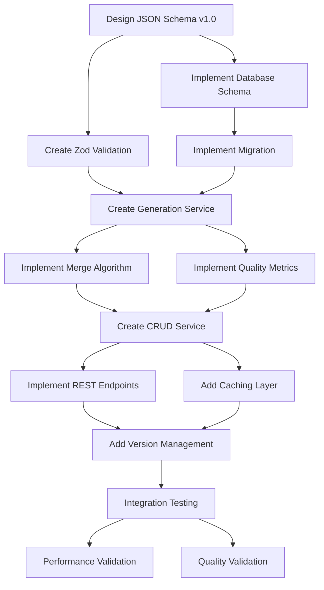

# Brand Voice JSON - Execution Plan

**Versão:** 1.0  
**Data:** Setembro 2025  
**Status:** 📅 Pronto para execução por agente  
**Agent Responsável:** Backend_Developer

---

## 🎯 Feature Scope

### Fonte
Baseado em @docs/README.md (Fase 1 - Cérebro da Marca) e @docs/features/F03_BRAND_VOICE_JSON.md

### Critérios de Aceitação
1. **Schema v1.0:** Implementar JSON schema completo com validação Zod runtime
2. **Generation Engine:** Merge inteligente de dados da Anamnese + Onboarding
3. **Quality Metrics:** Sistema de scoring para completeness, consistency, specificity
4. **Versioning System:** Controle de versões com migration automática
5. **API Integration:** Endpoints para CRUD e consumption por módulos de IA

### Contexto de Negócio & Valor
- **Fonte Única da Verdade:** Artefato central consumido por todos módulos de IA
- **Consistência:** Garantir que todo conteúdo gerado seja consistente com identidade definida
- **Flexibilidade:** Schema evolutivo que suporta crescimento da plataforma

### [⚠️ DOCUMENTAÇÃO PENDENTE]
- Estratégia de backup e disaster recovery para Brand Voice data
- Processo de validação manual quando quality score baixo
- Integração com future AI models além do OpenAI

---

## 📎 Premissas, Restrições & Políticas

### Tecnologias Obrigatórias
- **Backend:** Node.js + Express + TypeScript (strict mode)
- **Database:** Supabase PostgreSQL + Drizzle ORM
- **Validation:** Zod para runtime schema validation
- **Versioning:** Semantic versioning com migration functions
- **Storage:** JSONB fields para flexibility + indexed fields para queries

### Padrões de Arquitetura
- **Schema-First:** JSON Schema como source of truth
- **Immutable Versions:** Cada update cria nova versão, preserva histórico
- **Quality Gates:** Automatic validation antes de ativar versão
- **Cache Strategy:** In-memory cache para Brand Voice ativo

### Limites de Performance
- **Generation Time:** < 2s para merge de dados Anamnese + Onboarding
- **API Response:** < 100ms para retrieval de Brand Voice ativo
- **Quality Calculation:** < 500ms para metrics computation
- **Cache Hit Rate:** > 90% para Brand Voice retrieval

### Compliance & Políticas
- **Data Integrity:** Brand Voice changes devem ser auditáveis
- **Version Control:** Rollback capability para versões anteriores
- **Quality Assurance:** Minimum quality score antes de activation
- **Access Control:** RLS para isolamento entre accounts

---

## 🔌 Contratos & Interfaces (Data & API)

### APIs REST

#### POST /api/brand-voice/generate
**Request Body:**
```json
{
  "anamnesisAnalysisId": "uuid?", // opcional
  "onboardingSessionId": "uuid?", // opcional
  "manualOverrides": {
    "brand": { /* partial BrandSection */ },
    "voice": { /* partial VoiceSection */ },
    "visual": { /* partial VisualSection */ }
  }
}
```

**Response (201):**
```json
{
  "success": true,
  "data": {
    "id": "uuid",
    "version": "1.0",
    "brandVoiceJson": { /* complete BrandVoice schema */ },
    "qualityMetrics": {
      "completeness_score": 0.85,
      "consistency_score": 0.92,
      "specificity_score": 0.78,
      "usability_score": 0.88
    },
    "status": "active|draft",
    "createdAt": "ISO8601"
  }
}
```

#### GET /api/brand-voice/active
**Response (200):**
```json
{
  "success": true,
  "data": {
    "brandVoice": { /* complete BrandVoice v1.0 */ },
    "metadata": {
      "version": "1.0",
      "lastUpdated": "ISO8601",
      "qualityScore": 0.85
    }
  }
}
```

#### PUT /api/brand-voice/:id/activate
**Response (200):**
```json
{
  "success": true,
  "data": {
    "id": "uuid",
    "version": "string",
    "activated": true,
    "previousVersion": "string?"
  }
}
```

### Brand Voice JSON Schema v1.0

**Complete Schema (Zod):**
```typescript
const BrandVoiceSchema = z.object({
  $schema: z.literal("https://digitalwoof.com/schemas/brand-voice/v1.0.json"),
  version: z.literal("1.0"),
  brand: z.object({
    name: z.string().min(1).max(100),
    segment: z.enum(["veterinaria", "petshop", "banho_tosa", "hotel_pet", "agropet"]),
    businessType: z.enum(["clinica", "comercio", "servico", "misto"]),
    mission: z.string().max(200).optional(),
    values: z.array(z.object({
      name: z.string().min(1).max(50),
      description: z.string().max(100).optional(),
      weight: z.number().min(0).max(1)
    })).max(5),
    targetAudience: z.object({
      primary: z.string().min(1).max(200),
      personas: z.array(z.string()).max(10),
      painPoints: z.array(z.string()).max(10),
      goals: z.array(z.string()).max(10)
    })
  }),
  visual: z.object({
    logoUrl: z.string().url(),
    palette: z.object({
      primary: z.string().regex(/^#[0-9A-F]{6}$/i),
      secondary: z.array(z.string().regex(/^#[0-9A-F]{6}$/i)).max(5),
      accent: z.string().regex(/^#[0-9A-F]{6}$/i).optional(),
      neutral: z.array(z.string().regex(/^#[0-9A-F]{6}$/i)).max(3)
    }),
    typography: z.object({
      primary: z.string(),
      style: z.enum(["clean", "elegant", "playful", "professional"])
    }),
    imagery: z.object({
      style: z.enum(["photography", "illustration", "mixed"]),
      mood: z.enum(["warm", "professional", "playful", "trustworthy"]),
      avoid: z.array(z.string()).max(10)
    })
  }),
  voice: z.object({
    tone: z.object({
      confiança: z.number().min(0).max(1),
      acolhimento: z.number().min(0).max(1),
      humor: z.number().min(0).max(1),
      especialização: z.number().min(0).max(1),
      urgência: z.number().min(0).max(1).optional(),
      formalidade: z.number().min(0).max(1).optional()
    }),
    persona: z.object({
      description: z.string().min(10).max(500),
      characteristics: z.array(z.string()).min(1).max(10),
      communication_style: z.enum(["conversational", "professional", "friendly", "authoritative"])
    }),
    lexicon: z.object({
      prefer: z.array(z.string()).max(20),
      avoid: z.array(z.string()).max(15),
      banned: z.array(z.string()).max(10),
      industry_specific: z.object({
        medical_terms: z.enum(["simplified", "technical", "mixed"]),
        pet_terminology: z.array(z.string()).max(10)
      })
    }),
    style: z.object({
      sentence_length: z.enum(["short", "medium", "long", "mixed"]),
      paragraph_style: z.enum(["short", "scannable", "detailed"]),
      use_questions: z.boolean(),
      use_exclamations: z.boolean(),
      use_emojis: z.enum(["none", "minimal", "moderate", "frequent"]),
      cta_style: z.object({
        preferred: z.array(z.string()).max(5),
        urgency_level: z.enum(["low", "medium", "high"]),
        personalization: z.enum(["generic", "personalized"])
      }),
      formatting: z.object({
        use_lists: z.boolean(),
        use_bold: z.enum(["minimal", "moderate", "frequent"]),
        use_italics: z.boolean(),
        use_quotes: z.boolean()
      })
    })
  }),
  compliance: z.object({
    regulatory: z.object({
      medical_claims: z.enum(["strict", "moderate", "flexible"]),
      veterinary_advice: z.enum(["required_disclaimer", "optional_disclaimer", "none"]),
      medication_mentions: z.enum(["prohibited", "with_disclaimer", "allowed"])
    }),
    content_policies: z.object({
      claims_policy: z.string().min(10).max(500),
      disclaimer_required: z.boolean(),
      default_disclaimer: z.string().min(10).max(200),
      review_triggers: z.array(z.string()).max(20)
    }),
    legal: z.object({
      lgpd_compliance: z.boolean(),
      copyright_policy: z.string().min(10).max(300),
      user_generated_content: z.enum(["allowed", "moderated", "prohibited"])
    })
  }),
  channels: z.object({
    social_media: z.object({
      instagram: z.object({
        tone_adjustment: z.number().min(-0.5).max(0.5),
        hashtag_strategy: z.enum(["minimal", "moderate", "extensive"]),
        story_style: z.enum(["casual", "branded", "educational"])
      }),
      facebook: z.object({
        tone_adjustment: z.number().min(-0.5).max(0.5),
        post_length: z.enum(["short", "medium", "long"]),
        engagement_style: z.enum(["conversational", "informational"])
      }),
      whatsapp: z.object({
        formality_level: z.enum(["casual", "semi-formal", "formal"]),
        response_style: z.enum(["quick", "detailed", "personalized"])
      })
    }),
    content_types: z.object({
      educational: z.object({
        depth_level: z.enum(["basic", "intermediate", "advanced"]),
        use_examples: z.boolean(),
        include_sources: z.boolean()
      }),
      promotional: z.object({
        sales_approach: z.enum(["soft", "direct", "consultative"]),
        urgency_tactics: z.enum(["none", "minimal", "moderate"]),
        social_proof: z.enum(["testimonials", "statistics", "both"])
      }),
      customer_service: z.object({
        response_tone: z.enum(["helpful", "professional", "friendly"]),
        problem_solving: z.enum(["step_by_step", "direct", "consultative"])
      })
    })
  }),
  metadata: z.object({
    created_at: z.string().datetime(),
    updated_at: z.string().datetime(),
    version_history: z.array(z.object({
      version: z.string(),
      date: z.string().datetime(),
      changes: z.string(),
      created_by: z.string() // user_id or "system"
    })).max(50),
    source: z.object({
      anamnesis_analysis_id: z.string().uuid().optional(),
      onboarding_session_id: z.string().uuid().optional(),
      manual_override: z.boolean()
    }),
    quality_metrics: z.object({
      completeness_score: z.number().min(0).max(1),
      consistency_score: z.number().min(0).max(1),
      specificity_score: z.number().min(0).max(1),
      usability_score: z.number().min(0).max(1),
      last_validated: z.string().datetime()
    })
  })
});

type BrandVoice = z.infer<typeof BrandVoiceSchema>;
```

### Database Schema (Drizzle)
```typescript
export const brandVoice = pgTable('brand_voice', {
  id: uuid('id').primaryKey().defaultRandom(),
  userId: uuid('user_id').references(() => users.id).notNull(),
  accountId: uuid('account_id').references(() => accounts.id).notNull(),
  
  // Core JSON
  brandVoiceJson: jsonb('brand_voice_json').$type<BrandVoice>().notNull(),
  
  // Indexed fields for queries
  version: varchar('version', { length: 10 }).notNull(),
  brandName: varchar('brand_name', { length: 100 }).notNull(),
  segment: varchar('segment', { length: 20 }).notNull(),
  
  // Quality metrics
  completenessScore: decimal('completeness_score', { precision: 3, scale: 2 }),
  consistencyScore: decimal('consistency_score', { precision: 3, scale: 2 }),
  specificityScore: decimal('specificity_score', { precision: 3, scale: 2 }),
  usabilityScore: decimal('usability_score', { precision: 3, scale: 2 }),
  
  // Status and lifecycle
  status: varchar('status', { length: 20 }).$type<'draft' | 'active' | 'deprecated'>().notNull(),
  isActive: boolean('is_active').default(false),
  
  // Source tracking
  anamnesisAnalysisId: uuid('anamnesis_analysis_id').references(() => anamnesisAnalysis.id),
  onboardingSessionId: uuid('onboarding_session_id').references(() => brandOnboarding.id),
  
  // Metadata
  createdAt: timestamp('created_at').defaultNow().notNull(),
  updatedAt: timestamp('updated_at').defaultNow().notNull(),
  activatedAt: timestamp('activated_at'),
  
  // Constraints
}, (table) => ({
  oneActivePerUser: unique().on(table.userId, table.isActive).where(sql`${table.isActive} = true`),
  brandNameIdx: index('brand_voice_brand_name_idx').on(table.brandName),
  segmentIdx: index('brand_voice_segment_idx').on(table.segment),
  qualityIdx: index('brand_voice_quality_idx').on(table.completenessScore),
  activeIdx: index('brand_voice_active_idx').on(table.userId, table.isActive)
}));
```

### Config & Environment Variables
```bash
# Brand Voice settings
BRAND_VOICE_MIN_QUALITY_SCORE=0.7
BRAND_VOICE_CACHE_TTL_SECONDS=300
BRAND_VOICE_MAX_VERSIONS_PER_USER=10
BRAND_VOICE_SCHEMA_URL=https://digitalwoof.com/schemas/brand-voice/v1.0.json

# Quality calculation weights
QUALITY_WEIGHT_COMPLETENESS=0.4
QUALITY_WEIGHT_CONSISTENCY=0.3
QUALITY_WEIGHT_SPECIFICITY=0.2
QUALITY_WEIGHT_USABILITY=0.1
```

---

## 📦 Artefatos a Entregar

### Código Backend (server/)
- `services/brand-voice-generator.service.ts` - Core generation logic
- `services/brand-voice-quality.service.ts` - Quality metrics calculation
- `services/brand-voice.service.ts` - CRUD operations
- `routes/brand-voice.ts` - REST endpoints
- `utils/brand-voice-merger.ts` - Merge algorithm for multiple sources
- `utils/brand-voice-cache.ts` - Caching strategy implementation

### Shared Types & Validation
- `shared/schemas/brand-voice.ts` - Zod schema v1.0
- `shared/types/brand-voice.ts` - TypeScript interfaces
- `shared/utils/brand-voice-validator.ts` - Runtime validation utilities

### Migration & Database
- `server/migrations/003_brand_voice.sql` - Brand Voice table
- Update `shared/schema.ts` with brand_voice table

### Configuration & Templates
- `server/config/brand-voice-defaults.json` - Default values por segment
- `server/templates/prompt-templates.ts` - Templates para IA integration
- `server/fixtures/brand-voice-samples.json` - Samples para testing

### Testing
- `server/tests/unit/brand-voice-generator.test.ts` - Generation logic
- `server/tests/unit/brand-voice-quality.test.ts` - Quality metrics
- `server/tests/integration/brand-voice.api.test.ts` - API endpoints
- `server/tests/fixtures/brand-voice-test-data.json` - Test fixtures

---

## 🤖 Orquestração de Agentes

### Responsible Agent
**Backend_Developer** - Conforme @agents/Backend_Developer.md

### Collaborator Agents
- **Database_Admin:** Schema optimization, indexing strategy, query performance
- **QA_Engineer:** Quality metrics validation, schema testing, API validation
- **Tech_Lead:** Schema versioning strategy, migration planning

### Permissões de Ferramentas
- **Backend_Developer:** Full access a services/, schemas/, APIs
- **Database_Admin:** Schema design approval, index optimization
- **QA_Engineer:** Test implementation, quality validation
- **Tech_Lead:** Architectural decisions, versioning policies

### Handoffs & Protocolos

#### Backend_Developer → Database_Admin
```json
{
  "trigger": "brand_voice_schema_design_complete",
  "payload": {
    "table_design": "brand_voice with JSONB + indexed fields",
    "indexes_needed": ["user_id + is_active", "brand_name", "segment", "quality_scores"],
    "constraints": ["one_active_per_user", "quality_score_range"],
    "queries": ["findActiveByUser", "findByQualityScore", "listVersionHistory"]
  },
  "required_approval": true
}
```

#### Database_Admin → Backend_Developer
```json
{
  "trigger": "brand_voice_schema_approved",
  "payload": {
    "migration_file": "003_brand_voice.sql",
    "optimizations": ["partial_unique_index", "jsonb_gin_indexes"],
    "performance_notes": "JSONB queries optimized with GIN indexes"
  }
}
```

#### Backend_Developer → QA_Engineer
```json
{
  "trigger": "brand_voice_generation_complete",
  "payload": {
    "generation_logic": "merge_anamnesis_onboarding",
    "quality_metrics": ["completeness", "consistency", "specificity", "usability"],
    "test_scenarios": ["merge_scenarios", "quality_calculation", "version_migration"]
  }
}
```

#### Rollback Criteria
- Quality metrics calculation failure → revert to previous algorithm
- Schema migration failure → rollback database changes
- Brand Voice generation errors > 10% → investigate merge logic
- Performance degradation > 2s generation time → optimize algorithms

---

## 🗺️ Task Graph (Visão de Dependências)

### Hierarquia de Tarefas
1. **Schema Foundation**
   - JSON schema v1.0 design
   - Database schema implementation
   - Migration setup
2. **Core Generation**
   - Merge algorithm implementation
   - Quality metrics calculation
   - Default values system
3. **API Layer**
   - CRUD endpoints
   - Validation middleware
   - Cache implementation
4. **Quality & Versioning**
   - Version management
   - Quality gates
   - Migration system
5. **Integration & Testing**
   - Integration tests
   - Performance validation
   - Quality validation

### Dependencies Graph


---

## 📋 Task Breakdown (Detalhamento Executável)

### [ ] Implementar JSON Schema v1.0 Completo
- **Responsible Agent:** Backend_Developer
- **Purpose:** Definir estrutura completa do Brand Voice JSON com validação runtime
- **Inputs:** Especificação F03_BRAND_VOICE_JSON.md, requirements de features futuras
- **Outputs:**
  - `shared/schemas/brand-voice.ts` - Zod schema completo
  - `shared/types/brand-voice.ts` - TypeScript interfaces
  - JSON Schema file para external validation
- **Tools & Stack:** Zod, TypeScript, JSON Schema draft-07
- **Dependencies:** Nenhuma (tarefa foundation)
- **Acceptance Checks:**
  - Schema valida todos campos obrigatórios e opcionais
  - Type safety completa entre runtime e compile-time
  - Validation errors específicas e actionable
  - JSON Schema published em URL pública
  - Backward compatibility plan documentado
- **Observability:** Schema validation metrics, error categorization
- **Security Notes:** Input sanitization, content length limits
- **Effort Unit:** 5 story points
- **Baseado em:** @docs/features/F03_BRAND_VOICE_JSON.md seção "Schema Completo v1.0"

### [ ] Implementar Database Schema e Migration
- **Responsible Agent:** Database_Admin
- **Purpose:** Estrutura otimizada para armazenar Brand Voice com queries eficientes
- **Inputs:** JSON schema requirements, query patterns esperados
- **Outputs:**
  - `server/migrations/003_brand_voice.sql`
  - `shared/schema.ts` atualizado com brand_voice table
  - Index strategy documentada
- **Tools & Stack:** Drizzle ORM, PostgreSQL, Supabase
- **Dependencies:** JSON Schema design
- **Acceptance Checks:**
  - JSONB field para schema completo
  - Indexed fields para queries comuns (userId, brandName, segment)
  - Unique constraint para one active per user
  - Quality score indexes para filtering
  - Migration executa sem erros
- **Observability:** Query performance metrics, index usage stats
- **Security Notes:** RLS policies, user isolation
- **Effort Unit:** 3 story points
- **Baseado em:** @docs/features/F03_BRAND_VOICE_JSON.md seção "Armazenamento e Cache"

### [ ] Implementar Brand Voice Generator Core
- **Responsible Agent:** Backend_Developer
- **Purpose:** Engine central que merge dados de múltiplas fontes em Brand Voice
- **Inputs:** Anamnesis data, Onboarding data, manual overrides
- **Outputs:**
  - `services/brand-voice-generator.service.ts`
  - `utils/brand-voice-merger.ts` - merge algorithms
- **Tools & Stack:** TypeScript, merge algorithms, default value system
- **Dependencies:** JSON Schema, Database schema
- **Acceptance Checks:**
  - Merge prioriza user input > anamnesis > defaults
  - Weighted average para valores numéricos conflitantes
  - Default values apropriados por segment
  - Validation de consistency durante merge
  - Generation time < 2s
- **Observability:** Generation metrics, merge decision logs
- **Security Notes:** Input validation, sanitization de merged data
- **Effort Unit:** 6 story points
- **Baseado em:** @docs/features/F03_BRAND_VOICE_JSON.md seção "Geração e Atualização"

### [ ] Implementar Quality Metrics Calculator
- **Responsible Agent:** Backend_Developer
- **Purpose:** Sistema de scoring para completeness, consistency, specificity, usability
- **Inputs:** Complete Brand Voice JSON
- **Outputs:**
  - `services/brand-voice-quality.service.ts`
  - Quality scoring algorithms
- **Tools & Stack:** Statistical analysis, weighted scoring
- **Dependencies:** Brand Voice Generator
- **Acceptance Checks:**
  - Completeness: % campos preenchidos vs opcionais
  - Consistency: contradições internas (tone vs lexicon)
  - Specificity: genericidade vs specific to business
  - Usability: adequação para content generation
  - Calculation time < 500ms
- **Observability:** Quality score distributions, improvement tracking
- **Security Notes:** Metrics não expõem dados sensíveis
- **Effort Unit:** 4 story points
- **Baseado em:** @docs/features/F03_BRAND_VOICE_JSON.md seção "Validação e Qualidade"

### [ ] Implementar CRUD Service para Brand Voice
- **Responsible Agent:** Backend_Developer
- **Purpose:** Service layer para operações de Brand Voice com cache
- **Inputs:** Brand Voice data, user context, version requirements
- **Outputs:**
  - `services/brand-voice.service.ts`
  - `utils/brand-voice-cache.ts` - caching strategy
- **Tools & Stack:** Drizzle ORM, in-memory cache, TTL management
- **Dependencies:** Database schema, Quality calculator
- **Acceptance Checks:**
  - Create: nova Brand Voice com quality validation
  - Read: cache-first retrieval < 100ms
  - Update: versioning automático, preserva histórico
  - Activate: only one active per user, deactivates previous
  - List: version history com metadata
- **Observability:** Cache hit rates, operation latencies
- **Security Notes:** User isolation, version access control
- **Effort Unit:** 5 story points
- **Baseado em:** @docs/features/F03_BRAND_VOICE_JSON.md seção "Armazenamento e Cache"

### [ ] Implementar REST API Endpoints
- **Responsible Agent:** Backend_Developer
- **Purpose:** APIs RESTful para Brand Voice operations
- **Inputs:** HTTP requests com validation
- **Outputs:**
  - `routes/brand-voice.ts` - endpoint handlers
  - Middleware para validation e auth
- **Tools & Stack:** Express.js, Zod validation, JWT auth
- **Dependencies:** CRUD Service, Quality calculator
- **Acceptance Checks:**
  - POST /api/brand-voice/generate - gera nova Brand Voice
  - GET /api/brand-voice/active - retrieval otimizada
  - PUT /api/brand-voice/:id/activate - version activation
  - GET /api/brand-voice/history - version listing
  - Validation errors específicas e actionable
- **Observability:** API metrics, endpoint performance
- **Security Notes:** JWT validation, rate limiting, input sanitization
- **Effort Unit:** 4 story points
- **Baseado em:** @docs/features/F03_BRAND_VOICE_JSON.md seção "Uso por Módulos de IA"

### [ ] Implementar Version Management System
- **Responsible Agent:** Backend_Developer
- **Purpose:** Controle de versões com migration automática entre schemas
- **Inputs:** Schema changes, migration requirements
- **Outputs:**
  - `utils/brand-voice-versioning.ts`
  - Migration functions para schema evolution
- **Tools & Stack:** Semantic versioning, migration functions
- **Dependencies:** CRUD Service, JSON Schema
- **Acceptance Checks:**
  - Automatic version detection e migration
  - Backward compatibility preservation
  - Migration rollback capability
  - Version history tracking
  - Migration performance < 1s per Brand Voice
- **Observability:** Migration success rates, version distribution
- **Security Notes:** Migration integrity, rollback safety
- **Effort Unit:** 4 story points
- **Baseado em:** @docs/features/F03_BRAND_VOICE_JSON.md seção "Versionamento e Evolução"

### [ ] Implementar Default Values System
- **Responsible Agent:** Backend_Developer
- **Purpose:** Sistema de valores padrão inteligentes por segment/industry
- **Inputs:** Business segment, industry best practices
- **Outputs:**
  - `config/brand-voice-defaults.json`
  - Default value application logic
- **Tools & Stack:** JSON configuration, fallback logic
- **Dependencies:** Brand Voice Generator
- **Acceptance Checks:**
  - Defaults específicos por segment (veterinaria, petshop, etc.)
  - Compliance defaults apropriados
  - Lexicon defaults do setor pet
  - Override graceful por user input
  - Quality defaults que garantem usability
- **Observability:** Default usage statistics, override patterns
- **Security Notes:** Defaults não introduzem vulnerabilities
- **Effort Unit:** 3 story points
- **Baseado em:** @docs/features/F03_BRAND_VOICE_JSON.md seção "Algoritmo de Merge"

### [ ] Implementar Cache Strategy
- **Responsible Agent:** Backend_Developer
- **Purpose:** Caching inteligente para performance de retrieval
- **Inputs:** Brand Voice queries, cache invalidation events
- **Outputs:**
  - `utils/brand-voice-cache.ts`
  - Cache invalidation logic
- **Tools & Stack:** In-memory Map, TTL management, event-driven invalidation
- **Dependencies:** CRUD Service
- **Acceptance Checks:**
  - Cache TTL de 5 minutos para Brand Voice ativo
  - Invalidation automática em updates
  - Cache hit rate > 90%
  - Memory usage monitoring
  - Graceful fallback se cache fails
- **Observability:** Cache metrics, hit/miss rates, memory usage
- **Security Notes:** Cache isolation entre users
- **Effort Unit:** 3 story points
- **Baseado em:** @docs/features/F03_BRAND_VOICE_JSON.md seção "Caching Strategy"

### [ ] Implementar Integration com Content Generation
- **Responsible Agent:** Backend_Developer
- **Purpose:** Templates e utilities para consumo por módulos de IA
- **Inputs:** Brand Voice JSON, content generation context
- **Outputs:**
  - `templates/prompt-templates.ts`
  - `utils/brand-voice-prompt-builder.ts`
- **Tools & Stack:** Template strings, dynamic prompt generation
- **Dependencies:** Brand Voice CRUD, Quality system
- **Acceptance Checks:**
  - Prompt templates para different content types
  - Dynamic tone description generation
  - Compliance checking integration
  - Context-aware prompt building
  - Template performance < 50ms
- **Observability:** Template usage metrics, prompt effectiveness
- **Security Notes:** Template injection prevention
- **Effort Unit:** 4 story points
- **Baseado em:** @docs/features/F03_BRAND_VOICE_JSON.md seção "Uso por Módulos de IA"

### [ ] Implementar Unit Tests
- **Responsible Agent:** QA_Engineer
- **Purpose:** Validar comportamento isolado de generator, quality, versioning
- **Inputs:** Service functions, test scenarios, mock data
- **Outputs:**
  - `tests/unit/brand-voice-generator.test.ts`
  - `tests/unit/brand-voice-quality.test.ts`
  - `tests/fixtures/brand-voice-test-data.json`
- **Tools & Stack:** Jest, TypeScript, mock data generation
- **Dependencies:** All services implemented
- **Acceptance Checks:**
  - Generator merge scenarios testados
  - Quality metrics calculation validated
  - Schema validation edge cases
  - Version migration tested
  - Error conditions covered
- **Observability:** Test coverage metrics, test execution time
- **Security Notes:** Test data não contém dados sensíveis
- **Effort Unit:** 5 story points
- **Baseado em:** @docs/features/F03_BRAND_VOICE_JSON.md seção "Testes"

### [ ] Implementar Integration Tests
- **Responsible Agent:** QA_Engineer
- **Purpose:** Validar fluxo completo de generation e consumption
- **Inputs:** API endpoints, database, test scenarios
- **Outputs:**
  - `tests/integration/brand-voice.api.test.ts`
  - End-to-end generation flow tests
- **Tools & Stack:** Jest, Supertest, test database
- **Dependencies:** Complete API implementation
- **Acceptance Checks:**
  - Generation flow: anamnesis + onboarding → Brand Voice
  - API contract validation
  - Database persistence tested
  - Cache behavior validated
  - Performance targets met
- **Observability:** Integration test metrics, API performance
- **Security Notes:** Test isolation, data cleanup
- **Effort Unit:** 4 story points
- **Baseado em:** @docs/features/F03_BRAND_VOICE_JSON.md seção "Integration Tests"

---

## ✅ Success Metrics (do Plano)

### Métricas Quantificáveis
- **Generation Performance:** < 2s para merge completo de anamnesis + onboarding
- **API Response Time:** < 100ms para retrieval de Brand Voice ativo
- **Quality Calculation:** < 500ms para computation de todos metrics
- **Cache Hit Rate:** > 90% para Brand Voice retrieval
- **Schema Compliance:** 100% dos Brand Voice gerados válidos com schema
- **Migration Success:** 100% das migrations executadas sem data loss

### Validação Automatizada
- **Zod Schema Validation:** 100% runtime compliance
- **Quality Metrics:** Scoring algorithm consistency > 95%
- **API Contract Tests:** Response schemas validados automaticamente
- **Performance Tests:** Generation e retrieval dentro de SLI targets
- **Security Tests:** Input validation e access control funcionando

---

## 🔍 Estratégia de Validação & Qualidade

### Testes
- **Unit Tests:** Generator, quality calculator, versioning logic
- **Integration Tests:** API endpoints, database operations, cache behavior
- **Contract Tests:** Schema validation, API request/response
- **Performance Tests:** Generation time, retrieval latency, cache performance
- **Security Tests:** Input validation, access control, data isolation

### Gates de Qualidade
- **Schema Validation:** Zod runtime validation obrigatória
- **Quality Thresholds:** Minimum quality score antes de activation
- **Performance Gates:** SLI targets enforcement
- **Code Quality:** TypeScript strict, ESLint compliance
- **Test Coverage:** Critical paths 100% covered

---

## 🔒 Segurança, Privacidade & Compliance

### Ameaças (Modelo Resumido)
- **Data Injection:** Malicious data via anamnesis ou onboarding
- **Schema Poisoning:** Invalid data corrupting Brand Voice generation
- **Access Control Bypass:** Users accessing other users' Brand Voice
- **Cache Poisoning:** Corrupted cache affecting multiple users

### Controles (OWASP ASVS)
- **Input Validation:** Zod schema validation para todos inputs
- **Access Control:** RLS policies, JWT validation
- **Data Integrity:** Schema validation, quality gates
- **Audit Logging:** Version changes, access patterns
- **Cache Security:** User isolation, TTL enforcement

### Política de Dados Pessoais
- **Collection:** Brand Voice data pertence ao usuário
- **Retention:** Mantido enquanto conta ativa
- **Access:** Apenas owner e authorized modules
- **Deletion:** Cascade delete ao remover conta

### Rota de Incidentes
1. **Schema Violation:** Quarantine invalid Brand Voice, investigate source
2. **Quality Degradation:** Automatic rollback to previous version
3. **Performance Issue:** Cache invalidation, performance analysis
4. **Security Breach:** Access audit, user notification if needed

---

## 📈 Telemetria & Operação

### Logs
- **Generation Events:** brand_voice.generated, quality.calculated, version.activated
- **Quality Events:** quality.threshold_failed, consistency.warning
- **Performance Events:** generation.slow, cache.miss, api.timeout
- **Campos:** userId, brandVoiceId, version, qualityScore, processingTime

### Métricas
- **Business:** Brand Voice generation rate, quality score distribution
- **Performance:** Generation time, API latency, cache hit rate
- **Quality:** Quality score trends, validation failure rate
- **Usage:** API endpoint usage, most used features

### Alertas & SLOs
- **Critical:** Generation time > 5s, quality score < 0.5, API errors > 5%
- **Warning:** Cache hit rate < 80%, quality degradation trend
- **SLO Targets:** 99.5% generation success, < 2s processing time

### Runbooks
#### Quality Score Degradation
1. Check input data quality from anamnesis/onboarding
2. Review quality calculation algorithm
3. Analyze user feedback patterns
4. Adjust quality thresholds if needed

#### Performance Degradation
1. Check database query performance
2. Verify cache hit rates and TTL
3. Analyze generation algorithm complexity
4. Scale processing resources if needed

---

## 🧭 Alternativas Técnicas & Decisões

### Storage: JSONB vs Structured Tables
- **Considerado:** Full normalization, JSONB hybrid, pure JSON
- **Decisão:** JSONB hybrid com indexed fields
- **Prós:** Schema flexibility + query performance
- **Contras:** Complex migrations para schema changes
- **Critério de Reversão:** Query performance consistently poor

### Quality Calculation: Real-time vs Batch
- **Considerado:** Calculate on demand, pre-calculated, cached
- **Decisão:** Real-time calculation com caching
- **Prós:** Always current, simple architecture
- **Contras:** Computational overhead
- **Critério de Reversão:** Calculation time consistently > 1s

### Versioning: Immutable vs Mutable
- **Considerado:** Overwrite existing, immutable versions, hybrid
- **Decisão:** Immutable versions com activation status
- **Prós:** Complete audit trail, rollback capability
- **Contras:** Storage overhead
- **Critério de Reversão:** Storage costs become prohibitive

---

## ⚠️ Riscos & Unknowns

### Riscos Priorizados

#### Alto Impacto / Alta Probabilidade
- **Schema Evolution Complexity:** Future changes breaking existing Brand Voice
  - **Mitigação:** Robust migration system, backward compatibility testing
  - **Contingência:** Manual migration tools, rollback procedures

#### Alto Impacto / Média Probabilidade
- **Quality Metrics Accuracy:** Algorithm não reflecting real usefulness
  - **Mitigação:** User feedback integration, A/B testing quality algorithms
  - **Contingência:** Manual quality review process

#### Médio Impacto / Média Probabilidade
- **Performance at Scale:** Generation time degrading com volume
  - **Mitigação:** Performance monitoring, algorithm optimization
  - **Contingência:** Background processing, queue system

### [⚠️ PERGUNTAS ABERTAS]
- **AI Model Integration:** Como integrar com future models além OpenAI?
- **Quality Validation:** Como automatizar validation de quality metrics accuracy?
- **Schema Evolution:** Quantas versions antigas manter ativas?
- **Multi-tenant Performance:** Como otimizar para large number of users?

---

## 🔗 Dependências Entre Planos

### Planos Requeridos
- **Anamnese_Digital_Plan.md:** Fornece dados de análise para merge
  - **Interface:** AnamnesisAnalysis.findings → BrandVoice.source.anamnesis_analysis_id
  - **Contrato:** Findings devem estar estruturados para Brand Voice generation

- **Onboarding_Marca_Plan.md:** Fornece configuração manual do usuário
  - **Interface:** OnboardingResult → BrandVoice.source.onboarding_session_id
  - **Contrato:** Complete onboarding data para generation bem-sucedida

### Planos Afetados
- **Manual_Marca_Digital_Plan.md:** Consome Brand Voice para visualização
  - **Interface:** BrandVoice JSON → Manual visual rendering
  - **Contrato:** Brand Voice deve ter todos campos necessários para display

- **Biblioteca_Campanhas_Plan.md:** Usa Brand Voice para personalização de templates
  - **Interface:** BrandVoice.voice + BrandVoice.visual → Template customization
  - **Contrato:** Voice e Visual sections completas para template generation

- **Geracao_Conteudo_IA_Plan.md:** Consome Brand Voice para prompt building
  - **Interface:** Complete Brand Voice → AI prompts
  - **Contrato:** All sections populated para effective content generation

---

## 🧾 Versionamento, Branching & PRs

### Convenções
- **Branch:** `feature/F03-brand-voice-json`
- **Commits:** `feat(F03): implement Brand Voice JSON generation`
- **PR Title:** `F03: Implement Brand Voice JSON - Core System`

### Template de PR
```markdown
## F03: Brand Voice JSON Implementation

### Checklist de Prontidão para Execução por Agente
- [ ] JSON Schema v1.0 completo com Zod validation
- [ ] Database schema com JSONB + indexed fields
- [ ] Brand Voice generator com merge algorithm
- [ ] Quality metrics calculator implementado
- [ ] CRUD service com caching strategy
- [ ] REST APIs com validation completa
- [ ] Version management system funcionando
- [ ] Default values por segment
- [ ] Integration com prompt templates
- [ ] Unit e integration tests completos

### Performance Impact
- [ ] Generation time < 2s
- [ ] API response time < 100ms
- [ ] Quality calculation < 500ms
- [ ] Cache hit rate > 90%

### Quality Validation
- [ ] Schema compliance 100%
- [ ] Quality metrics accuracy validated
- [ ] Migration system tested
```

---

## ✅ Checklist de Prontidão para Execução por Agente

### Autonomia do Agente
- [x] **Backend_Developer** está definido em @agents/Backend_Developer.md
- [x] Todos algorithms e services têm specifications claras
- [x] Merge logic e quality calculations detalhadamente especificados
- [x] Integration points com other plans claramente definidos

### Inputs/Outputs Especificados
- [x] JSON Schema v1.0 completamente especificado com Zod
- [x] Database schema com fields e indexes detalhados
- [x] API contracts com request/response schemas
- [x] Quality metrics algorithms com formulas específicas

### Critérios de Aceitação Testáveis
- [x] Performance targets quantificáveis (< 2s generation, < 100ms API)
- [x] Quality metrics algorithmically verifiable
- [x] Schema compliance automaticamente testável
- [x] Cache performance measurable com specific targets

### Segurança/Observabilidade Acionáveis
- [x] Input validation com Zod schemas específicos
- [x] Access control com RLS policies claras
- [x] Logging events com structured fields definidos
- [x] Monitoring com SLI targets e alerting thresholds

---

*Gerado conforme @.github/prompts/plan_geral.prompt.md - Baseado em @docs/features/F03_BRAND_VOICE_JSON.md*