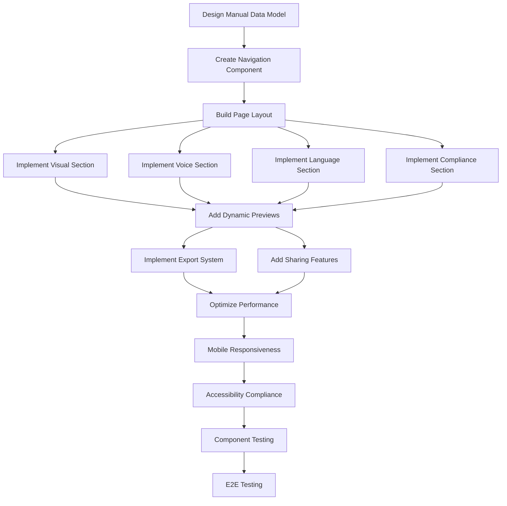

# Manual de Marca Digital - Execution Plan

**Versão:** 1.0  
**Data:** Setembro 2025  
**Status:** 📅 Pronto para execução por agente  
**Agent Responsável:** Frontend_Developer

---

## 🎯 Feature Scope

### Fonte
Baseado em @docs/README.md (Fase 1 - Cérebro da Marca) e @docs/features/F04_MANUAL_MARCA_DIGITAL.md

### Critérios de Aceitação
1. **Interface Visual:** Dashboard navegável que apresenta Brand Voice JSON de forma organizada
2. **Seções Principais:** Visual Identity, Tom de Voz, Linguagem, Compliance com dados dinâmicos
3. **Interatividade:** Elementos dinâmicos, previews, comparações lado-a-lado
4. **Export/Share:** PDF export, links compartilháveis, embed widgets
5. **Responsividade:** Interface funcional em desktop e mobile

### Contexto de Negócio & Valor
- **Fonte Visual Única:** Transformar Brand Voice JSON em documento consultável
- **Team Consistency:** Redução de 50% em inconsistências de marca
- **Adoption Rate:** > 70% dos usuários acessam manual após criar Brand Voice

### [⚠️ DOCUMENTAÇÃO PENDENTE]
- Estratégia de testes para componentes visuais complexos
- Ferramenta específica para PDF generation (Puppeteer vs Playwright)
- Política de cache para assets visuais

---

## 📎 Premissas, Restrições & Políticas

### Tecnologias Obrigatórias
- **Frontend:** React 18 + TypeScript + Tailwind CSS + shadcn/ui
- **Backend:** Node.js + Express para PDF generation e sharing
- **PDF Generation:** [⚠️ DOCUMENTAÇÃO PENDENTE: Tool específica]
- **Charts/Visualizations:** Recharts ou Chart.js para radar charts
- **Export:** Multiple formats (PDF, JSON, branded assets)

### Padrões de Arquitetura
- **Component Structure:** Modular sections (Visual, Voice, Language, Compliance)
- **State Management:** React Query para server state, Zustand para UI state
- **Responsive Design:** Mobile-first approach
- **Accessibility:** WCAG 2.1 AA compliance

### Limites de Performance
- **Carregamento Inicial:** < 3s para manual completo
- **Navegação entre Seções:** < 500ms
- **PDF Generation:** < 10s para manual completo
- **Cache Hit Rate:** > 90% para Brand Voice data

### Compliance & Políticas
- **Access Control:** Manual visibility baseada em sharing settings
- **Data Sync:** Real-time sync com Brand Voice JSON changes
- **Export Control:** Watermark em exports public/team
- **Mobile Support:** Functionality completa em dispositivos móveis

---

## 🔌 Contratos & Interfaces (Data & API)

### APIs REST

#### GET /api/manual-marca/:userId
**Response (200):**
```json
{
  "success": true,
  "data": {
    "manual": {
      "id": "uuid",
      "brandVoiceId": "uuid",
      "brandVoice": { /* complete BrandVoice JSON */ },
      "displayConfig": {
        "theme": "light|dark|brand_colors",
        "layout": "sidebar|tabs|accordion",
        "sectionsVisible": ["visual", "voice", "language", "compliance"],
        "customSections": [/* CustomSection[] */]
      },
      "overrides": {
        "customExamples": { /* section -> examples[] */ },
        "additionalGuidelines": { /* section -> guideline */ },
        "customComplianceRules": [/* ComplianceRule[] */]
      }
    },
    "sharing": {
      "publicUrl": "string?",
      "accessLevel": "private|team|public",
      "embedEnabled": "boolean"
    },
    "metadata": {
      "lastUpdated": "ISO8601",
      "lastViewed": "ISO8601",
      "version": "string"
    }
  }
}
```

#### POST /api/manual-marca/export
**Request Body:**
```json
{
  "format": "pdf|json|brand_kit",
  "sections": ["visual", "voice", "language", "compliance"],
  "options": {
    "includeExamples": "boolean",
    "includeHistory": "boolean",
    "customTemplate": "string?"
  }
}
```

**Response (200):**
```json
{
  "success": true,
  "data": {
    "downloadUrl": "string",
    "format": "string",
    "fileSize": "number",
    "expiresAt": "ISO8601"
  }
}
```

#### PUT /api/manual-marca/:id/sharing
**Request Body:**
```json
{
  "accessLevel": "private|team|public",
  "embedEnabled": "boolean",
  "allowedUsers": ["string"] // userIds
}
```

### Component Interfaces

#### ManualSection Interface
```typescript
interface ManualSectionProps {
  title: string;
  icon: React.ComponentType;
  data: any; // section-specific data
  interactive?: boolean;
  onEdit?: (data: any) => void;
  onExport?: (section: string) => void;
}
```

#### Brand Voice Rendered Interface
```typescript
interface RenderedManual {
  brandVoice: BrandVoice;
  sections: {
    visual: VisualIdentitySection;
    voice: TomDeVozSection;
    language: LanguagemSection;
    compliance: ComplianceSection;
  };
  examples: {
    content_previews: string[];
    comparison_examples: ComparisonExample[];
    channel_adaptations: ChannelExample[];
  };
  quality: {
    completeness_score: number;
    consistency_warnings: string[];
    improvement_suggestions: string[];
  };
}

interface VisualIdentitySection {
  palette: {
    primary: string;
    secondary: string[];
    neutral: string[];
    usage_examples: ColorUsageExample[];
    accessibility: AccessibilityInfo;
  };
  logo: {
    url: string;
    variants: LogoVariant[];
    usage_guidelines: string[];
  };
  typography: {
    primary: string;
    style: string;
    examples: TypographyExample[];
  };
}
```

### Database Schema (Extension)
```typescript
export const manualMarca = pgTable('manual_marca', {
  id: uuid('id').primaryKey().defaultRandom(),
  userId: uuid('user_id').references(() => users.id).notNull(),
  brandVoiceId: uuid('brand_voice_id').references(() => brandVoice.id).notNull(),
  
  // Display configuration
  displayConfig: jsonb('display_config').$type<DisplayConfig>().notNull(),
  
  // Custom content overlays
  overrides: jsonb('overrides').$type<ManualOverrides>(),
  
  // Sharing settings
  sharing: jsonb('sharing').$type<SharingConfig>(),
  
  // Usage tracking
  lastViewed: timestamp('last_viewed'),
  exportHistory: jsonb('export_history').$type<ExportRecord[]>(),
  
  createdAt: timestamp('created_at').defaultNow().notNull(),
  updatedAt: timestamp('updated_at').defaultNow().notNull()
});
```

### Config & Environment Variables
```bash
# Manual de Marca settings
MANUAL_CACHE_TTL_SECONDS=1800 # 30 minutes
PDF_GENERATION_TIMEOUT_MS=30000 # 30 seconds
MAX_EXPORT_SIZE_MB=50
EXPORT_RETENTION_DAYS=7

# Sharing settings
PUBLIC_MANUAL_BASE_URL=https://app.digitalwoof.com/manual
EMBED_ALLOWED_DOMAINS=digitalwoof.com,*.digitalwoof.com
WATERMARK_PUBLIC_EXPORTS=true

# Performance
MANUAL_LAZY_LOAD_SECTIONS=true
CHART_ANIMATION_DURATION=300
```

---

## 📦 Artefatos a Entregar

### Código Frontend (client/src/)
- `pages/ManualMarca.tsx` - Página principal do manual
- `components/manual/ManualDashboard.tsx` - Overview e navegação
- `components/manual/sections/VisualIdentitySection.tsx` - Seção visual
- `components/manual/sections/VoiceSection.tsx` - Tom de voz com radar chart
- `components/manual/sections/LanguageSection.tsx` - Glossário e guidelines
- `components/manual/sections/ComplianceSection.tsx` - Políticas e checklist
- `components/manual/shared/ManualNavigation.tsx` - Navegação entre seções
- `components/manual/shared/ExportOptions.tsx` - Export e sharing
- `components/manual/shared/SectionPreview.tsx` - Preview dinâmico
- `components/ui/RadarChart.tsx` - Chart para tom de voz
- `components/ui/ColorPalette.tsx` - Display avançado de cores
- `hooks/useManualData.ts` - Data fetching e cache

### Código Backend (server/)
- `routes/manual-marca.ts` - Endpoints de manual
- `services/manual-renderer.service.ts` - Rendering logic
- `services/pdf-generator.service.ts` - PDF export
- `services/manual-sharing.service.ts` - Sharing e embed
- `utils/manual-cache.ts` - Cache strategy
- `utils/color-utils.ts` - Color analysis e accessibility

### Shared Types & Schemas
- `shared/types/manual.ts` - Manual interfaces
- `shared/schemas/manual.ts` - Validation schemas

### Assets & Templates
- `client/src/assets/manual-templates/` - PDF templates
- `client/src/assets/icons/manual/` - Ícones específicos
- `server/templates/manual-pdf.html` - HTML template para PDF

### Testing
- `client/src/tests/manual/` - Component tests
- `server/tests/manual/` - Service tests
- E2E tests para export e sharing

---

## 🤖 Orquestração de Agentes

### Responsible Agent
**Frontend_Developer** - Conforme @agents/Frontend_Developer.md

### Collaborator Agents
- **Backend_Developer:** PDF generation, sharing APIs, rendering services
- **Database_Admin:** Schema for manual configuration, cache optimization
- **QA_Engineer:** Visual testing, accessibility validation, export testing

### Permissões de Ferramentas
- **Frontend_Developer:** Full access a components, pages, UI logic
- **Backend_Developer:** Export services, sharing APIs, rendering logic
- **Database_Admin:** Manual configuration schema, cache strategy
- **QA_Engineer:** Visual regression testing, accessibility audits

### Handoffs & Protocolos

#### Frontend_Developer → Backend_Developer
```json
{
  "trigger": "manual_ui_design_complete",
  "payload": {
    "sections_defined": ["visual", "voice", "language", "compliance"],
    "export_requirements": ["pdf", "json", "brand_kit"],
    "sharing_requirements": ["public_url", "embed", "access_control"],
    "performance_targets": {"load_time": "3s", "export_time": "10s"}
  },
  "required_approval": true
}
```

#### Backend_Developer → Frontend_Developer
```json
{
  "trigger": "manual_apis_ready",
  "payload": {
    "endpoints": ["/api/manual-marca/:userId", "/api/manual-marca/export"],
    "rendering_data": "RenderedManual interface",
    "export_formats": ["pdf", "json", "brand_kit"],
    "sharing_urls": "public_url generation available"
  }
}
```

#### Frontend_Developer → QA_Engineer
```json
{
  "trigger": "manual_components_complete",
  "payload": {
    "components": ["sections", "navigation", "export", "charts"],
    "accessibility_requirements": "WCAG 2.1 AA",
    "responsive_breakpoints": ["mobile", "tablet", "desktop"],
    "visual_testing_scenarios": ["themes", "charts", "exports"]
  }
}
```

#### Rollback Criteria
- Manual loading time > 5s consistently → optimize rendering
- PDF generation failure rate > 10% → investigate export service
- Mobile usability issues → revise responsive design
- Accessibility audit failures → fix compliance issues

---

## 🗺️ Task Graph (Visão de Dependências)

### Hierarquia de Tarefas
1. **Foundation & Structure**
   - Manual data modeling
   - Navigation component
   - Basic page layout
2. **Core Sections**
   - Visual identity rendering
   - Voice section with charts
   - Language glossary
   - Compliance dashboard
3. **Interactivity & Export**
   - Dynamic previews
   - Export functionality
   - Sharing system
4. **Performance & Polish**
   - Cache optimization
   - Mobile responsiveness
   - Accessibility compliance
5. **Testing & Validation**
   - Component testing
   - Export testing
   - Visual regression

### Dependencies Graph


---

## 📋 Task Breakdown (Detalhamento Executável)

### [ ] Implementar Manual Data Model e Rendering
- **Responsible Agent:** Frontend_Developer
- **Purpose:** Estrutura de dados para renderizar Brand Voice JSON como manual visual
- **Inputs:** Brand Voice JSON schema, UI requirements
- **Outputs:**
  - `shared/types/manual.ts` - Interfaces para manual rendering
  - `hooks/useManualData.ts` - Data fetching e processing
- **Tools & Stack:** TypeScript, React Query, data transformation
- **Dependencies:** Brand Voice JSON schema
- **Acceptance Checks:**
  - Transform Brand Voice JSON em RenderedManual structure
  - Cache inteligente com invalidation em Brand Voice updates
  - Error handling para Brand Voice incompletos
  - Loading states apropriados
  - Data consistency validation
- **Observability:** Data fetching metrics, cache hit rates
- **Security Notes:** Data sanitization, user isolation
- **Effort Unit:** 4 story points
- **Baseado em:** @docs/features/F04_MANUAL_MARCA_DIGITAL.md seção "Modelo de Dados"

### [ ] Criar Navigation Component e Layout
- **Responsible Agent:** Frontend_Developer
- **Purpose:** Estrutura navegacional responsiva entre seções do manual
- **Inputs:** Section definitions, responsive requirements
- **Outputs:**
  - `components/manual/ManualNavigation.tsx`
  - `components/manual/ManualLayout.tsx`
  - Navigation state management
- **Tools & Stack:** React, shadcn/ui, responsive design
- **Dependencies:** Manual data model
- **Acceptance Checks:**
  - Sidebar navigation em desktop
  - Bottom navigation em mobile
  - Section progress indicators
  - Smooth transitions entre seções
  - Deep linking para seções específicas
- **Observability:** Navigation usage patterns, section engagement
- **Security Notes:** URL validation, state sanitization
- **Effort Unit:** 3 story points
- **Baseado em:** @docs/features/F04_MANUAL_MARCA_DIGITAL.md seção "Interface e UX"

### [ ] Implementar Visual Identity Section
- **Responsible Agent:** Frontend_Developer
- **Purpose:** Seção visual com paleta, logo, tipografia e mood board
- **Inputs:** Visual data from Brand Voice JSON
- **Outputs:**
  - `components/manual/sections/VisualIdentitySection.tsx`
  - `components/ui/ColorPalette.tsx` - Advanced color display
  - Color accessibility validation
- **Tools & Stack:** React, color manipulation libraries, accessibility tools
- **Dependencies:** Navigation structure
- **Acceptance Checks:**
  - Paleta de cores com códigos hex
  - Color combinations e accessibility ratios
  - Logo display com diferentes sizes
  - Typography examples e guidelines
  - Download links para assets
- **Observability:** Section engagement, download metrics
- **Security Notes:** Asset URL validation, download rate limiting
- **Effort Unit:** 5 story points
- **Baseado em:** @docs/features/F04_MANUAL_MARCA_DIGITAL.md seção "Seção Visual Identity"

### [ ] Implementar Voice Section com Radar Chart
- **Responsible Agent:** Frontend_Developer
- **Purpose:** Visualização de tom de voz com radar chart e exemplos práticos
- **Inputs:** Voice tone data, persona information
- **Outputs:**
  - `components/manual/sections/VoiceSection.tsx`
  - `components/ui/RadarChart.tsx` - Interactive radar chart
  - Comparison examples component
- **Tools & Stack:** Recharts ou Chart.js, React animations
- **Dependencies:** Visual section structure
- **Acceptance Checks:**
  - Radar chart com 4+ dimensões de tom
  - Interactive hover states
  - Ejemplos lado-a-lado (Como NÃO vs Como SIM)
  - Persona description destacada
  - Channel adaptation guidelines
- **Observability:** Chart interaction metrics, example engagement
- **Security Notes:** Chart data validation, XSS prevention
- **Effort Unit:** 5 story points
- **Baseado em:** @docs/features/F04_MANUAL_MARCA_DIGITAL.md seção "Seção Tom de Voz"

### [ ] Implementar Language Section
- **Responsible Agent:** Frontend_Developer
- **Purpose:** Glossário interativo, CTAs e guidelines de formatação
- **Inputs:** Lexicon data, style preferences, CTAs
- **Outputs:**
  - `components/manual/sections/LanguageSection.tsx`
  - Interactive glossary component
  - CTA templates display
- **Tools & Stack:** React, search/filter functionality
- **Dependencies:** Voice section
- **Acceptance Checks:**
  - Glossário com termos preferidos/proibidos
  - Search e filter functionality
  - CTA library com copy buttons
  - Formatting guidelines com exemplos
  - Style consistency rules
- **Observability:** Glossary search patterns, CTA usage
- **Security Notes:** Search input sanitization, content validation
- **Effort Unit:** 4 story points
- **Baseado em:** @docs/features/F04_MANUAL_MARCA_DIGITAL.md seção "Seção Linguagem"

### [ ] Implementar Compliance Section
- **Responsible Agent:** Frontend_Developer
- **Purpose:** Dashboard de compliance com políticas e checklist automático
- **Inputs:** Compliance policies, regulatory requirements
- **Outputs:**
  - `components/manual/sections/ComplianceSection.tsx`
  - Compliance checklist component
  - Policy display with examples
- **Tools & Stack:** React, checklist state management
- **Dependencies:** Language section
- **Acceptance Checks:**
  - Políticas de conteúdo claramente explicadas
  - Checklist interativo para validation
  - Disclaimer templates
  - Alert system para content review
  - Escalation process documentation
- **Observability:** Compliance check usage, policy violations
- **Security Notes:** Policy content validation, checklist integrity
- **Effort Unit:** 4 story points
- **Baseado em:** @docs/features/F04_MANUAL_MARCA_DIGITAL.md seção "Seção Compliance"

### [ ] Implementar Dynamic Previews System
- **Responsible Agent:** Frontend_Developer
- **Purpose:** Preview em tempo real de aplicação do Brand Voice
- **Inputs:** Brand Voice settings, content templates
- **Outputs:**
  - `components/manual/shared/SectionPreview.tsx`
  - Content preview generators
  - Interactive example updater
- **Tools & Stack:** React, real-time updates, template rendering
- **Dependencies:** All sections implemented
- **Acceptance Checks:**
  - Preview atualiza com changes no Brand Voice
  - Multiple content types (social, email, website)
  - Before/after comparisons
  - Channel-specific adaptations
  - Export preview functionality
- **Observability:** Preview usage, content type preferences
- **Security Notes:** Template injection prevention, content sanitization
- **Effort Unit:** 5 story points
- **Baseado em:** @docs/features/F04_MANUAL_MARCA_DIGITAL.md seção "Integração com IA"

### [ ] Implementar Export System
- **Responsible Agent:** Backend_Developer
- **Purpose:** Sistema de export para PDF, JSON e brand kit
- **Inputs:** Manual data, export options, templates
- **Outputs:**
  - `services/pdf-generator.service.ts`
  - `routes/manual-marca.ts` - export endpoints
  - PDF templates para different formats
- **Tools & Stack:** [⚠️ DOCUMENTAÇÃO PENDENTE: PDF tool], Express.js
- **Dependencies:** Manual rendering complete
- **Acceptance Checks:**
  - PDF generation < 10s para manual completo
  - Multiple format support (PDF, JSON, brand kit)
  - Custom templates por export type
  - Download link com expiration
  - Export history tracking
- **Observability:** Export success rates, generation times, format preferences
- **Security Notes:** File generation security, download authorization
- **Effort Unit:** 6 story points
- **Baseado em:** @docs/features/F04_MANUAL_MARCA_DIGITAL.md seção "Exportação e Compartilhamento"

### [ ] Implementar Sharing System
- **Responsible Agent:** Backend_Developer
- **Purpose:** Sistema de compartilhamento com controle de acesso
- **Inputs:** Sharing settings, access control requirements
- **Outputs:**
  - `services/manual-sharing.service.ts`
  - Public URL generation
  - Embed widget system
- **Tools & Stack:** Express.js, URL generation, access control
- **Dependencies:** Export system
- **Acceptance Checks:**
  - Public URLs com access control
  - Embed widgets funcionais
  - Team sharing com permissions
  - Link expiration e revocation
  - Access audit logging
- **Observability:** Sharing usage, access patterns, embed performance
- **Security Notes:** Access control enforcement, link security
- **Effort Unit:** 4 story points
- **Baseado em:** @docs/features/F04_MANUAL_MARCA_DIGITAL.md seção "Compartilhamento"

### [ ] Implementar Cache Optimization
- **Responsible Agent:** Backend_Developer
- **Purpose:** Cache strategy para performance de loading e rendering
- **Inputs:** Usage patterns, performance requirements
- **Outputs:**
  - `utils/manual-cache.ts`
  - Cache invalidation logic
  - Performance monitoring
- **Tools & Stack:** Redis ou in-memory cache, TTL management
- **Dependencies:** Sharing system
- **Acceptance Checks:**
  - Multi-layer cache (manual data, rendered sections, exports)
  - Smart invalidation em Brand Voice changes
  - Cache hit rate > 90%
  - Memory usage monitoring
  - Graceful degradation
- **Observability:** Cache performance, hit rates, invalidation patterns
- **Security Notes:** Cache isolation, data expiration
- **Effort Unit:** 3 story points
- **Baseado em:** @docs/features/F04_MANUAL_MARCA_DIGITAL.md seção "Cache e Performance"

### [ ] Implementar Mobile Responsiveness
- **Responsible Agent:** Frontend_Developer
- **Purpose:** Otimização completa para dispositivos móveis
- **Inputs:** Mobile usage patterns, touch interaction requirements
- **Outputs:**
  - Mobile-optimized components
  - Touch gesture support
  - Mobile navigation patterns
- **Tools & Stack:** Responsive CSS, touch gestures, mobile testing
- **Dependencies:** Cache optimization
- **Acceptance Checks:**
  - Navigation funcional em mobile (bottom nav)
  - Touch gestures para sections
  - Readable typography em small screens
  - Optimized charts para mobile
  - Fast loading em mobile networks
- **Observability:** Mobile usage metrics, performance em mobile
- **Security Notes:** Mobile-specific security considerations
- **Effort Unit:** 4 story points
- **Baseado em:** @docs/features/F04_MANUAL_MARCA_DIGITAL.md seção "Layout Responsivo"

### [ ] Implementar Accessibility Compliance
- **Responsible Agent:** Frontend_Developer
- **Purpose:** WCAG 2.1 AA compliance para todos componentes
- **Inputs:** Accessibility requirements, screen reader testing
- **Outputs:**
  - Accessible components
  - Keyboard navigation
  - Screen reader optimization
- **Tools & Stack:** axe-core, screen readers, accessibility testing tools
- **Dependencies:** Mobile responsiveness
- **Acceptance Checks:**
  - Keyboard navigation completa
  - Screen reader compatibility
  - Color contrast compliance
  - Focus management apropriado
  - Semantic HTML structure
- **Observability:** Accessibility usage patterns, assistive technology support
- **Security Notes:** Accessibility não compromete security
- **Effort Unit:** 3 story points
- **Baseado em:** @docs/CODE_GUIDELINES.md accessibility requirements

### [ ] Implementar Component Testing
- **Responsible Agent:** QA_Engineer
- **Purpose:** Testes unitários para todos componentes do manual
- **Inputs:** Components, interaction patterns, visual states
- **Outputs:**
  - `client/src/tests/manual/` - component tests
  - Visual regression test setup
  - Accessibility test automation
- **Tools & Stack:** Jest, React Testing Library, visual regression tools
- **Dependencies:** Accessibility compliance
- **Acceptance Checks:**
  - Todos components testados isoladamente
  - Chart interactions testadas
  - Export functionality testada
  - Accessibility automated testing
  - Visual regression detection
- **Observability:** Test coverage, execution time, regression detection
- **Security Notes:** Test data isolation, mock security
- **Effort Unit:** 5 story points
- **Baseado em:** Testing strategy requirements

### [ ] Implementar E2E Testing
- **Responsible Agent:** QA_Engineer
- **Purpose:** Validação de fluxos completos do manual
- **Inputs:** User journeys, export workflows, sharing scenarios
- **Outputs:**
  - E2E test suite
  - Performance validation tests
  - Cross-browser compatibility tests
- **Tools & Stack:** Playwright/Cypress, performance testing tools
- **Dependencies:** Component testing
- **Acceptance Checks:**
  - Complete user journey testado
  - Export workflows validated
  - Sharing system tested
  - Performance targets met
  - Cross-browser compatibility
- **Observability:** E2E test metrics, performance benchmarks
- **Security Notes:** E2E test data security, environment isolation
- **Effort Unit:** 4 story points
- **Baseado em:** @docs/features/F04_MANUAL_MARCA_DIGITAL.md testing requirements

---

## ✅ Success Metrics (do Plano)

### Métricas Quantificáveis
- **Carregamento Inicial:** < 3s para manual completo
- **Navegação entre Seções:** < 500ms
- **PDF Generation:** < 10s para export completo
- **Cache Hit Rate:** > 90% para dados frequentes
- **Mobile Usage:** > 25% dos acessos via mobile
- **Adoption Rate:** > 70% dos usuários acessam após Brand Voice creation

### Validação Automatizada
- **Performance Tests:** Loading time, navigation speed, export time
- **Accessibility Tests:** WCAG 2.1 AA compliance automation
- **Visual Regression:** Component appearance consistency
- **Cross-browser Tests:** Functionality em major browsers
- **Mobile Tests:** Responsive behavior validation

---

## 🔍 Estratégia de Validação & Qualidade

### Testes
- **Unit Tests:** Components, hooks, utilities (Jest + RTL)
- **Integration Tests:** Section interactions, data flow
- **Visual Regression:** Chart rendering, color displays, layouts
- **E2E Tests:** Complete manual workflows, export/sharing
- **Performance Tests:** Loading, rendering, export times
- **Accessibility Tests:** Screen reader, keyboard navigation

### Gates de Qualidade
- **TypeScript Strict:** Zero any types, complete type coverage
- **Performance Budget:** Bundle size, loading time limits
- **Accessibility:** Automated axe-core validation
- **Visual Consistency:** Design system compliance
- **Mobile Optimization:** Touch targets, readable text

---

## 🔒 Segurança, Privacidade & Compliance

### Ameaças (Modelo Resumido)
- **Data Exposure:** Unauthorized access to private manuals
- **Export Abuse:** Bulk download of competitor manuals
- **Embed Security:** XSS via embedded widgets
- **Cache Poisoning:** Corrupted manual data affecting multiple users

### Controles (OWASP ASVS)
- **Access Control:** Manual visibility baseada em sharing settings
- **Export Control:** Rate limiting, watermarks, authorization
- **Embed Security:** CSP headers, sanitized content
- **Data Validation:** Input sanitization, content validation

### Política de Dados Pessoais
- **Collection:** Manual data pertence ao usuário
- **Sharing:** Explicit consent para public sharing
- **Retention:** Linked to Brand Voice lifecycle
- **Export:** User controls export permissions

### Rota de Incidentes
1. **Unauthorized Access:** Immediate access revocation, audit log review
2. **Export Abuse:** Rate limiting activation, usage pattern analysis
3. **Performance Degradation:** Cache invalidation, service scaling
4. **Data Corruption:** Backup restoration, integrity validation

---

## 📈 Telemetria & Operação

### Logs
- **Usage Events:** manual.viewed, section.navigated, export.generated
- **Performance Events:** manual.loaded, section.rendered, export.completed
- **Error Events:** manual.load_failed, export.failed, sharing.failed
- **Campos:** userId, manualId, section, loadTime, exportFormat

### Métricas
- **Business:** Manual adoption, section engagement, export usage
- **Performance:** Load times, navigation speed, export generation
- **Quality:** Error rates, user satisfaction scores
- **Usage:** Popular sections, export formats, sharing patterns

### Alertas & SLOs
- **Critical:** Manual load time > 5s, export failure rate > 10%
- **Warning:** Section engagement drop, mobile performance degradation
- **SLO Targets:** 99% availability, < 3s load time, < 10s export time

### Runbooks
#### Manual Loading Performance Issues
1. Check Brand Voice API response times
2. Verify cache hit rates and TTL settings
3. Analyze bundle size and code splitting
4. Review database query performance

#### Export System Failures
1. Check PDF generation service health
2. Verify file storage availability
3. Review template rendering errors
4. Analyze export queue backlog

---

## 🧭 Alternativas Técnicas & Decisões

### PDF Generation: Browser vs Library
- **Considerado:** Puppeteer, Playwright, jsPDF, PDFKit
- **Decisão:** [⚠️ DOCUMENTAÇÃO PENDENTE: Tool específica]
- **Prós:** High fidelity, CSS support, template flexibility
- **Contras:** Resource intensive, slower generation
- **Critério de Reversão:** Generation time consistently > 15s

### Chart Library: Recharts vs Chart.js vs D3
- **Considerado:** Recharts, Chart.js, D3, custom SVG
- **Decisão:** Recharts para React integration
- **Prós:** React-native, TypeScript support, responsive
- **Contras:** Bundle size impact
- **Critério de Reversão:** Performance impact > 500ms

### State Management: React Query vs Zustand vs Context
- **Considerado:** React Query only, Zustand, Context API
- **Decisão:** React Query + Zustand hybrid
- **Prós:** Server state caching + optimistic UI updates
- **Contras:** Additional complexity
- **Critério de Reversão:** State management becomes unmanageable

---

## ⚠️ Riscos & Unknowns

### Riscos Priorizados

#### Alto Impacto / Alta Probabilidade
- **Performance with Complex Manuals:** Large Brand Voice data degrading rendering
  - **Mitigação:** Lazy loading, code splitting, progressive rendering
  - **Contingência:** Simplified view mode, section-by-section loading

#### Alto Impacto / Média Probabilidade
- **Mobile UX Complexity:** Desktop-focused design não funcionando bem em mobile
  - **Mitigação:** Mobile-first design, touch-optimized interactions
  - **Contingência:** Separate mobile flow, simplified mobile version

#### Médio Impacto / Média Probabilidade
- **Export Quality:** Generated PDFs não refletindo design fidelity
  - **Mitigação:** Template testing, multiple format options
  - **Contingência:** Manual template customization, alternative formats

### [⚠️ PERGUNTAS ABERTAS]
- **PDF Tool Selection:** Qual ferramenta específica usar para generation?
- **Chart Performance:** Como otimizar radar charts para mobile?
- **Cache Strategy:** Redis vs in-memory para manual caching?
- **Embed Security:** Quais domains permitir para embed widgets?

---

## 🔗 Dependências Entre Planos

### Planos Requeridos
- **Brand_Voice_JSON_Plan.md:** Fonte de dados para rendering
  - **Interface:** Complete BrandVoice JSON → Manual sections
  - **Contrato:** Brand Voice deve ter all sections populated para full manual

### Planos Afetados
- **Biblioteca_Campanhas_Plan.md:** Pode link para manual como referência
  - **Interface:** Manual sharing URLs → Campaign template context
  - **Contrato:** Manual deve ser publicly accessible para campaign reference

- **Geracao_Conteudo_IA_Plan.md:** Pode usar manual como context
  - **Interface:** Manual guidelines → Content generation parameters
  - **Contrato:** Manual structure deve ser consumable by AI systems

---

## 🧾 Versionamento, Branching & PRs

### Convenções
- **Branch:** `feature/F04-manual-marca-digital`
- **Commits:** `feat(F04): implement manual de marca interface`
- **PR Title:** `F04: Implement Manual de Marca Digital - Visual Interface`

### Template de PR
```markdown
## F04: Manual de Marca Digital Implementation

### Checklist de Prontidão para Execução por Agente
- [ ] Manual data model e rendering logic
- [ ] Navigation component responsivo
- [ ] Visual identity section com color palette
- [ ] Voice section com radar chart interativo
- [ ] Language section com glossário searchable
- [ ] Compliance section com checklist
- [ ] Dynamic preview system funcionando
- [ ] Export system (PDF, JSON, brand kit)
- [ ] Sharing system com access control
- [ ] Cache optimization implementado
- [ ] Mobile responsiveness completa
- [ ] Accessibility WCAG 2.1 AA compliance

### Performance Impact
- [ ] Load time < 3s
- [ ] Navigation < 500ms
- [ ] Export generation < 10s
- [ ] Cache hit rate > 90%

### UX Validation
- [ ] Mobile usability tested
- [ ] Accessibility audit passed
- [ ] Visual regression tests passing
```

---

## ✅ Checklist de Prontidão para Execução por Agente

### Autonomia do Agente
- [x] **Frontend_Developer** está definido em @agents/Frontend_Developer.md
- [x] Todos components têm interfaces e props claramente definidos
- [x] UI patterns seguem shadcn/ui e design system established
- [x] Integration points com Backend_Developer bem especificados

### Inputs/Outputs Especificados
- [x] Manual data model com TypeScript interfaces completas
- [x] Component props e state interfaces definidas
- [x] API contracts para export e sharing especificados
- [x] Rendering logic com input/output schemas

### Critérios de Aceitação Testáveis
- [x] Performance targets mensuráveis (< 3s load, < 10s export)
- [x] Accessibility requirements automaticamente testáveis
- [x] Visual consistency verificável com regression tests
- [x] Mobile responsiveness com breakpoint specific tests

### Segurança/Observabilidade Acionáveis
- [x] Access control para sharing claramente implementável
- [x] Usage tracking com specific events definidos
- [x] Error handling com structured logging
- [x] Performance monitoring com SLI targets claros

---

*Gerado conforme @.github/prompts/plan_geral.prompt.md - Baseado em @docs/features/F04_MANUAL_MARCA_DIGITAL.md*