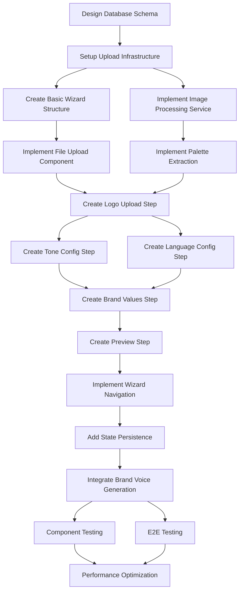

# Onboarding de Marca - Execution Plan

**Versão:** 1.0  
**Data:** Setembro 2025  
**Status:** 📅 Pronto para execução por agente  
**Agent Responsável:** Frontend_Developer

---

## 🎯 Feature Scope

### Fonte
Baseado em @docs/README.md (Fase 1 - Cérebro da Marca) e @docs/features/F02_ONBOARDING_MARCA.md

### Critérios de Aceitação
1. **Upload de Logo:** Usuário pode fazer upload de logo (SVG/PNG/JPG, máx 5MB) com validação e preview
2. **Extração de Paleta:** Sistema extrai automaticamente 3-6 cores dominantes da logo
3. **Configuração de Tom:** 4 sliders de personalidade (confiança, acolhimento, humor, especialização) com exemplos dinâmicos
4. **Configuração de Linguagem:** Termos preferidos, evitados, CTAs padrão com validação
5. **Geração de Brand Voice JSON:** Wizard completo gera artefato válido conforme schema v1.0

### Contexto de Negócio & Valor
- **Time-to-Complete:** < 15 min para usuário médio completar onboarding
- **Completion Rate:** > 80% dos usuários que iniciam completam o wizard
- **Proposta:** Configuração intuitiva que alimenta Brand Voice JSON com inputs do usuário

### [⚠️ DOCUMENTAÇÃO PENDENTE]
- Estratégia de testes automatizados para upload de arquivos
- Ferramenta específica para image processing (Sharp.js vs alternativas)
- Processo de antivírus scan para uploads

---

## 📎 Premissas, Restrições & Políticas

### Tecnologias Obrigatórias
- **Frontend:** React 18 + TypeScript + Tailwind CSS + shadcn/ui
- **Backend:** Node.js + Express + TypeScript para upload endpoints
- **Storage:** Supabase Storage para logos
- **Image Processing:** Sharp.js para compressão e otimização
- **Validation:** Zod schemas para todos inputs

### Padrões de Arquitetura
- **Components:** shadcn/ui patterns seguindo @docs/CODE_GUIDELINES.md
- **State Management:** React Query para server state, useState para local
- **File Upload:** Progressivo com preview e error handling
- **Responsiveness:** Mobile-first design

### Limites de Performance
- **Upload + Processing:** < 30s para arquivo 5MB
- **Extração de Paleta:** < 5s
- **Interface Responsiva:** < 200ms para slider changes
- **Brand Voice Generation:** < 2s

### Compliance & Políticas
- **File Security:** Antivírus scan obrigatório para uploads
- **MIME Type Validation:** Strict validation de tipos permitidos
- **Storage Retention:** Logos mantidos enquanto usuário ativo
- **Privacy:** Apenas usuário proprietário acessa suas imagens

---

## 🔌 Contratos & Interfaces (Data & API)

### APIs REST - Upload de Logo

#### POST /api/brand/upload-logo
**Multipart Form Data:**
```typescript
interface LogoUploadRequest {
  file: File; // SVG, PNG, JPG - max 5MB
  userId: string; // from JWT
}
```

**Response (200):**
```json
{
  "success": true,
  "data": {
    "logoUrl": "string",
    "palette": ["#hex", "#hex", "#hex"],
    "metadata": {
      "width": "number",
      "height": "number", 
      "format": "svg|png|jpg",
      "hasTransparency": "boolean",
      "fileSize": "number"
    }
  }
}
```

#### PUT /api/brand/onboarding
**Request Body:**
```json
{
  "logoUrl": "string",
  "palette": ["string"],
  "toneConfig": {
    "confiança": "number", // 0.0-1.0
    "acolhimento": "number",
    "humor": "number", 
    "especialização": "number"
  },
  "languageConfig": {
    "preferredTerms": ["string"], // max 20
    "avoidTerms": ["string"], // max 15
    "defaultCTAs": ["string"] // max 5
  },
  "brandValues": {
    "mission": "string", // optional, max 200 chars
    "values": [
      {
        "name": "string",
        "description": "string", // optional
        "weight": "number" // 0.0-1.0
      }
    ], // max 5
    "disclaimer": "string"
  }
}
```

**Validation Schema (Zod):**
```typescript
const OnboardingSchema = z.object({
  logoUrl: z.string().url(),
  palette: z.array(z.string().regex(/^#[0-9A-F]{6}$/i)).min(3).max(6),
  toneConfig: z.object({
    confiança: z.number().min(0).max(1),
    acolhimento: z.number().min(0).max(1),
    humor: z.number().min(0).max(1),
    especialização: z.number().min(0).max(1)
  }),
  languageConfig: z.object({
    preferredTerms: z.array(z.string().min(1)).max(20),
    avoidTerms: z.array(z.string().min(1)).max(15),
    defaultCTAs: z.array(z.string().min(1)).max(5)
  }),
  brandValues: z.object({
    mission: z.string().max(200).optional(),
    values: z.array(z.object({
      name: z.string().min(1).max(50),
      description: z.string().max(100).optional(),
      weight: z.number().min(0).max(1).default(1.0)
    })).max(5),
    disclaimer: z.string().min(10).max(500)
  })
});
```

### Componentes React (Outputs)

#### WizardStep Interface
```typescript
interface WizardStepProps {
  stepNumber: number;
  title: string;
  description: string;
  isCompleted: boolean;
  onNext: (data: any) => void;
  onPrevious: () => void;
  children: React.ReactNode;
}
```

#### Onboarding State
```typescript
interface OnboardingState {
  currentStep: number;
  logoData: LogoProcessingResult | null;
  toneConfig: ToneConfiguration;
  languageConfig: LanguageConfiguration;
  brandValues: BrandValues;
  isLoading: boolean;
  errors: Record<string, string>;
}
```

### Database Schema (Drizzle)
```typescript
export const brandOnboarding = pgTable('brand_onboarding', {
  id: uuid('id').primaryKey().defaultRandom(),
  userId: uuid('user_id').references(() => users.id).notNull(),
  
  // Logo e Visual
  logoUrl: text('logo_url'),
  palette: jsonb('palette').$type<string[]>(),
  logoMetadata: jsonb('logo_metadata').$type<LogoMetadata>(),
  
  // Tom de Voz
  toneConfig: jsonb('tone_config').$type<ToneConfiguration>().notNull(),
  
  // Linguagem
  languageConfig: jsonb('language_config').$type<LanguageConfiguration>().notNull(),
  
  // Valores e Missão
  brandValues: jsonb('brand_values').$type<BrandValues>(),
  
  // Metadata
  stepCompleted: text('step_completed').$type<'logo' | 'palette' | 'tone' | 'language' | 'values' | 'completed'>(),
  
  createdAt: timestamp('created_at').defaultNow().notNull(),
  updatedAt: timestamp('updated_at').defaultNow().notNull(),
  completedAt: timestamp('completed_at')
});
```

### Config & Environment Variables
```bash
# Upload settings
MAX_FILE_SIZE_MB=5
ALLOWED_MIME_TYPES=image/svg+xml,image/png,image/jpeg
SUPABASE_STORAGE_BUCKET=brand-assets

# Image processing
SHARP_QUALITY=80
PALETTE_COLORS_MIN=3
PALETTE_COLORS_MAX=6

# Security
ENABLE_ANTIVIRUS_SCAN=true
UPLOAD_RATE_LIMIT_RPM=10
```

---

## 📦 Artefatos a Entregar

### Código Frontend (client/src/)
- `components/onboarding/OnboardingWizard.tsx` - Wizard principal
- `components/onboarding/steps/LogoUploadStep.tsx` - Upload de logo
- `components/onboarding/steps/ToneConfigStep.tsx` - Sliders de personalidade
- `components/onboarding/steps/LanguageConfigStep.tsx` - Configuração linguagem
- `components/onboarding/steps/BrandValuesStep.tsx` - Valores e missão
- `components/onboarding/steps/PreviewStep.tsx` - Preview final
- `components/ui/FileUpload.tsx` - Componente upload reutilizável
- `components/ui/ColorPalette.tsx` - Display de paleta de cores
- `hooks/useOnboarding.ts` - State management do wizard

### Código Backend (server/)
- `routes/brand.ts` - Endpoints de upload e onboarding
- `services/logo-processor.service.ts` - Processamento de imagem
- `services/palette-extractor.service.ts` - Extração de cores
- `middleware/upload.middleware.ts` - Validation de upload
- `utils/image-utils.ts` - Utilities para imagem

### Shared Types
- `shared/types/onboarding.ts` - TypeScript interfaces
- `shared/schemas/onboarding.ts` - Zod validation schemas

### Migrations & Database
- `server/migrations/002_brand_onboarding.sql` - Tabela onboarding
- Update em `shared/schema.ts`

### Assets & Configuration
- `client/public/icons/file-types/` - Ícones para tipos de arquivo
- `client/src/styles/onboarding.css` - Estilos específicos se necessário

---

## 🤖 Orquestração de Agentes

### Responsible Agent
**Frontend_Developer** - Conforme @agents/Frontend_Developer.md

### Collaborator Agents
- **Backend_Developer:** APIs de upload, processamento de imagem
- **Database_Admin:** Schema design, otimização para assets
- **DevOps_Specialist:** Configuração de storage, security scanning

### Permissões de Ferramentas
- **Frontend_Developer:** Full access a client/, componentes, hooks, styles
- **Backend_Developer:** Upload endpoints, image processing services
- **Database_Admin:** Schema approval, storage optimization
- **DevOps_Specialist:** Supabase Storage config, antivirus setup

### Handoffs & Protocolos

#### Frontend_Developer → Backend_Developer
```json
{
  "trigger": "upload_api_requirements_defined",
  "payload": {
    "endpoints": ["/api/brand/upload-logo", "/api/brand/onboarding"],
    "file_constraints": {"maxSize": "5MB", "types": ["SVG", "PNG", "JPG"]},
    "processing_requirements": ["palette_extraction", "compression", "metadata"]
  },
  "required_approval": true
}
```

#### Backend_Developer → Frontend_Developer
```json
{
  "trigger": "upload_api_ready",
  "payload": {
    "endpoints_available": ["/api/brand/upload-logo"],
    "response_schemas": {"LogoProcessingResult": "schema"},
    "error_codes": ["FILE_TOO_LARGE", "INVALID_FORMAT", "PROCESSING_FAILED"]
  }
}
```

#### Database_Admin → Frontend_Developer
```json
{
  "trigger": "onboarding_schema_approved",
  "payload": {
    "table": "brand_onboarding",
    "step_tracking": "step_completed field",
    "json_fields": ["palette", "tone_config", "language_config"]
  }
}
```

#### Rollback Criteria
- Upload processing failure > 20% → investigate image processing pipeline
- Wizard completion rate < 60% → review UX flow
- Performance targets not met → optimize upload/processing
- Security scan findings → block deployment until resolved

---

## 🗺️ Task Graph (Visão de Dependências)

### Hierarquia de Tarefas
1. **Foundation & Setup**
   - Database schema design
   - Upload infrastructure setup
   - Basic wizard structure
2. **Upload Implementation** 
   - File upload component
   - Image processing service
   - Palette extraction
3. **Wizard Steps**
   - Tone configuration
   - Language configuration  
   - Values & mission
4. **Integration & Flow**
   - Wizard navigation
   - State persistence
   - Brand Voice JSON generation
5. **Testing & Polish**
   - Component testing
   - E2E wizard flow
   - Performance optimization

### Dependencies Graph


---

## 📋 Task Breakdown (Detalhamento Executável)

### [ ] Implementar Database Schema para Onboarding
- **Responsible Agent:** Database_Admin
- **Purpose:** Estrutura para armazenar progresso e dados do wizard
- **Inputs:** Especificação F02_ONBOARDING_MARCA.md, existing schema.ts
- **Outputs:**
  - `shared/schema.ts` atualizado com brand_onboarding table
  - `server/migrations/002_brand_onboarding.sql`
- **Tools & Stack:** Drizzle ORM, PostgreSQL, Supabase
- **Dependencies:** Nenhuma (schema independente)
- **Acceptance Checks:**
  - Schema valida com `drizzle-kit generate`
  - JSONB fields funcionando para configs complexas
  - Unique constraint por userId para onboarding ativo
  - Migration executa sem conflitos
- **Observability:** Migration logs, schema validation metrics
- **Security Notes:** RLS policies para isolamento por usuário
- **Effort Unit:** 2 story points
- **Baseado em:** @docs/features/F02_ONBOARDING_MARCA.md seção "Modelo de Dados"

### [ ] Implementar Infrastructure de Upload
- **Responsible Agent:** Backend_Developer
- **Purpose:** API endpoint segura para upload de logos com validação
- **Inputs:** Multipart files, user context via JWT
- **Outputs:**
  - `server/routes/brand.ts` - POST /api/brand/upload-logo
  - `server/middleware/upload.middleware.ts` - validação e security
- **Tools & Stack:** Express.js, Multer, Supabase Storage, Sharp.js
- **Dependencies:** Database schema
- **Acceptance Checks:**
  - Aceita apenas SVG/PNG/JPG até 5MB
  - Validação de MIME type stricta
  - Antivírus scan integrado
  - Storage seguro no Supabase
  - Error handling para todos cenários
- **Observability:** Upload metrics, file size distribution, error tracking
- **Security Notes:** File type validation, size limits, antivirus scan, rate limiting
- **Effort Unit:** 4 story points
- **Baseado em:** @docs/features/F02_ONBOARDING_MARCA.md seção "Upload e Processamento de Logo"

### [ ] Implementar Processamento de Imagem
- **Responsible Agent:** Backend_Developer
- **Purpose:** Otimização, compressão e extração de metadados da logo
- **Inputs:** Uploaded image file
- **Outputs:**
  - `server/services/logo-processor.service.ts`
  - Optimized image em Supabase Storage
  - Metadata com dimensões, formato, transparência
- **Tools & Stack:** Sharp.js, image metadata extraction
- **Dependencies:** Upload infrastructure
- **Acceptance Checks:**
  - Compressão mantendo qualidade (quality=80)
  - Redimensionamento se > 2000px
  - Detecção de transparência
  - Geração de variants (se necessário)
  - Processing time < 30s para 5MB
- **Observability:** Processing time metrics, compression ratios
- **Security Notes:** Memory limits para large files, timeout protection
- **Effort Unit:** 3 story points
- **Baseado em:** @docs/features/F02_ONBOARDING_MARCA.md seção "Processamento"

### [ ] Implementar Extração de Paleta de Cores
- **Responsible Agent:** Backend_Developer
- **Purpose:** Extrair 3-6 cores dominantes da logo automaticamente
- **Inputs:** Processed image file
- **Outputs:**
  - `server/services/palette-extractor.service.ts`
  - Array de cores hex principais
- **Tools & Stack:** Colorthief, Vibrant.js, ou Sharp.js
- **Dependencies:** Image processing
- **Acceptance Checks:**
  - Extrai 3-6 cores dominantes
  - Cores em formato hex válido
  - Fallback para paleta padrão se extração falha
  - Processing time < 5s
  - Cores contrastantes e usáveis
- **Observability:** Extraction success rate, color quality metrics
- **Security Notes:** Resource limits para processing
- **Effort Unit:** 3 story points
- **Baseado em:** @docs/features/F02_ONBOARDING_MARCA.md seção "Extração automática de paleta"

### [ ] Criar Wizard Structure e Navigation
- **Responsible Agent:** Frontend_Developer
- **Purpose:** Framework básico do wizard com navegação entre steps
- **Inputs:** Figma/designs (se disponível), step requirements
- **Outputs:**
  - `components/onboarding/OnboardingWizard.tsx`
  - `hooks/useOnboarding.ts` - state management
- **Tools & Stack:** React 18, TypeScript, React Query, shadcn/ui
- **Dependencies:** Database schema (para state shape)
- **Acceptance Checks:**
  - 5 steps definidos com progress indicator
  - Navegação next/previous funcional
  - Progress persistence no localStorage
  - Loading states entre steps
  - Responsive design mobile/desktop
- **Observability:** Step completion metrics, abandonment tracking
- **Security Notes:** Client-side validation, state sanitization
- **Effort Unit:** 4 story points
- **Baseado em:** @docs/features/F02_ONBOARDING_MARCA.md seção "Fluxo do Usuário"

### [ ] Implementar Logo Upload Step
- **Responsible Agent:** Frontend_Developer
- **Purpose:** Interface para upload com preview e feedback
- **Inputs:** User file selection
- **Outputs:**
  - `components/onboarding/steps/LogoUploadStep.tsx`
  - `components/ui/FileUpload.tsx` - reusable component
- **Tools & Stack:** React dropzone, file preview, progress indication
- **Dependencies:** Upload API, Wizard structure
- **Acceptance Checks:**
  - Drag & drop e click para upload
  - Preview instantâneo da imagem
  - Progress bar durante upload
  - Validation feedback (tamanho, formato)
  - Error messages claras
- **Observability:** Upload attempt metrics, error categorization
- **Security Notes:** Client-side file validation, size limits
- **Effort Unit:** 4 story points
- **Baseado em:** @docs/features/F02_ONBOARDING_MARCA.md seção "Tela 1: Upload de Logo"

### [ ] Implementar Tone Configuration Step
- **Responsible Agent:** Frontend_Developer
- **Purpose:** 4 sliders de personalidade com exemplos dinâmicos
- **Inputs:** Slider values 0.0-1.0
- **Outputs:**
  - `components/onboarding/steps/ToneConfigStep.tsx`
  - Dynamic examples based on slider positions
- **Tools & Stack:** shadcn/ui sliders, real-time updates
- **Dependencies:** Wizard structure
- **Acceptance Checks:**
  - 4 sliders: confiança, acolhimento, humor, especialização
  - Exemplos de copy atualizando em tempo real
  - Labels descritivos para cada posição
  - Warning para combinações problemáticas
  - Valores persistidos corretamente
- **Observability:** Slider interaction metrics, final value distributions
- **Security Notes:** Value validation (0.0-1.0 range)
- **Effort Unit:** 5 story points
- **Baseado em:** @docs/features/F02_ONBOARDING_MARCA.md seção "Tela 3: Tom de Voz"

### [ ] Implementar Language Configuration Step
- **Responsible Agent:** Frontend_Developer
- **Purpose:** Configuração de termos preferidos, evitados e CTAs
- **Inputs:** Term arrays, CTA strings
- **Outputs:**
  - `components/onboarding/steps/LanguageConfigStep.tsx`
  - Tags input components
- **Tools & Stack:** Tag input component, autocomplete
- **Dependencies:** Wizard structure
- **Acceptance Checks:**
  - 4 seções: Preferidos, Evitar, Proibidos (readonly), CTAs
  - Tags input com add/remove
  - Validation: max 20 preferidos, 15 evitar, 5 CTAs
  - No overlap entre preferidos e evitados
  - Autocomplete com sugestões do setor pet
- **Observability:** Term usage analytics, validation error tracking
- **Security Notes:** Input sanitization, XSS prevention
- **Effort Unit:** 4 story points
- **Baseado em:** @docs/features/F02_ONBOARDING_MARCA.md seção "Tela 4: Linguagem"

### [ ] Implementar Brand Values Step
- **Responsible Agent:** Frontend_Developer
- **Purpose:** Configuração de missão, valores e disclaimer
- **Inputs:** Mission text, values array, disclaimer
- **Outputs:**
  - `components/onboarding/steps/BrandValuesStep.tsx`
  - Dynamic values input component
- **Tools & Stack:** Form components, character counters
- **Dependencies:** Wizard structure
- **Acceptance Checks:**
  - Mission field (20-200 chars, optional)
  - Dynamic values list (max 5, name + description)
  - Pre-selected pet industry values
  - Disclaimer with compliance validation
  - Character counting and validation
- **Observability:** Field completion rates, character usage stats
- **Security Notes:** Text length limits, content sanitization
- **Effort Unit:** 3 story points
- **Baseado em:** @docs/features/F02_ONBOARDING_MARCA.md seção "Valores e Missão"

### [ ] Implementar Preview e Brand Voice Generation
- **Responsible Agent:** Frontend_Developer
- **Purpose:** Preview final e geração do Brand Voice JSON
- **Inputs:** All onboarding data collected
- **Outputs:**
  - `components/onboarding/steps/PreviewStep.tsx`
  - Integration com Brand Voice generation
- **Tools & Stack:** JSON generation, preview components
- **Dependencies:** All previous steps, Brand Voice JSON schema
- **Acceptance Checks:**
  - Preview visual da marca criada
  - 3 exemplos de conteúdo: educativo, promocional, humanizado
  - Botão "Regenerar exemplos"
  - Brand Voice JSON válido gerado
  - Opção de voltar e ajustar
- **Observability:** Generation success rate, preview engagement
- **Security Notes:** JSON schema validation, output sanitization
- **Effort Unit:** 4 story points
- **Baseado em:** @docs/features/F02_ONBOARDING_MARCA.md seção "Tela 5: Preview Final"

### [ ] Implementar State Persistence
- **Responsible Agent:** Frontend_Developer
- **Purpose:** Salvar progresso do wizard automaticamente
- **Inputs:** Wizard state changes
- **Outputs:**
  - Persistence logic em useOnboarding hook
  - Recovery mechanism em wizard init
- **Tools & Stack:** React Query mutations, localStorage backup
- **Dependencies:** All wizard steps, onboarding API
- **Acceptance Checks:**
  - Auto-save após cada step completion
  - Recovery após refresh/reload
  - Backup em localStorage se API falha
  - Clear state após completion
  - Progress indicator reflete estado real
- **Observability:** Save/restore success rates, recovery scenarios
- **Security Notes:** Sensitive data handling, state validation
- **Effort Unit:** 3 story points
- **Baseado em:** @docs/features/F02_ONBOARDING_MARCA.md seção "Persistência e recuperação"

### [ ] Implementar Component Testing
- **Responsible Agent:** QA_Engineer
- **Purpose:** Testes unitários para componentes do wizard
- **Inputs:** React components, mock data
- **Outputs:**
  - `client/src/tests/onboarding/` - component tests
  - Mock providers e fixtures
- **Tools & Stack:** Jest, React Testing Library, MSW
- **Dependencies:** All components implemented
- **Acceptance Checks:**
  - Cada step component testado isoladamente
  - Upload component com mock file handling
  - Form validation testada
  - Navigation flow testado
  - Error states testados
- **Observability:** Test coverage metrics, test execution time
- **Security Notes:** Mock sensitive data appropriately
- **Effort Unit:** 4 story points
- **Baseado em:** @docs/features/F02_ONBOARDING_MARCA.md seção "Testes"

### [ ] Implementar E2E Wizard Testing
- **Responsible Agent:** QA_Engineer
- **Purpose:** Validar fluxo completo do onboarding
- **Inputs:** Complete wizard implementation
- **Outputs:**
  - E2E tests para jornada completa
  - Performance tests para upload
- **Tools & Stack:** Playwright/Cypress, test file fixtures
- **Dependencies:** Complete wizard implementation
- **Acceptance Checks:**
  - Fluxo completo: upload → config → preview → generation
  - Mobile responsiveness testada
  - File upload com arquivos reais
  - Performance targets validados (< 15min completion)
  - Error recovery scenarios testados
- **Observability:** E2E test metrics, performance benchmarks
- **Security Notes:** Test data cleanup, secure test environments
- **Effort Unit:** 3 story points
- **Baseado em:** @docs/features/F02_ONBOARDING_MARCA.md seção "E2E Testing"

---

## ✅ Success Metrics (do Plano)

### Métricas Quantificáveis
- **Completion Rate:** > 80% dos usuários que iniciam completam wizard
- **Time to Complete:** < 15 min média para usuário típico
- **Upload Success Rate:** > 99% para arquivos válidos
- **Processing Time:** < 30s para upload + processamento
- **Interface Responsiveness:** < 200ms para slider changes
- **Brand Voice Quality:** JSON schema compliance 100%

### Validação Automatizada
- **Jest Tests:** 100% component tests passando
- **E2E Tests:** Fluxo completo validado automaticamente
- **Performance Tests:** Upload/processing dentro de targets
- **Accessibility:** WCAG 2.1 AA compliance via axe-core
- **Security Scan:** 0 vulnerabilities em uploads

---

## 🔍 Estratégia de Validação & Qualidade

### Testes
- **Unit Tests:** React components, hooks, utilities (Jest + RTL)
- **Integration Tests:** API calls, file upload, state management
- **E2E Tests:** Complete wizard flow, mobile responsiveness
- **Performance Tests:** Upload speed, image processing time
- **Accessibility Tests:** Screen reader, keyboard navigation

### Gates de Qualidade
- **TypeScript Strict:** Zero any types, strict null checks
- **ESLint + Prettier:** Component patterns, React best practices
- **Bundle Size:** Monitor impact of image processing libraries
- **Core Web Vitals:** LCP, FID, CLS dentro de targets
- **Security Scan:** File upload vulnerabilities

---

## 🔒 Segurança, Privacidade & Compliance

### Ameaças (Modelo Resumido)
- **Malicious File Upload:** Executables mascarados como imagens
- **SSRF Attacks:** URLs maliciosas em processamento
- **DoS via Large Files:** Upload de arquivos enormes
- **XSS via Metadata:** Injection via EXIF ou SVG content

### Controles (OWASP ASVS)
- **File Validation:** MIME type + magic bytes verification
- **Antivirus Scanning:** Automated scan before processing
- **Size Limits:** 5MB hard limit, rate limiting
- **Content Sanitization:** SVG sanitization, metadata stripping
- **Isolated Processing:** Sandboxed image processing

### Política de Dados Pessoais
- **Collection:** Apenas logos fornecidas voluntariamente
- **Retention:** Mantidas enquanto conta ativa
- **Access:** Apenas proprietário da conta
- **Deletion:** Automática ao deletar conta

### Rota de Incidentes
1. **File Upload Issue:** Quarantine file, block user, investigate
2. **Processing Failure:** Logs analysis, error notification
3. **Storage Breach:** Access audit, user notification
4. **Security Vulnerability:** Immediate patching, security review

---

## 📈 Telemetria & Operação

### Logs
- **Upload Events:** file.uploaded, processing.started, palette.extracted
- **Wizard Events:** step.completed, step.abandoned, wizard.completed
- **Error Events:** upload.failed, processing.failed, validation.failed
- **Campos:** userId, fileId, stepNumber, processingTime, errorCode

### Métricas
- **Business:** Completion rate por step, abandonment points
- **Performance:** Upload speed, processing time, wizard duration
- **Quality:** Palette extraction success, file format distribution
- **Error Rates:** Por tipo de erro, recovery success rate

### Alertas & SLOs
- **Critical:** Upload success rate < 95%, processing time > 60s
- **Warning:** Completion rate < 70%, wizard duration > 20min
- **SLO Targets:** 99% upload availability, < 30s processing time

### Runbooks
#### Upload Failure Investigation
1. Check Supabase Storage status
2. Verify file size/type distribution in errors
3. Review antivirus scan logs
4. Check processing service health

#### Low Completion Rate Response
1. Analyze abandonment by step
2. Review error messages clarity
3. Check mobile vs desktop completion
4. A/B testing para UX improvements

---

## 🧭 Alternativas Técnicas & Decisões

### Image Processing: Client vs Server
- **Considerado:** Client-side (browser), server-side (Sharp.js), service (Cloudinary)
- **Decisão:** Server-side com Sharp.js
- **Prós:** Consistent processing, security control, quality optimization
- **Contras:** Server load, processing time
- **Critério de Reversão:** Processing time > 60s consistently

### State Management: Context vs React Query
- **Considerado:** React Context, React Query, Zustand
- **Decisão:** React Query + useState local
- **Prós:** Server state sync, caching, error handling
- **Contras:** Additional complexity
- **Critério de Reversão:** State complexity becomes unmanageable

### File Upload: Direct vs Presigned URLs
- **Considerado:** Direct upload via API, presigned URLs to Supabase
- **Decisão:** Direct upload through API
- **Prós:** Better control, validation, processing pipeline
- **Contras:** Server bandwidth usage
- **Critério de Reversão:** Bandwidth costs > $X/month

---

## ⚠️ Riscos & Unknowns

### Riscos Priorizados

#### Alto Impacto / Alta Probabilidade
- **Image Processing Performance:** Large files degrading user experience
  - **Mitigação:** Compression, size limits, progress feedback
  - **Contingência:** Client-side preview, server-side background processing

#### Alto Impacto / Média Probabilidade
- **Wizard Abandonment:** Complex flow intimidating users
  - **Mitigação:** Progressive disclosure, clear progress, save/resume
  - **Contingência:** Simplified "quick setup" mode

#### Médio Impacto / Média Probabilidade
- **Mobile UX:** Complex interactions não funcionando bem em mobile
  - **Mitigação:** Mobile-first design, touch-friendly components
  - **Contingência:** Dedicated mobile flow

### [⚠️ PERGUNTAS ABERTAS]
- **Image Processing Library:** Sharp.js é a melhor opção vs alternativas?
- **Antivirus Integration:** Qual service/library usar para virus scanning?
- **Mobile Strategy:** PWA capabilities necessárias para upload?
- **Palette Quality:** Como medir e melhorar qualidade das cores extraídas?

---

## 🔗 Dependências Entre Planos

### Planos Requeridos
- **Anamnese_Digital_Plan.md (Opcional):** Pre-population de campos com insights
  - **Interface:** AnamnesisAnalysis.findings → Onboarding pre-fill
  - **Contrato:** Optional integration, onboarding funciona independentemente

### Planos Afetados
- **Brand_Voice_JSON_Plan.md:** Consome dados do onboarding
  - **Interface:** OnboardingResult → BrandVoice.source.onboarding_session_id
  - **Contrato:** Complete onboarding data deve gerar Brand Voice válido

- **Manual_Marca_Digital_Plan.md:** Usa logo e paleta de cores
  - **Interface:** LogoUrl + Palette → Manual visual assets
  - **Contrato:** Assets processados devem estar acessíveis via URLs públicas

---

## 🧾 Versionamento, Branching & PRs

### Convenções
- **Branch:** `feature/F02-onboarding-marca`
- **Commits:** `feat(F02): implement brand onboarding wizard`
- **PR Title:** `F02: Implement Onboarding de Marca - Frontend Wizard`

### Template de PR
```markdown
## F02: Onboarding de Marca Implementation

### Checklist de Prontidão para Execução por Agente
- [ ] Database schema para onboarding implementado
- [ ] Upload API com antivirus scan funcionando
- [ ] Image processing e palette extraction
- [ ] Wizard structure com 5 steps navegáveis
- [ ] Todos steps implementados com validation
- [ ] State persistence e recovery
- [ ] Brand Voice JSON generation
- [ ] Component tests implementados
- [ ] E2E wizard flow validado
- [ ] Mobile responsiveness testada

### Performance Impact
- [ ] Upload + processing < 30s
- [ ] Wizard responsiveness < 200ms
- [ ] Bundle size impact analisado

### UX Validation
- [ ] Completion rate target validado
- [ ] Error messages clarity testada
- [ ] Mobile UX aprovada
```

---

## ✅ Checklist de Prontidão para Execução por Agente

### Autonomia do Agente
- [x] **Frontend_Developer** está definido em @agents/Frontend_Developer.md
- [x] Todas as tarefas têm componentes e outputs específicos
- [x] Tecnologias (React, shadcn/ui) estão na documentação oficial
- [x] Handoffs com Backend_Developer claramente definidos

### Inputs/Outputs Especificados
- [x] React component interfaces definidas com TypeScript
- [x] API contracts com Zod schemas completos
- [x] Database schema para persistence especificado
- [x] File upload constraints e validation rules claros

### Critérios de Aceitação Testáveis
- [x] Performance targets mensuráveis (< 30s upload, < 15min completion)
- [x] UX metrics quantificáveis (> 80% completion rate)
- [x] Technical validation automatizável (schema compliance)
- [x] Accessibility standards verificáveis (WCAG 2.1 AA)

### Segurança/Observabilidade Acionáveis
- [x] File upload security controls especificados
- [x] Event tracking para wizard steps definido
- [x] Error handling e recovery scenarios mapeados
- [x] Performance monitoring com SLI targets claros

---

*Gerado conforme @.github/prompts/plan_geral.prompt.md - Baseado em @docs/features/F02_ONBOARDING_MARCA.md*