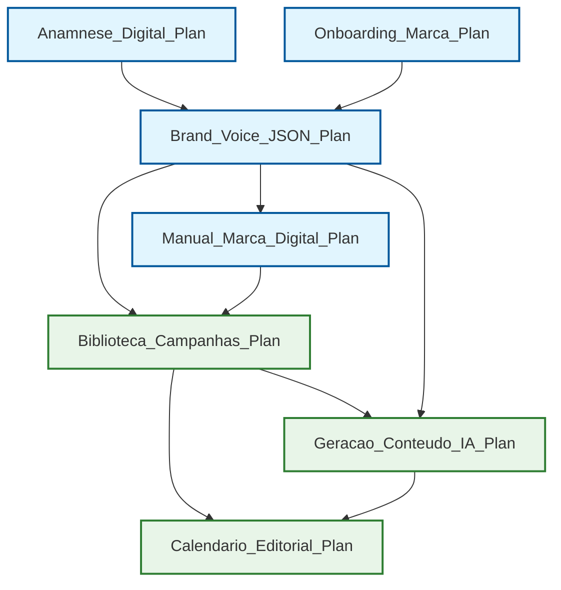

# 📑 Project Plans Index - Digital Woof Platform

**Versão:** 1.0  
**Data de Criação:** Setembro 2025  
**Responsável:** Tech Lead + Equipe de Desenvolvimento  
**Status:** Planejamento Executável por Agentes IA

---

## 🔗 Plans Index

### Fase 1: Cérebro da Marca (P0 - Crítico)

1. **[Anamnese_Digital_Plan.md](./Anamnese_Digital_Plan.md)** — Análise automatizada da presença digital  
   - **Agente Responsável:** Backend_Developer  
   - **Colaboradores:** QA_Engineer, DevOps_Specialist  
   - **Dependências:** Nenhuma (feature inicial)  
   - **Status:** ✅ Completo

2. **[Onboarding_Marca_Plan.md](./Onboarding_Marca_Plan.md)** — Wizard de configuração de identidade  
   - **Agente Responsável:** Frontend_Developer  
   - **Colaboradores:** Backend_Developer, Database_Admin  
   - **Dependências:** Anamnese_Digital_Plan.md (opcional)  
   - **Status:** ✅ Completo

3. **[Brand_Voice_JSON_Plan.md](./Brand_Voice_JSON_Plan.md)** — Artefato central de personalidade da marca  
   - **Agente Responsável:** Backend_Developer  
   - **Colaboradores:** Database_Admin, QA_Engineer  
   - **Dependências:** Anamnese_Digital_Plan.md, Onboarding_Marca_Plan.md  
   - **Status:** ✅ Completo

4. **[Manual_Marca_Digital_Plan.md](./Manual_Marca_Digital_Plan.md)** — Interface visual navegável da identidade  
   - **Agente Responsável:** Frontend_Developer  
   - **Colaboradores:** Backend_Developer  
   - **Dependências:** Brand_Voice_JSON_Plan.md  
   - **Status:** ✅ Completo

### Fase 2: Criação de Conteúdo (P0-P1)

5. **[Biblioteca_Campanhas_Plan.md](./Biblioteca_Campanhas_Plan.md)** — Templates específicos do setor pet  
   - **Agente Responsável:** Backend_Developer  
   - **Colaboradores:** Database_Admin, Frontend_Developer  
   - **Dependências:** Brand_Voice_JSON_Plan.md, Manual_Marca_Digital_Plan.md  
   - **Status:** ✅ Completo

6. **[Geracao_Conteudo_IA_Plan.md](./Geracao_Conteudo_IA_Plan.md)** — Engine de IA para criação automática  
   - **Agente Responsável:** Backend_Developer  
   - **Colaboradores:** QA_Engineer, DevOps_Specialist  
   - **Dependências:** Brand_Voice_JSON_Plan.md, Biblioteca_Campanhas_Plan.md  
   - **Status:** ✅ Completo

7. **[Calendario_Editorial_Plan.md](./Calendario_Editorial_Plan.md)** — Planejamento automático baseado em sazonalidade  
   - **Agente Responsável:** Frontend_Developer  
   - **Colaboradores:** Backend_Developer, Database_Admin  
   - **Dependências:** Biblioteca_Campanhas_Plan.md, Geracao_Conteudo_IA_Plan.md  
   - **Status:** ✅ Completo

---

## 🌐 Global Dependencies Graph



---

## 🤖 Matriz RACI por Agente

| Plano | Backend_Developer | Frontend_Developer | Database_Admin | QA_Engineer | DevOps_Specialist | Tech_Lead | Product_Owner |
|-------|-------------------|-------------------|----------------|-------------|------------------|-----------|---------------|
| Anamnese_Digital | **R** | I | C | C | C | A | I |
| Onboarding_Marca | C | **R** | C | I | I | A | I |
| Brand_Voice_JSON | **R** | I | C | C | I | A | I |
| Manual_Marca_Digital | C | **R** | I | I | I | A | I |
| Biblioteca_Campanhas | **R** | C | C | I | I | A | I |
| Geracao_Conteudo_IA | **R** | I | I | C | C | A | I |
| Calendario_Editorial | C | **R** | C | I | I | A | I |

**Legenda:**
- **R** = Responsible (Executante)
- **A** = Accountable (Aprovador)
- **C** = Consulted (Consultado)
- **I** = Informed (Informado)

---

## 📊 Invariantes Globais

### 🔒 Segurança Mínima

- **Autenticação:** JWT + Supabase Auth obrigatório em todas as APIs
- **Autorização:** RBAC com Row Level Security (RLS) no Supabase
- **Validação:** Zod schemas obrigatórios para todos os inputs
- **LGPD:** Compliance obrigatório, auditoria de dados pessoais
- **Secrets:** Variáveis sensíveis apenas via environment variables
- **Rate Limiting:** Implementado em todos os endpoints públicos

### 📈 Observabilidade Mínima

- **Logs Estruturados:** JSON format com contextId, userId, timestamp
- **Métricas de Performance:** p95 ≤ 2s para operações de UI
- **Error Tracking:** Structured error responses com error codes
- **Health Checks:** `/health` endpoint em todos os serviços
- **Database Monitoring:** Query performance tracking

### 🧪 Qualidade Mínima

- **TypeScript Strict:** Configuração strict mode obrigatória
- **Code Coverage:** Mínimo quando implementado (ver docs/TODO.md)
- **Linting:** ESLint + Prettier configurados e obrigatórios
- **Pre-commit Hooks:** Validação de código antes do commit
- **Code Review:** Mínimo 1 aprovação antes do merge

### 🏗️ Arquitetura Mínima

- **Monorepo:** client/ + server/ + shared/ structure
- **Database:** Supabase PostgreSQL com Drizzle ORM
- **Build:** Vite para frontend, tsc para backend
- **Type Safety:** Shared types entre client e server
- **API Design:** RESTful com consistent response format

---

## 🔄 Regras de Versionamento & PRs

### Branch Strategy
- **main:** Production-ready code
- **feature/F{XX}-{nome}:** Feature branches baseadas no número da feature
- **fix/{nome-do-bug}:** Bug fixes
- **docs/{nome-da-melhoria}:** Documentation updates

### Commit Convention
```
<type>(scope): <description>

<body>

<footer>
```

**Tipos válidos:** feat, fix, docs, style, refactor, test, chore

**Exemplos:**
```
feat(F01): implement anamnesis digital analysis
fix(auth): resolve JWT token expiration handling
docs(F03): update Brand Voice JSON schema documentation
```

### Pull Request Template

```markdown
## 📋 Checklist de Execução por Agente

- [ ] **Autonomia:** Agente consegue executar todas as tarefas com base apenas no plano
- [ ] **Inputs/Outputs:** Todos especificados com esquemas e locais
- [ ] **Critérios de Aceitação:** Testáveis automaticamente
- [ ] **Segurança/Observabilidade:** Implementadas e acionáveis
- [ ] **Dependências:** Verificadas e atendidas
- [ ] **Testes:** Unitários, integração e E2E implementados
- [ ] **Documentação:** Atualizada e completa
- [ ] **Performance:** Métricas dentro dos SLIs definidos
```

### CODEOWNERS
```
# Global
* @tech-lead

# Plans
/plans/ @tech-lead @product-owner

# Frontend
/client/ @frontend-developer @tech-lead

# Backend  
/server/ @backend-developer @tech-lead

# Database
/shared/schema.ts @database-admin @backend-developer

# Documentation
/docs/ @tech-lead @product-owner
```

---

## 🎯 Métricas de Execução de Planos

### Métricas de Qualidade
- **Plan Completeness:** 100% dos artefatos definidos entregues
- **Acceptance Criteria:** 100% dos critérios objetivamente testados
- **Documentation Coverage:** 100% dos contratos e interfaces documentados
- **Security Compliance:** 0 vulnerabilidades críticas ou altas

### Métricas de Performance
- **Time to Value:** MVP funcional em até 8 semanas de desenvolvimento
- **Development Velocity:** Todos os planos da Fase 1 executáveis em paralelo
- **Error Rate:** < 5% de retrabalho por definições insuficientes
- **Agent Autonomy:** > 90% das tarefas executáveis sem consulta humana

### Métricas de Qualidade dos Planos
- **Plan Traceability:** 100% das tarefas rastreáveis a @docs/README.md
- **Agent Assignment:** 100% dos planos têm agente responsável definido
- **Dependency Clarity:** 100% das dependências inter-planos mapeadas
- **Technical Debt:** 0 "TODO" ou "FIXME" em artefatos de produção

---

## ⚠️ Riscos Globais & Mitigações

### Riscos de Planejamento
- **Sobreposição de Responsabilidades:** Matriz RACI clara + handoff protocols
- **Dependências Circulares:** DAG validation automática
- **Scope Creep:** Strict adherence to @docs/README.md como fonte única

### Riscos Técnicos
- **Integration Complexity:** Shared types + contract testing
- **Performance Degradation:** SLI monitoring + alerts
- **Security Vulnerabilities:** Automated security scanning + manual reviews

### Riscos de Execução por Agentes
- **Insufficient Context:** Detailed specifications + examples in each plan
- **Ambiguous Acceptance Criteria:** Automated testing requirements
- **Missing Dependencies:** Explicit dependency tracking + validation

---

## 🧾 Templates de Comunicação entre Agentes

### Handoff Message Schema
```json
{
  "messageId": "uuid",
  "fromAgent": "string",
  "toAgent": "string", 
  "planId": "string",
  "taskId": "string",
  "action": "handoff | review | rollback | complete",
  "payload": {
    "artefacts": ["string"],
    "validationResults": {},
    "nextSteps": "string"
  },
  "timestamp": "ISO8601"
}
```

### Rollback Trigger Criteria
- **Quality Gate Failure:** Code coverage, security scan, or performance below thresholds
- **Integration Test Failure:** Contract violations between services
- **Acceptance Criteria Failure:** Automated tests failing
- **Dependency Issue:** Required artefact not available or invalid

---

## 📚 Referências e Fontes

### Documentação Autorizada
- **@docs/README.md** - Fonte única de requisitos e especificações
- **@docs/features/README.md** - Índice completo de todas as features
- **@agents/README.md** - Catálogo de agentes e responsabilidades

### Padrões Técnicos
- **@docs/CODE_GUIDELINES.md** - Padrões de código obrigatórios
- **@docs/PROJECT_STRUCTURE.md** - Organização de arquivos
- **@docs/DESIGN_DECISIONS.md** - Decisões arquiteturais justificadas

### Compliance e Qualidade
- **@docs/TODO.md** - Lacunas pendentes de definição
- **@docs/TROUBLESHOOTING.md** - Soluções para problemas comuns
- **@docs/GLOSSARY.md** - Definições de termos técnicos

---

## 🔄 Histórico de Versões

| Versão | Data | Mudanças | Responsável |
|--------|------|----------|-------------|
| 1.0 | Set/2025 | Versão inicial completa com 7 planos da Fase 1-2 | Tech_Lead |

---

## ✅ Prontidão para Execução - Checklist Global

### Autonomia dos Agentes
- [x] Todos os planos têm agente responsável definido em @agents/README.md
- [x] Protocolos de handoff especificados com schemas JSON
- [x] Critérios de rollback objetivos e acionáveis
- [x] Dependências inter-planos mapeadas no DAG

### Rastreabilidade
- [x] Todas as features derivam de @docs/README.md e @docs/features/
- [x] Agentes responsáveis existem em @agents/README.md
- [x] Ferramentas e tecnologias citadas estão na documentação oficial
- [x] Métricas de sucesso são quantificáveis e testáveis

### Qualidade e Segurança
- [x] Invariantes globais especificados e obrigatórios
- [x] Estratégias de validação automatizáveis definidas
- [x] Segurança, privacidade e compliance endereçados em cada plano
- [x] Observabilidade e telemetria especificadas

### Execução
- [x] Todos os artefatos têm formato/esquema/local de gravação definidos
- [x] Critérios de aceitação são testáveis automaticamente
- [x] Performance targets são mensuráveis e realistas
- [x] Versionamento e branching estão padronizados

---

*Gerado conforme @.github/prompts/plan_geral.prompt.md - Setembro 2025*